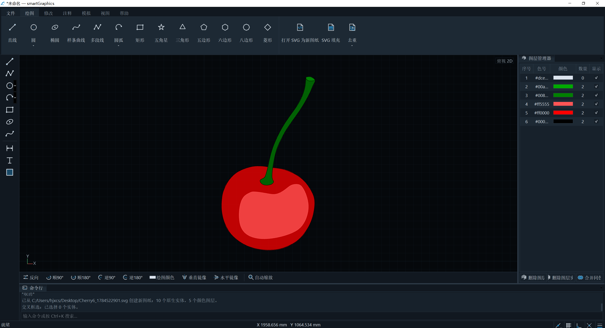

# vectorPath

vectorPath 是一个面向 Windows 的现代二维 CAD/CAM 学习与技术展示项目，使用
C++17、Qt 5.12.10、OpenGL、CMake 和 Ninja 开发。项目覆盖二维绘制与编辑、图层和标注、
DWG/DXF/SVG/位图导入导出、刀路排序与仿真，以及可撤销的文档事务。

> 当前版本：`0.2.0-alpha.1`。项目仍在持续开发，不宣称完整兼容 AutoCAD。



> 位图经颜色分区和轮廓提取后转换为可编辑矢量实体，并按颜色组织到图层中。

## 主要能力

- 直线、圆、圆弧、椭圆、样条、多段线和常用规则图形。
- 修剪、延伸、打断、连接、倒角、圆角、偏移、阵列、拉伸、夹点编辑等二维操作。
- 图层、颜色、线宽、文字、标注、填充与可撤销/重做事务。
- 原生 `.vectorpath` 文档并兼容旧 `.smartcam`、`.smartcad` 文件、ASCII DXF、基于 GNU LibreDWG
  适配器的 DWG 读写。
- SVG 色块导入、像素精确的位图矢量化、偏移线填充与图层去重。
- 刀路排序、方向调整和交互式仿真。
- 深色、浅色和高对比度主题，Ribbon、停靠面板、快捷键与命令行。

## 位图矢量化：精确结果与大图优化

vectorPath 的位图导入不是模糊拟合，也不依赖 K-means、Potrace 或曲线平滑。算法按
像素精确比较颜色，使用四邻域判定色块，将结果转换为闭合 SVG 轮廓。它特别适合颜色边界
明确的图标、像素图、标牌和规则色块素材。

核心流程为：

`水平同色游程 → 相邻行严格重叠连接 → 并查集合并色块 → 生成有向边 → 共线压缩 → 闭合轮廓 → SVG`

游程采用半开区间 `[begin_x, end_x)`；相邻行只有同色游程真正重叠时才连接，端点接触不会
把斜对角像素错误合并。性能优化集中在数据表示和可控并行：游程提取与相邻行连接可并行，
ID 分配、并查集、轮廓压缩和 SVG 输出保持串行。小于 1,048,576 像素时，自动模式使用
单线程以避免线程调度开销。稳定 ID、规范化和排序保证单线程与多线程可以生成完全相同的
SVG 字节。

### 优化效果

基准程序与软件位图导入直接调用同一个 `bitmapToVectorResult()` 核心实现。固定种子
`20260727`，在 64 位 Release 下使用 12 个自动线程，每种算法执行 3 次并取中位数：

| 测试集 | 正确性 | 四邻域 flood fill | 游程单线程 | 游程多线程 | 相对 flood fill | 相对单线程 | 峰值工作集 |
| --- | ---: | ---: | ---: | ---: | ---: | ---: | ---: |
| 1000 份相对均衡样本 | 1000/1000 | 19,618.17 ms | 7,015.54 ms | 4,879.50 ms | **4.02×** | **1.44×** | 359.3 MB |
| 5000 份大图压力样本 | 5000/5000 | 1,216,018.72 ms | 279,075.69 ms | 102,223.19 ms | **11.90×** | **2.73×** | 384.1 MB |

5000 份测试的逐文件加速比 P10/P50/P90 为 **2.88× / 13.70× / 27.80×**。其中 4010 张
是 4096×4096 图片，因此这组结果重点证明大图压力和长时间连续处理下的优化效果与稳定性，
不能据此承诺所有图片都获得相同加速；小图、棋盘格和高度离散色块可能受固定开销影响。
当前基准也没有设置单独的计时外预热轮次。

- [1000 份基准完整报告](sgraphVectorBenchmark/results/20260727-1/bitmap_vector_benchmark_report.html)
- [5000 份压力测试完整报告](sgraphVectorBenchmark/results/20260727-2/bitmap_vector_benchmark_report.html)
- [测试方法与结果说明](sgraphDocs/TEST_RESULTS.md)

## 快速构建

仓库**不包含 Qt SDK**。请先安装 Qt 5.12.10 MSVC 套件、Visual Studio 2022 C++ 工具、
CMake、Ninja 和 Python 3，然后运行：

```powershell
python sgraphBuildTools/s_build_64_release.py --clean
```

脚本会自动查找 Qt、激活 Visual Studio 编译环境、编译和运行测试，并使用所找到 Qt 的
`windeployqt` 把运行所需 DLL 和插件复制到 `build/64/Release`。32 位入口：

```powershell
python sgraphBuildTools/s_build_32_release.py --clean
```

如果 Qt 不在常用路径，可显式指定：

```powershell
python sgraphBuildTools/s_build_64_release.py --qt-dir C:\Qt\Qt5.12.10\5.12.10\msvc2017_64
```

也可设置 `SGRAPH_QT64_DIR`、`SGRAPH_QT32_DIR` 或 `QTDIR`。详细说明见
[`sgraphDocs/BUILDING.md`](sgraphDocs/BUILDING.md)。

## 文档

- [使用说明](sgraphDocs/USER_GUIDE.md)
- [代码架构](sgraphDocs/ARCHITECTURE.md)
- [完整编译工具链](sgraphDocs/BUILDING.md)
- [测试结果](sgraphDocs/TEST_RESULTS.md)
- [实现状态](sgraphDocs/s_implementation_status.md)
- [默认快捷键](sgraphDocs/s_default_shortcuts.md)
- [第三方组件与许可证](THIRD_PARTY_NOTICES.md)

## 仓库结构

所有自研模块目录使用 `sgraph` 前缀；第三方源码与工具统一放在
`sgraphThirdParty`。`build`、`dist`、自动生成的基准图片和本地 Qt SDK 均不会提交。

## 许可与状态

vectorPath 自研代码目前采用仓库内的
[`LICENSE.md`](LICENSE.md)；第三方组件继续适用各自许可证。
特别是 LibreDWG 为 GPLv3+，Qt 5.12.10 和 Qt Advanced Docking System 适用 LGPL
条款。发布二进制前请阅读 [`THIRD_PARTY_NOTICES.md`](THIRD_PARTY_NOTICES.md)。

欢迎通过 Issue 提交可复现的问题；安全问题请按 [`SECURITY.md`](SECURITY.md) 处理。
