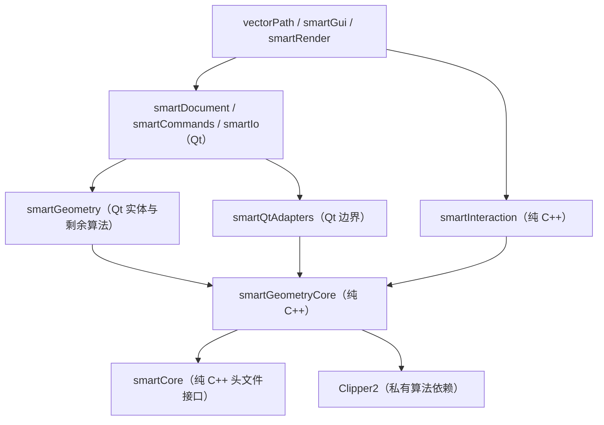

# 代码架构

vectorPath 正在按原计划逐步抽离可独立构建的 C++17 核心。当前已迁移基础结果、ID 集合、
基础和曲线几何、布尔与多边形算法，以及辅助绘图状态。桌面仍复用这些实现，文本与颜色实体、
文档、命令和完整编辑交互尚未完成纯 C++ 迁移。

## 构建边界与依赖

下图箭头表示“依赖”。`smartGeometryCore` 与桌面聚合 `smartGeometry` 位于同一源码目录，
通过不同目标划分依赖；算法没有复制为两份。

`VECTORPATH_BUILD_DESKTOP` 默认 `ON`，保持桌面构建。设为 `OFF` 时不查找 Qt，也不构建
Ribbon、Qt ADS、Qt 适配器、桌面文档/命令/IO/渲染/界面或应用；仅构建纯核心及对应测试。
Windows 入口是 `sgraphBuildTools/vp_build_core.py`，参数与手动配置见 [BUILDING.md](BUILDING.md)。

## 模块职责

- `sgraphCore` / `smartCore`：纯 C++ 的 `VpResult<T>`、ID 集合辅助函数；不再持有 QSettings。
- `sgraphGeometry` / `smartGeometryCore`：点、六种曲线实体值结构、标准形状、椭圆与样条求值、
  布尔、多边形面积和包含判断；公共头与链接依赖均不要求 Qt。
- `sgraphGeometry` / `smartGeometry`：当前仍依赖 Qt 的文本/颜色实体聚合、标注显示、
  填充完整有效性及刀路算法；PUBLIC 链接 `smartGeometryCore` 共用纯算法。
- `sgraphQtAdapters` / `smartQtAdapters`：QString/UTF-16 转换、错误显示、QPointF 转换、
  坐标格式化和旧 QSettings 缺失键迁移；只能由桌面侧依赖。
- `sgraphInteraction` / `smartInteraction`：`VpDraftingState` 管理栅格、旋转、正交和追踪状态，
  接受世界坐标及显式容差；视口转发输入并绘制结果。完整工具、选择、夹点、事务预览尚未迁入。
- `sgraphDocument`：Qt 文档、实体记录、图层、样式、事务、历史、恢复和原生持久化；尚未纯化。
- `sgraphCommands`：命令目录、别名与坐标输入解析；当前仍依赖 Qt 和文档。
- `sgraphIo`：DXF/DWG/SVG/位图编解码及矢量导入。
- `sgraphRender`：OpenGL 视口、选择、对象捕捉、预览和交互式绘制编辑。
- `sgraphGui`：Ribbon、停靠工作区、主题、图标、对话框和主窗口行为。
- `sgraphApp`：应用启动、Qt 配置和中文界面翻译。
- `sgraphTests`：纯核心测试与 Qt 单元、集成测试；桌面关闭时只注册纯核心测试。
- `sgraphVectorBenchmark`：位图矢量化生成器、正确性验证、性能基准和历史结果。
- `sgraphBuildTools`：四种桌面配置与独立核心的 Windows 构建入口。
- `sgraphThirdParty`：原样引入的第三方源码与运行组件。

## 值类型与兼容约定

- 命名空间统一为 `Vp`，自研 C++ 文件使用 `vp_` 前缀，每个 `.h/.cpp` 不超过 800 行。
- `VpResult<T>` 以 `std::u16string` 保存错误文本，Qt 适配器保留 UTF-16 代码单元。
  原生库异常诊断另存字节，由 `toQtError()` 按原有 `QString::fromLocal8Bit` 语义显示。
- `VpPoint2d` 不再包含 Qt 成员；桌面通过 `toQtPoint()`、`toCorePoint()` 和 `formatPoint()`
  完成坐标边界转换及显示。
- `vp_curve_entities.h` 中的六种曲线结构是唯一类型定义；`vp_entity.h` 引入并用于原有实体聚合。
  几何精度、容差、文件格式和枚举数值保持不变。
- 文档修改仍通过 `VpDocumentTransaction` 提交，提供统一撤销/重做边界。
- 位图矢量化保持精确颜色和四邻域语义；DWG 继续通过隔离的 LibreDWG 外部工具适配。

## 兼容性边界

当前重点是二维 CAD/CAM。三维建模、三维编辑和三维可视化明确不在当前范围。功能完成度
以 `vp_autocad_gap_matrix.yaml` 和 `vp_smartcad_feature_inventory.yaml` 为准；仅有入口或
占位界面的功能不得视为完成。

完整产品品牌已改为 vectorPath。下列旧名称属于兼容协议或稳定标识，不能作为普通技术债
机械替换：

- 旧 `.smartcam`、`.smartcad` 扩展名、`SMCAD001` 文件 magic、原生文件版本 24 和
  manifest 中的 `smartCad` 兼容字段。
- 首次启动依次读取的旧设置位置 `smartCamLearning/smartCam`、
  `smartCadLearning/smartGraphics`，以及旧 `smartCam.stb`、`smartCad.stb` 打印样式名。
- 已持久化的 Qt object name、状态栏样式选择器和 DXF XDATA 应用名 `SMARTCAD`。
- 保留一个版本的 `SMARTCAM_BUILD_TESTS`、`SMARTCAD_BUILD_TESTS` 构建变量兼容映射。
- CAD 功能目录中的稳定 `SMARTCAD.*` 功能 ID，以及历史版本记录和历史基准报告。
