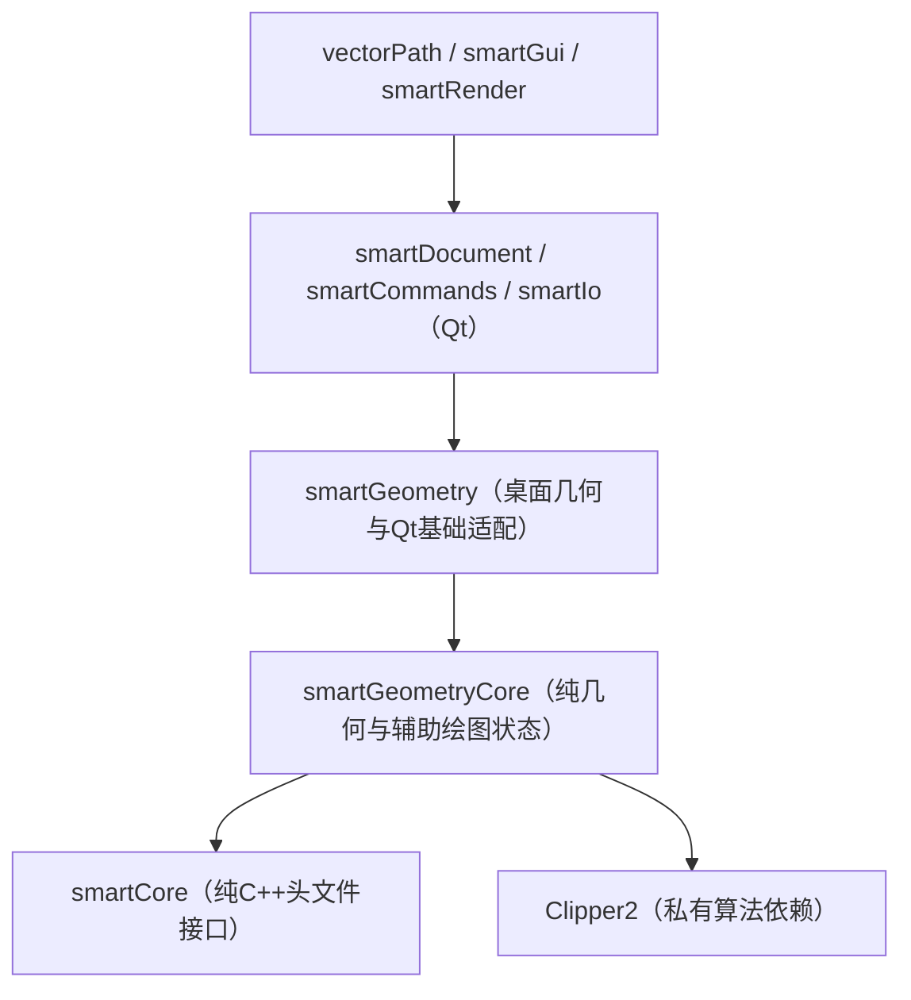

# 代码架构

vectorPath 按原计划逐步抽离 C++17 核心，并将少量辅助实现收拢到现有模块。当前已纯化基础
结果、ID 集合、基础/曲线/布尔/多边形算法，以及栅格、正交和追踪状态；文本和颜色实体、
文档、命令及完整编辑交互仍依赖 Qt，整体重构尚未完成。

## 构建边界与依赖

下图箭头表示“依赖”。`sgraphGeometry` 通过两个目标的显式源列表区分纯核心和 Qt 桌面
实现，桌面直接链接复用纯算法，没有复制类型或算法。

根 `vectorPath.sln` 是原生 Visual Studio 入口；各模块 `.vcxproj` 显式登记源文件和依赖。
默认“生成解决方案”只构建应用及依赖，两个测试程序与性能项目可单独生成。
命令行入口为 `sgraphBuildTools/vp_build.py`：直接调用 MSBuild，`--core` 构建纯核心且不查找
Qt 或 Qt/MSBuild；`--test` 开启测试，`--benchmarks` 开启性能项目。
最后的 CMake 入口留在 Git 提交 `12fb231`，当前不调用 vendor 自带 CMake，详见 [BUILDING.md](BUILDING.md)。

## 模块职责

- `sgraphCore` / `smartCore`：纯 C++ `VpResult<T>` 和 ID 集合辅助函数，不包含 Qt。
- `sgraphGeometry` / `smartGeometryCore`：点、六种曲线值结构、标准形状、椭圆/样条、布尔、
  多边形面积与包含判断，以及 `VpDraftingState` 的栅格、旋转、正交、追踪状态和运算。
- `sgraphGeometry` / `smartGeometry`：仍含 Qt 的文本/颜色实体、标注、填充完整检查和刀路，
  以及 `vp_qt_geometry.*`、`vp_qt_text.h` 中的点、文本、错误显示适配；这些文件不进入纯目标。
- `sgraphDocument`：Qt 文档、图层、样式、事务、历史、恢复和原生持久化；尚未纯化。
- `sgraphCommands`：命令目录、别名与坐标输入解析；当前仍依赖 Qt 和文档。
- `sgraphIo`：DXF/DWG/SVG/位图编解码及矢量导入。
- `sgraphRender`：视口、选择、对象捕捉、预览和绘制编辑；把辅助绘图状态交给纯核心。
- `sgraphGui`：Ribbon、工作区、主题、对话框、主窗口和旧 QSettings 缺失键迁移。
- `sgraphApp`：应用组装、Qt 配置、翻译和设置迁移调用。
- `sgraphTests`：两个普通测试可执行程序，保留 38 个分进程套件及可选集合基准。
- `sgraphVectorBenchmark`：按需构建的位图生成器、基准和输出检查；样本与报告仅本地生成，结果目录全部忽略。
- `sgraphBuildTools`：共享 MSBuild 属性、原生工程构建辅助文件、Python 驱动和分进程测试入口。
- `sgraphThirdParty`：原样引入的第三方源码与运行组件；`vp_*.vcxproj` 在该目录统一接入上游源码。

## 值类型与交互约定

- 命名空间统一为 `Vp`；类型用 `Vp` 前缀，自研 C++ 文件用 `vp_` 前缀且每个不超过 800 行。
- `VpResult<T>` 使用 `std::u16string` 错误文本；原生异常字节到 Qt 边界后再按原有
  `QString::fromLocal8Bit` 语义显示。
- `VpPoint2d` 不含 Qt 成员；桌面显式调用 `toQtPoint()`、`toCorePoint()` 和 `formatPoint()`。
- 六种曲线结构只定义在 `vp_curve_entities.h`；`vp_entity.h` 引入并用于桌面实体聚合。
- `VpDraftingState` 接收世界坐标和显式容差。视口保留事件、坐标转换、渲染与文档集成；
  完整工具、选择、夹点、预览和事务生命周期还未全部迁移。
- 文档修改仍通过 `VpDocumentTransaction`；几何精度、容差、文件布局和兼容枚举保持不变。
- 位图保持精确颜色与四邻域语义，DWG 继续使用隔离的 LibreDWG 外部工具。

本次合并辅助目录和构建目标不把 Qt 放回纯核心；Qt 代码由桌面目标显式登记。
删除的未使用命令接口、转发头和未读取的设计数据不再作为功能实现证据。

## 兼容性边界

当前重点是二维 CAD/CAM。三维建模、三维编辑和三维可视化明确不在当前范围。功能完成度
以 `vp_autocad_gap_matrix.yaml` 和 `vp_smartcad_feature_inventory.yaml` 为准；仅有入口或
占位界面的功能不得视为完成。

完整产品品牌已改为 vectorPath。下列旧名称属于兼容协议或稳定标识，不能作为普通技术债
机械替换：

- 旧 `.smartcam`、`.smartcad` 扩展名、`SMCAD001` 文件 magic、原生文件版本 24 和
  manifest 中的 `smartCad` 兼容字段。
- 首次启动依次读取的旧设置位置 `smartCamLearning/smartCam`、
  `smartCadLearning/smartGraphics`，以及旧 `smartCam.stb`、`smartCad.stb` 打印样式名。
- 已持久化的 Qt object name、状态栏样式选择器和 DXF XDATA 应用名 `SMARTCAD`。
- 旧 CMake 构建变量已随自研 CMake 入口退出；命令行测试使用 `--test`。
- CAD 功能目录中的稳定 `SMARTCAD.*` 功能 ID，以及历史版本记录中的兼容标识。
