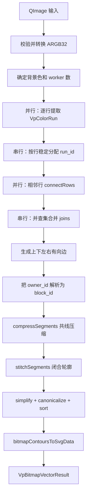
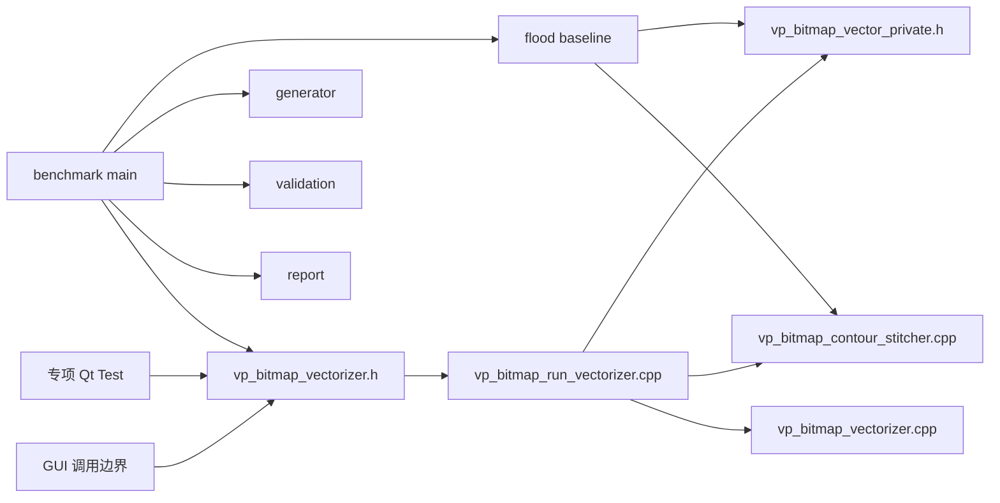
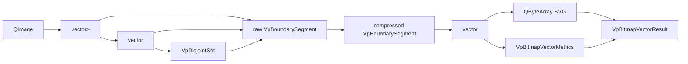
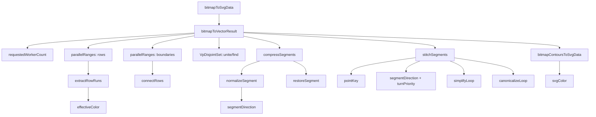
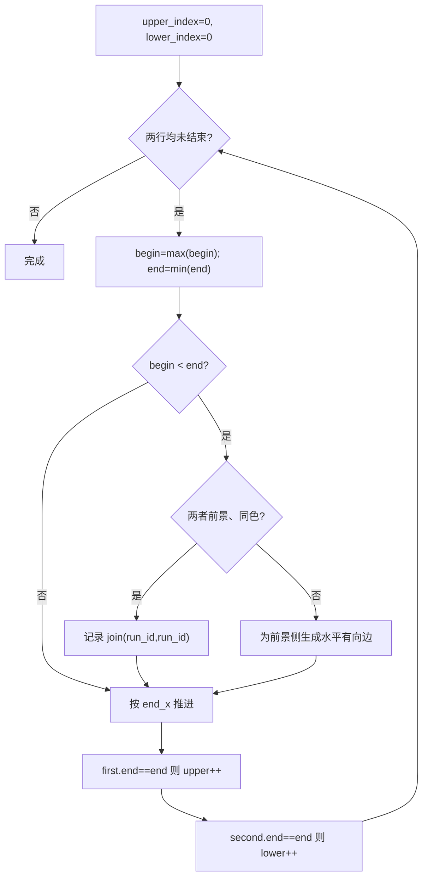
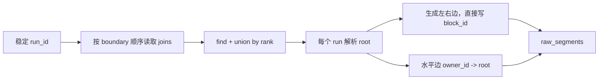
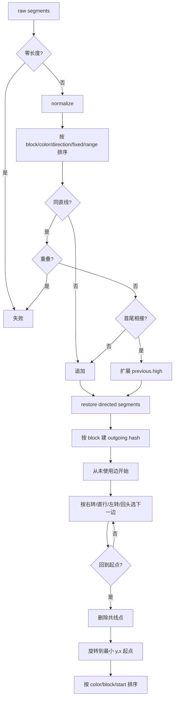
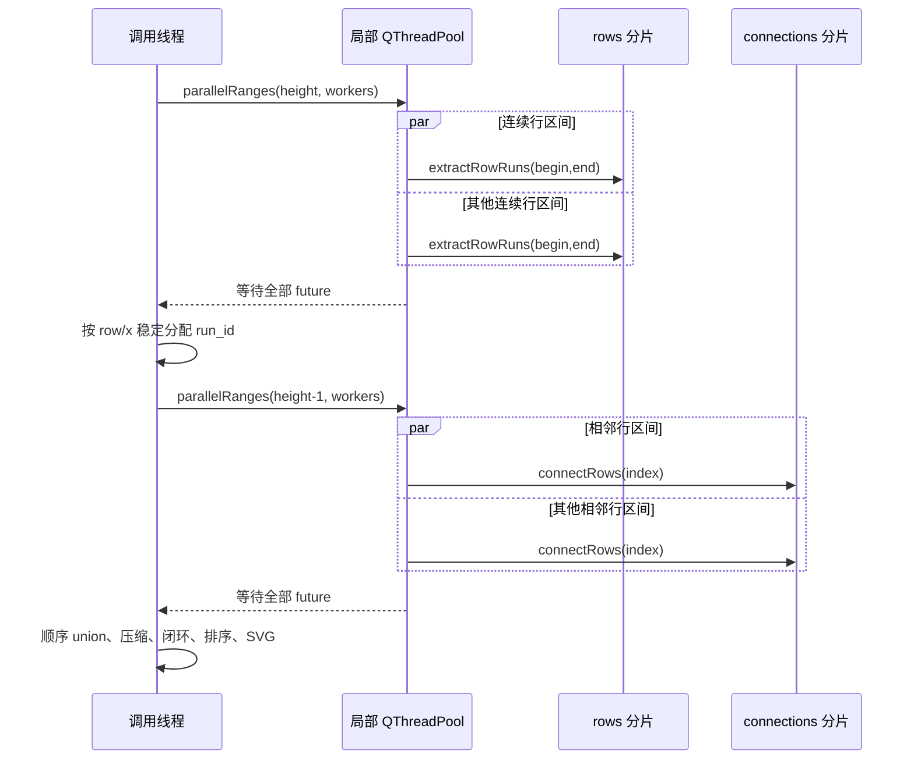
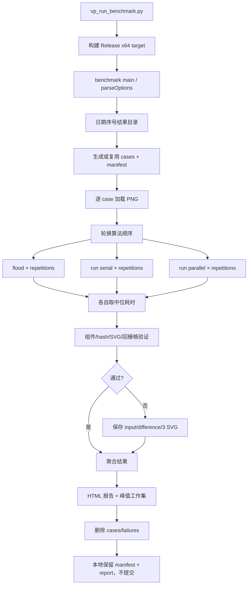
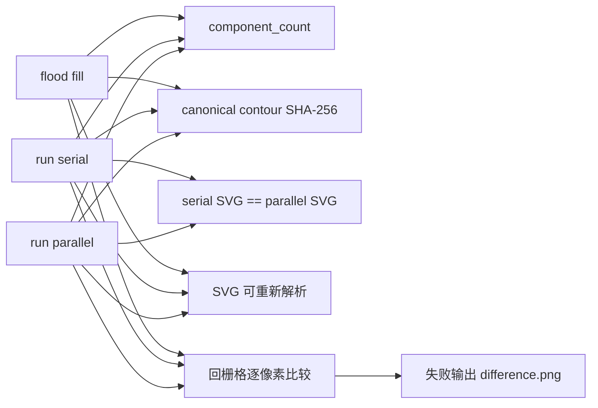

# vectorPath 位图矢量化详尽源码与调用关系

> 适用版本：`v0.2.0-alpha.1`<br>
> 源码核对日期：2026-08-05<br>
> 范围：位图游程矢量化核心、四邻域 flood fill 基线、基准生成/验证/报告和专项测试<br>

## 0. 文档目的与范围

本文完整解释 vectorPath 中由用户提出的位图矢量化方案：精确颜色、四邻域、水平游程、
严格相邻行重叠、并查集、有向边、共线压缩、闭合轮廓和确定性 SVG。内容从数学定义一直
下钻到真实 C++ 接口、文件内辅助函数、关键源码、函数调用关系、多线程边界、基准和测试。

正文不展开 GUI 控件和 CAD 文档事务，只把它们作为公共接口的调用边界。正式算法位于
`sgraphIo`；flood fill 只存在于 benchmark，用于正确性和性能参照，不是软件正式算法。

## 1. 设计目标、适用场景与非目标

### 1.1 目标

- 对输入 ARGB32 像素做精确颜色比较，不量化、不聚类；
- 按四邻域把同色像素划分为独立色块；
- 输出色块的像素边界轮廓和 SVG；
- 消除连续像素边上的冗余共线点；
- 在大图上并行可安全拆分的阶段；
- 单线程和多线程产生完全相同的 SVG 字节；
- 暴露阶段计数、耗时和工作内存估算，便于基准验证。

### 1.2 最适合的输入

像素画、图标、标志、离散色块图、扫描后已经过颜色规整的图片。对这些输入，精确颜色能够
保留原始像素语义，输出轮廓不会受色差阈值或拟合参数影响。

### 1.3 非目标

- 不使用 K-means 或其他颜色聚类；
- 不使用 Potrace；
- 不做 Bézier 拟合或曲线平滑；
- 不主动减少颜色；
- 不消除照片噪声、JPEG 色块或抗锯齿颜色；
- 不承诺所有图片都比逐像素方案更快；
- 内部多线程不等于 UI 后台异步。

## 2. 数学定义和核心不变量

### 2.1 像素、颜色与背景

输入图像先转换为 `QImage::Format_ARGB32`。每个像素使用 `QRgb` 精确比较，比较内容包含
alpha。若 `qAlpha(color) == 0`，像素视为背景；若 `ignore_background=true` 且颜色等于选定
背景色，也视为背景。背景统一映射为 `QRgb(0)`。

### 2.2 四邻域

像素 `(x,y)` 只与 `(x-1,y)`、`(x+1,y)`、`(x,y-1)`、`(x,y+1)` 相邻。对角位置
`(x±1,y±1)` 不相邻。因此两个只在角点接触的同色像素属于两个组件。

### 2.3 水平游程

一条游程是固定行内颜色相同的最大连续区间：

```text
R = (row, begin_x, end_x, color)
覆盖像素：begin_x <= x < end_x
长度：end_x - begin_x
```

使用半开区间可让相邻区间共享端点而不重叠，并使长度、交集和边坐标直接使用整数运算。

### 2.4 相邻行连接条件

相邻行游程 A、B 属于同一色块，当且仅当：

```text
A.is_foreground && B.is_foreground
A.color == B.color
max(A.begin_x, B.begin_x) < min(A.end_x, B.end_x)
```

严格小于号保证交集至少覆盖一个像素列。等号表示只有网格端点接触，不建立 join。

### 2.5 轮廓不变量

- 边坐标位于像素网格顶点，而不是像素中心；
- 每条边有方向，色块内部始终位于一致一侧；
- 每条边只属于一个 `block_id` 和一个颜色；
- 压缩只合并同组件、同色、同方向、同直线且首尾相接的边；
- 每条压缩边在闭环阶段只能使用一次；
- 成功轮廓至少三个顶点并闭合；
- 相同输入和设置的轮廓排序稳定。

## 3. 总体流程图



## 4. 全部相关文件及职责

### 4.1 正式核心

| 文件 | 主要内容 | 上游/下游 |
| --- | --- | --- |
| `sgraphIo/vp_bitmap_vectorizer.h` | 公共设置、指标、轮廓、结果和 3 个 API | GUI/测试/基准调用；实现分布在 3 个 cpp |
| `sgraphIo/vp_bitmap_vector_private.h` | `VpBoundarySegment`、压缩和闭环内部接口 | run vectorizer、flood baseline、stitcher |
| `sgraphIo/vp_bitmap_run_vectorizer.cpp` | 游程、并行、连接、并查集、边生成和总控 | 调用 contour stitcher 与 SVG writer |
| `sgraphIo/vp_bitmap_contour_stitcher.cpp` | 边方向、压缩、闭环、简化和规范化 | 接收原始边，输出 `VpBitmapContour` |
| `sgraphIo/vp_bitmap_vectorizer.cpp` | 颜色格式、SVG 序列化和 QByteArray 包装 | 接收规范轮廓，输出稳定 SVG |
| `sgraphIo/vp_io.vcxproj` | 将以上源文件编入 `smartIo`，链接 Qt Concurrent | 原生解决方案、smartGui、benchmark |

### 4.2 Benchmark 与专项测试

| 文件 | 主要内容 |
| --- | --- |
| `sgraphVectorBenchmark/src/vp_bitmap_benchmark_types.h` | case、算法摘要、case 结果、运行选项 |
| `vp_bitmap_benchmark_generator.h/.cpp` | 固定种子图片生成、断点复用和 manifest |
| `vp_bitmap_flood_baseline.h/.cpp` | 四邻域逐像素 flood fill 参照实现 |
| `vp_bitmap_benchmark_validation.h/.cpp` | 轮廓哈希、SVG 验证、回栅格逐像素比较 |
| `vp_bitmap_benchmark_report.h/.cpp` | 聚合、分位数和 HTML 报告 |
| `vp_bitmap_vector_benchmark.cpp` | 三算法轮换执行、中位数、峰值工作集、失败产物和退出码 |
| `sgraphVectorBenchmark/vp_run_benchmark.py` | Release x64 构建和 benchmark 启动入口 |
| `sgraphVectorBenchmark/vp_bitmap_benchmark.vcxproj` | 原生 benchmark 项目，默认不参与解决方案生成 |
| `sgraphBuildTools/vp_test.py` | 执行 smoke 并验证最终输出只保留 manifest 与 HTML |
| `sgraphTests/vp_svg_vector_import_test.cpp` | 4 个位图核心专项 Qt Test |

运行和本地输出约定位于 benchmark 的 `README.md`。仓库仅保留运行入口、生成器和验证代码，
不再提交固定图片、manifest 或 HTML，整个结果目录由 Git 忽略。

## 5. 文件级调用关系



## 6. 数据结构及字段语义

### 6.1 公共结构

#### `VpBitmapVectorSettings`

```cpp
struct VpBitmapVectorSettings
{
    bool ignore_background = true;
    QColor background_color;
    int worker_count = 0;
};
```

| 字段 | 含义 | 读取位置 |
| --- | --- | --- |
| `ignore_background` | 是否把选定背景色映射为透明背景 | `effectiveColor()` |
| `background_color` | 有效时优先使用；无效时使用左上角像素 | `bitmapToVectorResult()`、flood baseline |
| `worker_count` | 大于 0 为显式线程数；0 为自动 | `requestedWorkerCount()` |

#### `VpBitmapVectorMetrics`

记录像素、游程、组件、压缩后线段、轮廓数量；scan/connection/stitch/total 纳秒；核心工作
容器估算字节、SVG 字节和实际 worker 数。`estimated_working_bytes` 不是完整进程峰值工作集。

#### `VpBitmapContour`

`color` 是原始 QRgb；`block_id` 是并查集组件根；`points` 是不重复终点的闭合多边形顶点序列，
闭合由 SVG `Z` 表示，不在 vector 尾部重复首点。

#### `VpBitmapVectorResult`

同时返回 `svg_data`、可供验证/导入复用的 `contours` 和 `metrics`。

### 6.2 内部结构

| 类型 | 字段和作用 | 生命周期 |
| --- | --- | --- |
| `VpColorRun` | row、begin/end、color、run_id、foreground | 提取后到边生成结束 |
| `VpRowConnection` | joins 与水平 boundary segments | 每个行边界一个，连接阶段到汇集结束 |
| `VpDisjointSet` | parent、8 位 rank | join 合并到 block_id 解析 |
| `VpBoundarySegment` | start、end、color、owner_id、block_id | 原始边、压缩边、闭环输入 |
| `VpNormalizedSegment` | block/color/direction/fixed/low/high | 只在压缩函数内部 |

### 6.3 Benchmark 结构

| 类型 | 作用 |
| --- | --- |
| `VpBitmapBenchmarkCase` | id、类别、尺寸、case seed、颜色数、PNG 路径 |
| `VpBitmapAlgorithmSummary` | 成功、错误、中位毫秒、轮廓 hash、metrics |
| `VpBitmapBenchmarkCaseResult` | 一个 case 的 flood/serial/parallel 和验证结果 |
| `VpBitmapBenchmarkOptions` | case 数、总 seed、线程、重复、smoke、输出目录 |
| `VpBitmapValidationResult` | 是否通过、错误、三类 hash 和 difference 图 |
| `VpMeasuredResult` | benchmark 内部：summary 加一次保留的完整结果 |

## 7. 数据流关系图



## 8. 核心函数调用图



## 9. SVG 包装函数源码解析

### 9.1 `svgColor()`

```cpp
QString svgColor(QRgb color)
```

- **文件/可见性**：`vp_bitmap_vectorizer.cpp`，匿名命名空间，只在本翻译单元可见。
- **调用者**：`bitmapContoursToSvgData()`。
- **输入输出**：QRgb → 大写 `#RRGGBB`；alpha 由另一属性输出。
- **实现**：分别用 `qRed/qGreen/qBlue` 取分量，以宽度 2、基数 16、零补齐格式化。
- **前置条件**：无；QRgb 任意值有效。
- **复杂度**：固定 O(1) 时间和空间。
- **边界**：透明颜色仍输出 RGB，透明度由 `fill-opacity` 保留。

### 9.2 `bitmapContoursToSvgData()`

```cpp
QByteArray bitmapContoursToSvgData(
    int width, int height, const std::vector<VpBitmapContour>& contours);
```

- **调用者**：`bitmapToVectorResult()`；flood baseline 也用它生成参照 SVG。
- **被调用**：`svgColor()`、QMap/QTextStream。
- **输入**：图像整数宽高和已经规范、排序的轮廓。
- **输出**：UTF-8 SVG；函数本身不返回失败。
- **实现方法**：先按 QRgb 放入 `QMap<quint32,...>`，颜色键天然升序；每种颜色写一个 path，
  多轮廓串在同一 `d` 内，以 `fill-rule="evenodd"` 表示外环和孔洞。

关键源码：

```cpp
stream << "  <path fill=\"" << svgColor(iterator.key())
       << "\" fill-opacity=\""
       << QString::number(qAlpha(iterator.key()) / 255.0, 'g', 8)
       << "\" fill-rule=\"evenodd\" d=\"";
```

每个有效轮廓输出 `M x y`、若干 `L x y` 和 `Z`。少于 3 点的轮廓被跳过；正常核心流程已在
stitch 阶段拒绝这类退化轮廓。

- **复杂度**：K 个轮廓分组约 O(K log G)，输出 O(V)，G 为颜色数、V 为总顶点数。
- **确定性**：QMap 颜色序、输入轮廓稳定排序、整数坐标和固定数字格式共同保证字节稳定。
- **边界**：该函数不校验 width/height；公共核心保证来自有效 QImage。

### 9.3 `bitmapToSvgData()`

```cpp
VpResult<QByteArray> bitmapToSvgData(
    const QImage& source, const VpBitmapVectorSettings& settings);
```

- **调用者**：GUI 边界、专项测试。
- **被调用**：`bitmapToVectorResult()`。
- **实现**：失败时原样传播错误；成功时移动 `result.value().svg_data`，丢弃轮廓和指标。
- **复杂度**：由 `bitmapToVectorResult()` 主导；包装本身 O(1) 移动。
- **线程**：同步；从 GUI 调用会等到全部阶段完成。

## 10. 游程和并查集函数源码解析

### 10.1 `VpDisjointSet::VpDisjointSet()`

```cpp
explicit VpDisjointSet(int size);
```

初始化 `m_parent` 为 `[0,1,...,size-1]`，rank 全为 0。size 等于前景游程数且已验证大于 0。
时间/空间均 O(R)。对象只在调用线程访问，不需要锁。

### 10.2 `VpDisjointSet::find()`

```cpp
int find(int value);
```

第一轮沿 parent 找根，第二轮把路径上所有节点直接指向根：

```cpp
while (m_parent[static_cast<std::size_t>(value)] != value)
{
    const int parent = m_parent[static_cast<std::size_t>(value)];
    m_parent[static_cast<std::size_t>(value)] = root;
    value = parent;
}
```

- **调用者**：`unite()`、`bitmapToVectorResult()` 的组件解析。
- **前置条件**：`0 <= value < size`；由稳定 run_id 保证。
- **后置条件**：返回根并压缩查询路径。
- **复杂度**：摊销 O(α(R))。

### 10.3 `VpDisjointSet::unite()`

```cpp
void unite(int first, int second);
```

先 find 两根；相同即返回。比较 8 位 rank，把较低树挂到较高树；相同 rank 时选择 first root
为父并递增 rank。join 按固定行边界顺序输入，因此即便有等秩选择，根 ID 仍确定。

### 10.4 `effectiveColor()`

```cpp
QRgb effectiveColor(QRgb color, QRgb background,
                    const VpBitmapVectorSettings& settings);
```

透明像素或被忽略的精确背景色返回 0，其他颜色原样返回。调用者是 `extractRowRuns()`。
时间 O(1)，无状态，多个线程可安全并行调用。

### 10.5 `extractRowRuns()`

```cpp
std::vector<VpColorRun> extractRowRuns(
    const QImage& image, int row, QRgb background,
    const VpBitmapVectorSettings& settings);
```

- **调用者**：第一轮 `parallelRanges()` 的分片 lambda。
- **前置条件**：ARGB32、宽度大于 0、row 有效；主函数保证。
- **实现**：通过 `constScanLine()` 读连续 QRgb。保存当前 begin/color；从 x=1 扫到 width，
  最后一次用哨兵强制结束游程。

```cpp
if (x == image.width() || next_color != color)
{
    runs.push_back({row, begin_x, x, color, -1,
                    qAlpha(color) != 0});
    begin_x = x;
    color = next_color;
}
```

- **后置条件**：游程覆盖整行、互不重叠、首尾相接、相邻游程颜色不同。
- **复杂度**：O(W) 时间，O(r_row) 输出。
- **线程**：每个任务只写 `rows[row]`，不同 row 无数据竞争。

### 10.6 `requestedWorkerCount()`

```cpp
int requestedWorkerCount(const QImage& image,
                         const VpBitmapVectorSettings& settings);
```

显式 `worker_count > 0` 时返回至少 1；自动模式计算 `width*height`，小于
`1024*1024` 返回 1，否则返回至少 1 的 `QThread::idealThreadCount()`。返回值可能大于行数，
实际任务数会由 `parallelRanges()` 限制。

### 10.7 `parallelRanges()`

```cpp
void parallelRanges(int item_count, int worker_count,
                    const std::function<void(int, int)>& operation);
```

- item_count≤0：直接返回；worker≤1：同步调用 `[0,item_count)`；
- 并行时 `task_count=min(item_count,worker_count*4)`；
- `chunk_size=ceil(item_count/task_count)`；
- 创建局部 QThreadPool，提交连续半开区间，最后逐个 `waitForFinished()`。

```cpp
futures.push_back(QtConcurrent::run(
    &pool, [begin, end, &operation]() { operation(begin, end); }));
```

operation 以引用捕获是安全的，因为函数在返回前等待全部 future。函数提供执行机制，不保证
operation 本身线程安全；两个实际调用都让分片写入互不重叠的 vector 元素。

### 10.8 `connectRows()`

```cpp
void connectRows(const std::vector<VpColorRun>& upper,
                 const std::vector<VpColorRun>& lower,
                 int boundary_y, VpRowConnection& result);
```

双指针同时扫描两行排序游程。每轮计算交集 `[begin_x,end_x)`。严格重叠且前景同色时添加
`(first.run_id,second.run_id)`；否则为交界两侧的前景生成水平有向边。

关键源码：

```cpp
if (begin_x < end_x)
{
    if (first.is_foreground && second.is_foreground &&
        first.color == second.color)
    {
        result.joins.emplace_back(first.run_id, second.run_id);
    }
    else
    {
        // 上侧边从右向左；下侧边从左向右。
    }
}
```

推进规则使用 `end_x=min(first.end_x,second.end_x)`：谁在交集末端结束就推进谁；同时结束则
两个都推进。复杂度 O(|upper|+|lower|)，输出由颜色交界数量决定。

## 11. `connectRows()` 双指针流程图



| 情况 | 结果 |
| --- | --- |
| `[0,1)` 与 `[1,2)` | begin=end=1，不连接 |
| `[0,3)` 与 `[1,2)` 同色 | 严格重叠，join；外露部分形成边 |
| `[0,2)` 与 `[1,3)` 异色 | 不 join；在重叠界线为两色各生成相反方向边 |
| 前景与背景重叠 | 只给前景生成边 |
| 两个透明游程 | 无 join、无边 |

## 12. `bitmapToVectorResult()` 逐阶段源码解析

```cpp
VpResult<VpBitmapVectorResult> bitmapToVectorResult(
    const QImage& source, const VpBitmapVectorSettings& settings);
```

这是正式算法总入口。调用者包括 `bitmapToSvgData()`、专项测试和 benchmark 的 serial/parallel
两条路径。

### 12.1 输入校验与规范化

空图或非正尺寸返回“位图数据为空。”。随后启动总计时器，将图像转换为 ARGB32；有效的显式
背景色优先，否则读取左上角。`requestedWorkerCount()` 固定本次 worker 数。

### 12.2 并行游程提取

预分配 `rows[height]`，分片 lambda 只写属于自己的行。并行完成后才进入稳定编号。

### 12.3 稳定 run_id

```cpp
int next_run_id = 0;
for (std::vector<VpColorRun>& row : rows)
{
    for (VpColorRun& run : row)
    {
        if (run.is_foreground)
        {
            run.run_id = next_run_id++;
        }
    }
}
```

编号与线程完成顺序无关，只取决于行号和行内 x 顺序。若没有前景游程，返回“位图中没有可
转换的前景区域。”。

### 12.4 外框边和相邻行连接

`connections` 大小是 `height+1`：索引 0 保存顶边，height 保存底边，中间索引保存相邻行
边界。顶边方向左→右，底边右→左。中间行对由第二轮 `parallelRanges()` 处理，每个 index
只写 `connections[index+1]`。

### 12.5 并查集合并

主线程按 connections 顺序、每个 joins 顺序调用 `unite()`。这一步把纵向同色覆盖关系传递
成连通分量。`component_roots` 通过所有前景 run 的 `find()` 统计唯一根。

### 12.6 左右边与 block_id

每个前景游程无条件生成左、右竖边：

```cpp
raw_segments.push_back(
    {{run.begin_x, run.row + 1}, {run.begin_x, run.row},
     run.color, run.run_id, block_id});
raw_segments.push_back(
    {{run.end_x, run.row}, {run.end_x, run.row + 1},
     run.color, run.run_id, block_id});
```

左边下→上，右边上→下。水平边在 connect 阶段只有 owner_id，汇集后用
`disjoint_set.find(owner_id)` 填入最终 block_id。

### 12.7 压缩、闭环、SVG 和指标

依次调用 `compressSegments()`、`stitchSegments()`，任一失败都传播错误文本。成功后生成 SVG，
记录各阶段耗时和计数。工作内存估算只包含游程 ID 数和原始/压缩边的结构体大小。

- **后置条件**：result.contours 已稳定排序，svg_data 与 contours 对应，metrics.worker_count
  反映实际选择。
- **复杂度**：扫描 O(P)，连接 O(R)，union O(Jα(R))，压缩 O(E log E)，闭环约 O(C)，SVG
  O(V)。总复杂度通常由 P 与 E log E 主导。
- **空间**：O(R+E+C+V)。
- **线程**：函数同步返回；内部两个阶段并行，Document/GUI 状态不参与。

## 13. 并查集与边生成示例

输入（`.` 表示背景）：

```text
RR.
.RR
```

游程：A=`row0 [0,2)`，B=`row1 [1,3)`。交集 `[1,2)` 非空且同色，所以 join(A,B)，最终一个
block。外框和交界生成的有向边围成阶梯形轮廓。若输入改为：

```text
R.
.R
```

A=`[0,1)`、B=`[1,2)`，交集为空，两个 run 不 union，得到两个 block 和两个方形轮廓。



## 14. 边压缩辅助函数源码解析

### 14.1 `segmentDirection()`

```cpp
int segmentDirection(const VpBoundarySegment& segment);
```

以 `end-start` 映射方向：x>0 为 0（右），y>0 为 1（下），x<0 为 2（左），否则为 3（上）。
调用者是 normalize 和 stitch。输入必须是非零、轴对齐边；零长度在 compress 入口拒绝。

### 14.2 `turnPriority()`

```cpp
int turnPriority(int previous_direction, int next_direction);
```

`turn=(next-previous+4)%4`。优先级：turn=1 → 0，turn=0 → 1，turn=3 → 2，turn=2 → 3，
即右转、直行、左转、回头。它在同一顶点存在多个 outgoing 候选时保持贴边方向。

### 14.3 `pointKey()`

```cpp
quint64 pointKey(const QPoint& point);
```

把 x 的 32 位模式放高位、y 放低位，负坐标也按补码位模式唯一编码。调用者是 stitch 的
outgoing QHash。O(1)，无冲突地表示一对 32 位整数。

### 14.4 `normalizeSegment()`

```cpp
VpNormalizedSegment normalizeSegment(const VpBoundarySegment& segment);
```

把有向边转为可排序的 block/color/direction/fixed/low/high。水平边 fixed=y，范围取 x；竖边
fixed=x，范围取 y。low/high 消除端点大小差异，但 direction 单独保留原方向。

### 14.5 `restoreSegment()`

```cpp
VpBoundarySegment restoreSegment(const VpNormalizedSegment& segment);
```

按 direction 把 fixed/low/high 还原为有向 QPoint；owner_id 置 -1，保留 block_id 和颜色。
normalize/restore 在合法轴对齐边上互为逆操作。

### 14.6 `compressSegments()`

```cpp
VpResult<std::vector<VpBoundarySegment>> compressSegments(
    const std::vector<VpBoundarySegment>& source);
```

实现步骤：

1. 拒绝 start=end 的零长度边；
2. 全部 normalize；
3. 按 `(block,color,direction,fixed,low,high)` 排序；
4. 同直线且 `segment.low < previous.high` 视为重复/重叠，失败；
5. 同直线且 `low == previous.high` 合并为更长区间；
6. 其他边另起记录；
7. restore 为有向边。

关键源码：

```cpp
if (is_same_line && segment.low == previous.high)
{
    previous.high = segment.high;
    continue;
}
```

复杂度 O(E log E)，空间 O(E)。排序同时把相同 block 的边变为连续区间，为 stitch 的分组
假设提供条件。

## 15. 闭环辅助函数源码解析

### 15.1 `simplifyLoop()`

```cpp
std::vector<QPoint> simplifyLoop(const std::vector<QPoint>& source);
```

少于 4 点直接返回。对每个顶点取 previous/current/next，以二维叉积判断是否共线；叉积非零才
保留 current。首尾按模运算连接，所以起点处也会简化。O(V) 时间和空间。

### 15.2 `canonicalizeLoop()`

```cpp
void canonicalizeLoop(std::vector<QPoint>& points);
```

寻找字典序最小 `(y,x)` 顶点，`std::rotate()` 到首位。它不反转方向，只消除同一闭环不同起点
造成的表示差异。空输入直接返回。

### 15.3 `stitchSegments()`

```cpp
VpResult<std::vector<VpBitmapContour>> stitchSegments(
    std::vector<VpBoundarySegment>& segments);
```

前置条件：segments 已由 compress 按 block 分组和排序。函数为每个 block 建立
`start point key -> edge indices` 的 outgoing 表，并从每条未使用边开始追踪。

每步：标记当前边、把 start 加入 loop、检查 end 是否回到 loop_start；否则查询 end 的未使用
outgoing，以 `turnPriority()` 选唯一最优。无候选或最优并列都失败，防止对拓扑歧义作任意选择。

关键源码：

```cpp
if (best_index < 0 || has_tie)
{
    return VpResult<std::vector<VpBitmapContour>>::failure(
        QStringLiteral("位图轮廓存在开放端点或无法消解的分支。"));
}
```

guard 不超过本 block 边数，避免异常图无限循环。闭合后 simplify，少于三点失败，canonicalize，
再保存颜色/block。最后按 color、block_id、首点 `(y,x)` 排序。

失败路径：

- 闭合前重复使用边；
- 开放端点或同优先级分支；
- guard 结束仍未闭合；
- 简化后少于三个顶点。

平均复杂度约 O(C+V)，QHash 查找均摊 O(1)；异常高分支顶点会增加候选扫描。

## 16. 共线压缩和闭环流程图



## 17. 多线程时序与确定性



确定性来自：

1. 每个并行任务只写固定下标；
2. rows/connections 容器在任务前按最终大小分配；
3. run_id 在所有 row future 完成后按固定顺序分配；
4. join 按 connection 下标顺序串行 union；
5. segment 压缩有全字段排序；
6. 闭环使用固定转向优先级并拒绝并列歧义；
7. 每个 loop 旋转到固定首点，contour 再稳定排序；
8. SVG 用 QMap 按颜色输出。

算法内部同步等待，因此调用者线程仍被占用。若 GUI 要异步，必须在外层把 QImage 和 settings
复制到后台任务，并把结果安全投递回 GUI 线程。

## 18. Flood fill 基线源码解析

### 18.1 `effectiveColor()`（baseline 私有版本）

签名与正式实现相同，语义也相同，确保比较的是连通算法差异而不是背景规则差异。它位于
benchmark 翻译单元，不与正式版本链接冲突。

### 18.2 `appendBoundary()`

```cpp
void appendBoundary(std::vector<VpBoundarySegment>& edges,
                    int x, int y, int direction,
                    QRgb color, int component);
```

把一个像素四边按方向 0=上、1=右、2=下、3=左转换为一致方向的网格边；owner_id 和
block_id 都直接使用 flood component。O(1)。

### 18.3 `bitmapToVectorFloodFill()`

```cpp
VpResult<VpBitmapVectorResult> bitmapToVectorFloodFill(
    const QImage& source, const VpBitmapVectorSettings& settings);
```

逐像素 labels 初始 -1，背景标 -2，前景组件标非负 ID。每发现未访问前景像素，用 vector 加
head 索引实现 FIFO 队列，对上右下左四邻域 BFS。同色未标记邻居入队；越界或异色邻居生成
该像素边界。

```cpp
if (next_color != color)
{
    appendBoundary(raw_segments, x, y, direction,
                   color, component_count);
    continue;
}
```

扫描结束后与正式算法共享 `compressSegments()`、`stitchSegments()` 和 SVG writer，从而比较
连通/边生成差异，同时避免两套闭环实现造成噪声。

- **复杂度**：像素 BFS O(P)，边压缩 O(E log E)，空间 labels O(P) 加 queue/edges。
- **线程**：固定单线程，metrics.worker_count=1。
- **用途**：正确性 oracle 和性能基线，不进入 smartIo 正式调用链。

## 19. Benchmark 图片生成函数

### 19.1 `palette()`

返回 16 个固定不透明 QRgb 的静态 QVector 引用。静态局部初始化线程安全；生成器单线程调用。

### 19.2 `caseSize()`

smoke 使用 64–256 小图。正式模式按 index 分段：前 400 为 64–256，400–749 为 512–1024，
750–949 为 1280–2048，950–989 为 2560/3072，`index>=990` 固定 4096×4096。因 index 从
0 开始，5000 case 中 4010 张为 4K。

### 19.3 `categoryForIndex()`

按 index 对 8 类取模：色带、嵌套、分叉汇合、细线、棋盘、随机矩形、离散同色和合成图案
变体。分类是可重复的，不由随机数决定。

### 19.4 图案绘制函数

| 函数 | 实现方法 | 主要压力点 |
| --- | --- | --- |
| `drawBands()` | 横纵交替填充 2–11 条色带 | 长游程、少边界 |
| `drawNested()` | 不断内缩矩形并换色 | 多层孔洞/嵌套 |
| `drawSplitMerge()` | 中央竖干加多条横支 | 游程跨行分裂和重新汇合 |
| `drawThinCorridors()` | 1–3 像素横竖通道 | 大量细边和交叉 |
| `drawChecker()` | 两色棋盘格 | 大量斜对角接触和短游程 |
| `drawRandomRectangles()` | 最多 256 个随机色矩形 | 遮挡、交界和多颜色 |
| `drawDisconnected()` | 网格中留 inset 的同/异色色块 | 同色不连通组件 |
| `drawSyntheticVariant()` | 按 case 种子生成 320×240 色带、矩形与分叉图案，再快速缩放并镜像 | 合成图案的多尺寸与方向变体；不读取外部图片 |

这些函数使用 QPainter 填充整数矩形，不启用抗锯齿，避免生成不可控的插值颜色。

### 19.5 `generateImage()`

```cpp
QImage generateImage(const QSize& size, const QString& category,
                     quint32 seed, int index);
```

为每个 case 创建独立 `QRandomGenerator(seed)`，以调色板首色填背景，再按类别分派绘制。相同
size/category/seed/index 产生相同像素。

### 19.6 `colorCount()`

逐行读取 ARGB32 并插入 QSet，返回精确颜色数。O(P) 时间、O(G) 空间。

### 19.7 `writeManifest()`

写 seed、case_count 和每个 case 的 id/category/width/height/seed/color_count/相对文件路径。
使用缩进 JSON；打开或写失败返回 false。

### 19.8 `generateBitmapBenchmarkCases()`

```cpp
VpResult<std::vector<VpBitmapBenchmarkCase>> generateBitmapBenchmarkCases(
    const VpBitmapBenchmarkOptions& options);
```

创建 output/cases；为每个 index 派生 case seed、尺寸和类别。若目标 PNG 已存在，则加载并检查
尺寸；有效就复用，缺失、损坏或尺寸不符则重新生成并保存。最后计算颜色数、组装 case 并重写
manifest。目录或 PNG/manifest 写失败返回中文错误。

断点复用只复用输入像素，不复用算法耗时和验证结果。

## 20. Benchmark 测量和主程序函数

### 20.1 `measure()`

```cpp
VpMeasuredResult measure(
    int repetitions,
    const std::function<VpResult<VpBitmapVectorResult>()>& operation);
```

每次用 QElapsedTimer 包围完整 operation，失败立即返回错误。保存所有毫秒并排序，取
`times[size/2]`；仅保留第一次完整 result，metrics 也来自第一次，而中位数只用于耗时。

```cpp
std::sort(times.begin(), times.end());
measured.summary.milliseconds = times[times.size() / 2];
```

没有单独计时外预热；同一 case 的三算法顺序会轮换以降低固定顺序偏差。

### 20.2 `saveFailureArtifacts()`

为失败 case 创建 `failures/case_NNNN`，保存 input、可选 difference，以及成功算法对应的
flood/serial/parallel SVG。目录/单文件写失败不会改变主验证结果，也没有独立错误返回。

### 20.3 `peakWorkingSet()`

Windows 使用 `GetProcessMemoryInfo()` 读取 `PeakWorkingSetSize`；非 Windows 或 API 失败返回 0。
这是进程生命周期峰值，不是单 case 的精确峰值。

### 20.4 `nextResultDirectory()`

在 benchmark `results` 下以当前本地时间 `yyyyMMdd-` 为前缀，扫描已有数字后缀并取最大值+1，
返回如 `20260805-1`。不创建最终目录，生成器随后创建。

### 20.5 临时目录清理

`removeTemporaryDirectory(output,name)` 在目录不存在时成功，否则 `removeRecursively()`；
`removeTemporaryArtifacts()` 同时删除 `cases` 和 `failures`。当前成功运行结束后只保留 manifest
和 HTML，均为 Git 忽略的本地输出；如果清理失败，main 返回 3。

### 20.6 `parseOptions()`

注册 `--cases`、`--seed`、`--threads`、`--repetitions`、`--output`、`--smoke`。case/repetition
至少 1，threads 至少 0；未指定 output 时调用 nextResultDirectory。

### 20.7 `main()`

流程：生成 cases；逐个重新加载 PNG；构造 ignore_background=false 的 flood、serial(1) 和
parallel(N/auto) 设置；按 case index 轮换算法执行顺序；每种算法 measure；三者成功时验证；
失败保存诊断；最后写报告、清临时数据、按失败数量返回。

退出码：0 全通过，1 生成/报告等前置失败，2 有 case 验证失败，3 临时数据清理失败。

## 21. Benchmark 总流程图



## 22. Benchmark 正确性验证函数

### 22.1 `contourHash()`

```cpp
QByteArray contourHash(const std::vector<VpBitmapContour>& contours);
```

每条轮廓编码为 `color: x,y;...`，先对轮廓条目字节排序，再用 SHA-256 串联并以 `|` 分隔。
这样 hash 不依赖输入 vector 顺序，但依赖每条 loop 的点序；可发现颜色、顶点或方向差异。

### 22.2 `rasterize()`

```cpp
QImage rasterize(int width, int height,
                 const std::vector<VpBitmapContour>& contours);
```

按颜色分组，收集每条垂直边与每个 scanline 的交点 x；每行排序后两两配对，使用 even-odd
规则填充 `[begin_x,end_x)`。结果初始透明。该实现独立于正式 SVG renderer，可直接逐像素比较。

复杂度约 O(VH_edge + I log I + P_fill)：长竖边会向跨越的每一行写交点，因此是验证优先而非
性能最优实现。

### 22.3 `compareImage()`

```cpp
bool compareImage(const QImage& source, const QImage& actual,
                  QImage* difference);
```

逐像素比较。源透明像素统一成 `(0,0,0,0)`，忽略透明 RGB 垃圾值；不匹配时 difference 对应
像素标红。返回是否全匹配。前置条件是 actual 尺寸与 source 一致，由 rasterize 调用保证。

### 22.4 `validateSvg()`

把 result.svg_data 重新交给项目 SVG parser；解析失败时返回带算法名的错误，否则空字符串。
这验证结构可读，但不替代回栅格像素验证。

### 22.5 `validateBitmapBenchmarkCase()`

```cpp
VpBitmapValidationResult validateBitmapBenchmarkCase(
    const QImage& source, const VpBitmapVectorResult& flood_fill,
    const VpBitmapVectorResult& run_serial,
    const VpBitmapVectorResult& run_parallel);
```

验证顺序采用 fail-fast：

1. 三算法 component_count 相同；
2. 三算法规范轮廓 hash 相同；
3. serial.svg_data 与 parallel.svg_data 字节相同；
4. 三份 SVG 都可被 parser 重新解析；
5. flood 轮廓回栅格等于源图；
6. serial 回栅格等于源图；
7. parallel 回栅格等于源图。

任何失败立即写 error 并保留最近 difference；全部通过后清空 difference、设置 passed=true。

## 23. 正确性验证关系图



## 24. HTML 报告全部函数

### 24.1 `VpAggregate`

内部结构按类别累计 count、passed、flood_ms、serial_ms 和 parallel_ms。

### 24.2 格式化辅助函数

| 函数 | 实现与边界 |
| --- | --- |
| `escapeHtml(QString)` | 依次替换 `& < > "`，用于类别和错误文本。 |
| `milliseconds(double)` | 小于 10ms 保留 3 位，否则 2 位。 |
| `speedup(baseline,candidate)` | candidate≤0 返回破折号，否则 baseline/candidate，2 位并加 ×。 |
| `percentile(values,fraction)` | 排序后按浮点位置做上下点线性插值；空集返回 0。 |

### 24.3 表格写入函数

- `writeSummaryCards()`：正确性、三算法累计、相对 flood、峰值工作集；
- `writeCategoryTable()`：按类别输出数量、通过、三耗时和相对 flood；
- `writeWorstTable()`：可按最小加速比或最大 parallel 耗时排序，只取 20 条；
- `writeAllRows()`：输出每个 case 的尺寸、颜色、结果、三耗时、指标、SVG、估算内存和错误。

它们都直接写 QTextStream，不持有结果所有权；所有用户/数据文本先 escape。

### 24.4 `writeBitmapBenchmarkReport()`

```cpp
VpResult<QString> writeBitmapBenchmarkReport(
    const VpBitmapBenchmarkOptions& options,
    const std::vector<VpBitmapBenchmarkCaseResult>& results,
    quint64 peak_working_set_bytes);
```

汇总 passed、三算法累计、类别和逐文件 speedup；计算 P10/P50/P90；根据“全部正确且 parallel
累计小于 flood”选择结论口径；写入包含 CSS、排序 JS、环境/参数、卡片和表格的 HTML。标题
使用 `results.size()` 实际数量，不再写死 1000。文件无法写入时返回 failure；成功返回报告路径。

## 25. Python、MSBuild 与输出布局

### 25.1 `vp_run_benchmark.py::parse_arguments()`

声明 cases、seed、threads、repetitions、output 等脚本参数。脚本参数再转发给 C++ benchmark，
避免用户手工定位可执行文件。

### 25.2 `vp_run_benchmark.py::main()`

定位仓库根，调用统一入口 `sgraphBuildTools/vp_build.py --bits <位数> --benchmarks`
构建 Release benchmark，再启动生成的程序并返回退出码。默认位数为 64；构建步骤使用
`check=True`，失败直接终止，默认不运行普通套件测试。

### 25.3 Benchmark 原生工程

`smartBitmapVectorBenchmark` 链接 smartIo、Qt Core/Gui/Concurrent；Windows 额外链接 Psapi。
工程定义注入 benchmark root，不依赖固定图片目录。项目默认不参与解决方案生成，
可右键单独构建，或由 `--benchmarks` 构建；同时使用 `--test` 才通过 `vp_test.py` 运行：

- `vectorPathBitmapVectorBenchmarkSmoke`：20 case、seed 20260727、2 线程、1 次、smoke；
- `vectorPathBitmapBenchmarkOutputLayout`：依赖 smoke，检查最终目录。

### 25.4 `vp_test.py::verify_benchmark_layout()`

要求 manifest 和 HTML 存在；cases 和 failures 不存在；顶层条目排序后必须恰好为这两个文件。
同时检查 manifest 的样本数和条目数均为 20。任一不满足即报告检查失败并使测试入口返回非零退出码。

注意：manifest 中的 `file` 记录描述运行期输入路径，而成功结束后 cases 已清理；manifest 是
可追溯元数据，不是长期 PNG 包。

## 26. 专项 Qt Test

位图专项位于 `VpSvgVectorImportTest`，编入共享的 `vectorPathDesktopTests` 程序；`vp_test.py`
使用 `vectorPathSvgVectorImportTests` 套件参数单独启动进程，测试隔离方式保持不变：

### 26.1 `vectorizesSolidBitmapAsOneRegion()`

构造 300×300 单色图，不忽略背景，调用 `bitmapToSvgData()`；验证成功和 SVG 结构，用于覆盖
单游程/单组件/矩形闭环。

### 26.2 `keepsDiagonalPixelsAsSeparateContours()`

2×2 透明图只设置 `(0,0)`、`(1,1)` 为红；关闭背景忽略，验证 SVG 成功并保持两个轮廓，直接
锁定四邻域端点不连接规则。

### 26.3 `vectorizesSplitMergeRunsWithSameParallelResult()`

构造跨行分裂/汇合图案；分别 worker=1 和 worker=4 调用 `bitmapToVectorResult()`；检查两者成功、
组件/轮廓和 SVG 字节一致，锁定稳定 ID 与确定性。

### 26.4 `vectorizesHoleAsTwoClosedContours()`

红色矩形中挖透明孔，worker=3；验证一个组件但存在外环和内环两个闭合轮廓，锁定 even-odd
孔洞语义和闭环实现。

## 27. 历史性能结果与正确口径

以下为历史测量摘要。原固定图片、逐文件 HTML 与 manifest 已从仓库移除；当前生成器改用
合成图案变体，输入分布已有变化，不能仅凭相同种子完全复现旧输入和结果。以下数字不作为
当前版本的验收结果；新结果需通过保留的运行入口在本地重新生成和测量。

### 27.1 1000 文件相对均衡测试

| 指标 | 结果 |
| --- | ---: |
| 正确性 | 1000/1000 |
| flood fill | 19,618.17 ms |
| 游程单线程 | 7,015.54 ms |
| 自动多线程 | 4,879.50 ms |
| 相对 flood fill | 4.02× |
| 相对游程单线程 | 1.44× |
| 峰值工作集 | 359.3 MB |

### 27.2 5000 文件压力测试

固定 seed 20260727、Release x64、12 线程、每算法 3 次取中位数：

| 指标 | 结果 |
| --- | ---: |
| 正确性 | 5000/5000，失败 0 |
| flood fill | 1,216,018.72 ms |
| 游程单线程 | 279,075.69 ms |
| 游程多线程 | 102,223.19 ms |
| 相对 flood fill | 11.90× |
| 相对单线程 | 2.73× |
| 逐文件 P10/P50/P90 | 2.88× / 13.70× / 27.80× |
| 峰值工作集 | 384.1 MB |

5000 组中 index 990 起固定 4K，共 4010 张 4096×4096，所以代表大图耐久压力，不是均衡
样本。每算法三次计时没有单独不计时预热；不能承诺所有图片或机器获得同样加速。

## 28. 复杂度汇总

设 P=像素数，R=前景游程数，J=join 数，E=原始边数，C=压缩边数，V=轮廓顶点数。

| 阶段 | 时间 | 额外空间 |
| --- | --- | --- |
| ARGB32 转换 | O(P) | O(P)，QImage 可能共享/复制 |
| 游程提取 | O(P) | O(R+背景游程) |
| 稳定编号 | O(R) | O(1) |
| 相邻行连接 | O(R+J+水平边) | O(J+水平边) |
| 并查集 | O(J α(R)) | O(R) |
| 左右边生成 | O(R) | O(R) |
| 共线压缩 | O(E log E) | O(E) |
| 闭环/简化 | 均摊 O(C+V) | O(C+V) |
| SVG 输出 | O(V+K log G) | O(V) 字符串 |
| flood labels/BFS | O(P) | O(P+E) |

## 29. 错误与触发条件

| 错误文本/类别 | 触发条件 |
| --- | --- |
| 位图数据为空 | null 或非正尺寸输入 |
| 没有可转换前景 | 全透明或全部被背景忽略 |
| 零长度线段 | raw edge start=end，表示上游不变量破坏 |
| 重复或重叠线段 | 同 block/color/direction/line 区间重叠 |
| 闭合前重复使用线段 | 拓扑回到已用非起始边 |
| 开放端点或无法消解分支 | 无 outgoing 或同优先级候选并列 |
| 轮廓未能闭合 | guard 结束或终点不回起点 |
| 少于三个顶点 | 简化后退化 |
| PNG/manifest/报告失败 | 文件系统、编码器或目录错误 |
| 三算法数量/hash 不同 | 连通或轮廓结果不一致 |
| serial/parallel SVG 不同 | 确定性回归 |
| SVG 解析失败 | 输出结构无效 |
| 回栅格不同 | 轮廓丢失、颜色/孔洞/边界错误 |

## 30. 函数调用邻接表

| 函数 | 直接调用 |
| --- | --- |
| `bitmapToSvgData` | `bitmapToVectorResult` |
| `bitmapToVectorResult` | worker、parallelRanges、extract、connect、DSU、compress、stitch、SVG writer |
| `extractRowRuns` | `effectiveColor` |
| `parallelRanges` | 调用传入 operation |
| `connectRows` | 无其他项目函数 |
| `compressSegments` | normalize、restore |
| `normalizeSegment` | segmentDirection |
| `stitchSegments` | pointKey、segmentDirection、turnPriority、simplifyLoop、canonicalizeLoop |
| `bitmapContoursToSvgData` | svgColor |
| `bitmapToVectorFloodFill` | baseline effectiveColor、appendBoundary、compress、stitch、SVG writer |
| `generateBitmapBenchmarkCases` | caseSize、category、generateImage、colorCount、writeManifest |
| `generateImage` | 8 类 draw 函数之一 |
| `validateBitmapBenchmarkCase` | contourHash、validateSvg、rasterize、compareImage |
| `writeBitmapBenchmarkReport` | 格式化、percentile 和 4 类表格函数 |
| benchmark `main` | parseOptions、generator、measure、三算法、validation、failure、report、cleanup |

## 31. 修改影响检查表

- 修改背景规则：同步正式/baseline effectiveColor、专项测试和 manifest 口径；
- 修改连通规则：同步严格重叠数学定义、diagonal 测试、flood 参照；
- 修改边方向：检查 appendBoundary、run 边、turnPriority、孔洞和回栅格；
- 修改并行分片：证明固定下标写入、稳定编号和 future 生命周期；
- 修改轮廓规范化：更新 hash、SVG 字节一致性和历史基准比较；
- 修改 SVG 格式：更新 parser 验证、字节确定性和 GUI 消费边界；
- 修改 generator：保留 seed 可复现性并更新类别/尺寸说明；
- 修改计时：明确是否增加预热、保留哪次 metrics、如何取中位数；
- 修改输出清理：同步 `vp_test.py` 的布局检查和 benchmark README。

## 32. 相关文档

- [完整代码架构与文件参考](CODEBASE_REFERENCE.md)
- [测试结果](TEST_RESULTS.md)
- [位图基准说明](../sgraphVectorBenchmark/README.md)
- [README](../README.md)

## 33. 全部函数签名索引

以下按源码文件列出本文范围内全部具名函数和方法。匿名 lambda 不单独编号，其行为随宿主函数
说明。

### 33.1 正式核心

```cpp
// vp_bitmap_vectorizer.cpp / .h
QString svgColor(QRgb color);
QByteArray bitmapContoursToSvgData(
    int width, int height,
    const std::vector<VpBitmapContour>& contours);
VpResult<QByteArray> bitmapToSvgData(
    const QImage& source,
    const VpBitmapVectorSettings& settings);

// vp_bitmap_run_vectorizer.cpp
VpDisjointSet::VpDisjointSet(int size);
int VpDisjointSet::find(int value);
void VpDisjointSet::unite(int first, int second);
QRgb effectiveColor(
    QRgb color, QRgb background,
    const VpBitmapVectorSettings& settings);
std::vector<VpColorRun> extractRowRuns(
    const QImage& image, int row, QRgb background,
    const VpBitmapVectorSettings& settings);
int requestedWorkerCount(
    const QImage& image,
    const VpBitmapVectorSettings& settings);
void parallelRanges(
    int item_count, int worker_count,
    const std::function<void(int, int)>& operation);
void connectRows(
    const std::vector<VpColorRun>& upper,
    const std::vector<VpColorRun>& lower,
    int boundary_y, VpRowConnection& result);
VpResult<VpBitmapVectorResult> bitmapToVectorResult(
    const QImage& source,
    const VpBitmapVectorSettings& settings);

// vp_bitmap_contour_stitcher.cpp / private header
int segmentDirection(const VpBoundarySegment& segment);
int turnPriority(int previous_direction, int next_direction);
quint64 pointKey(const QPoint& point);
VpNormalizedSegment normalizeSegment(const VpBoundarySegment& segment);
VpBoundarySegment restoreSegment(const VpNormalizedSegment& segment);
std::vector<QPoint> simplifyLoop(const std::vector<QPoint>& source);
void canonicalizeLoop(std::vector<QPoint>& points);
VpResult<std::vector<VpBoundarySegment>> compressSegments(
    const std::vector<VpBoundarySegment>& source);
VpResult<std::vector<VpBitmapContour>> stitchSegments(
    std::vector<VpBoundarySegment>& segments);
```

### 33.2 生成器与 flood baseline

```cpp
const QVector<QRgb>& palette();
QSize caseSize(int index, bool smoke, QRandomGenerator& random);
QString categoryForIndex(int index);
void drawBands(QImage& image, QRandomGenerator& random);
void drawNested(QImage& image, QRandomGenerator& random);
void drawSplitMerge(QImage& image, QRandomGenerator& random);
void drawThinCorridors(QImage& image, QRandomGenerator& random);
void drawChecker(QImage& image, QRandomGenerator& random);
void drawRandomRectangles(QImage& image, QRandomGenerator& random);
void drawDisconnected(QImage& image, QRandomGenerator& random);
void drawSyntheticVariant(QImage& image, QRandomGenerator& random, int index);
QImage generateImage(
    const QSize& size, const QString& category,
    quint32 seed, int index);
int colorCount(const QImage& image);
bool writeManifest(
    const QString& output_directory,
    const std::vector<VpBitmapBenchmarkCase>& cases,
    const VpBitmapBenchmarkOptions& options);
VpResult<std::vector<VpBitmapBenchmarkCase>> generateBitmapBenchmarkCases(
    const VpBitmapBenchmarkOptions& options);

QRgb effectiveColor(
    QRgb color, QRgb background,
    const VpBitmapVectorSettings& settings);
void appendBoundary(
    std::vector<bitmapVectorPrivate::VpBoundarySegment>& edges,
    int x, int y, int direction, QRgb color, int component);
VpResult<VpBitmapVectorResult> bitmapToVectorFloodFill(
    const QImage& source,
    const VpBitmapVectorSettings& settings);
```

### 33.3 验证和报告

```cpp
QByteArray contourHash(const std::vector<VpBitmapContour>& contours);
QImage rasterize(
    int width, int height,
    const std::vector<VpBitmapContour>& contours);
bool compareImage(
    const QImage& source, const QImage& actual,
    QImage* difference);
QString validateSvg(
    const VpBitmapVectorResult& result,
    const QString& algorithm);
VpBitmapValidationResult validateBitmapBenchmarkCase(
    const QImage& source,
    const VpBitmapVectorResult& flood_fill,
    const VpBitmapVectorResult& run_serial,
    const VpBitmapVectorResult& run_parallel);

QString escapeHtml(QString value);
QString milliseconds(double value);
QString speedup(double baseline, double candidate);
double percentile(std::vector<double> values, double fraction);
void writeSummaryCards(
    QTextStream& stream, int passed, int total,
    double flood_ms, double serial_ms, double parallel_ms,
    quint64 peak_bytes);
void writeCategoryTable(
    QTextStream& stream,
    const QMap<QString, VpAggregate>& categories);
void writeWorstTable(
    QTextStream& stream, QString title,
    std::vector<const VpBitmapBenchmarkCaseResult*> values,
    bool by_regression);
void writeAllRows(
    QTextStream& stream,
    const std::vector<VpBitmapBenchmarkCaseResult>& results);
VpResult<QString> writeBitmapBenchmarkReport(
    const VpBitmapBenchmarkOptions& options,
    const std::vector<VpBitmapBenchmarkCaseResult>& results,
    quint64 peak_working_set_bytes);
```

### 33.4 Benchmark 主程序、Python 和专项测试

```cpp
VpMeasuredResult measure(
    int repetitions,
    const std::function<VpResult<VpBitmapVectorResult>()>& operation);
void saveFailureArtifacts(
    const VpBitmapBenchmarkOptions& options,
    const VpBitmapBenchmarkCase& test_case,
    const QImage& source,
    const VpMeasuredResult& flood_fill,
    const VpMeasuredResult& run_serial,
    const VpMeasuredResult& run_parallel,
    const QImage& difference);
quint64 peakWorkingSet();
QString nextResultDirectory();
bool removeTemporaryDirectory(
    const QString& output_directory,
    const QString& directory_name);
bool removeTemporaryArtifacts(const QString& output_directory);
VpBitmapBenchmarkOptions parseOptions(QCoreApplication& application);
int main(int argc, char* argv[]);

void VpSvgVectorImportTest::vectorizesSolidBitmapAsOneRegion();
void VpSvgVectorImportTest::keepsDiagonalPixelsAsSeparateContours();
void VpSvgVectorImportTest::vectorizesSplitMergeRunsWithSameParallelResult();
void VpSvgVectorImportTest::vectorizesHoleAsTwoClosedContours();
```

```python
def parse_arguments() -> argparse.Namespace
def main() -> int
```

## 34. 完整相关文件索引

下列路径构成本文的源码核对范围。生产代码、Benchmark、专项测试、构建入口和辅助说明均以当前仓库中的真实路径列出；GUI 仅作为调用边界，不纳入逐文件展开。

### 34.1 生产算法与构建登记

- `sgraphIo/vp_io.vcxproj`
- `sgraphIo/vp_bitmap_vectorizer.h`
- `sgraphIo/vp_bitmap_vector_private.h`
- `sgraphIo/vp_bitmap_vectorizer.cpp`
- `sgraphIo/vp_bitmap_run_vectorizer.cpp`
- `sgraphIo/vp_bitmap_contour_stitcher.cpp`

### 34.2 Benchmark 类型、实现与运行入口

- `sgraphVectorBenchmark/vp_bitmap_benchmark.vcxproj`
- `sgraphVectorBenchmark/vp_run_benchmark.py`
- `sgraphVectorBenchmark/src/vp_bitmap_benchmark_types.h`
- `sgraphVectorBenchmark/src/vp_bitmap_benchmark_generator.h`
- `sgraphVectorBenchmark/src/vp_bitmap_benchmark_generator.cpp`
- `sgraphVectorBenchmark/src/vp_bitmap_flood_baseline.h`
- `sgraphVectorBenchmark/src/vp_bitmap_flood_baseline.cpp`
- `sgraphVectorBenchmark/src/vp_bitmap_benchmark_validation.h`
- `sgraphVectorBenchmark/src/vp_bitmap_benchmark_validation.cpp`
- `sgraphVectorBenchmark/src/vp_bitmap_benchmark_report.h`
- `sgraphVectorBenchmark/src/vp_bitmap_benchmark_report.cpp`
- `sgraphVectorBenchmark/src/vp_bitmap_vector_benchmark.cpp`
- `sgraphBuildTools/vp_test.py`

### 34.3 专项测试与辅助资料

- `sgraphTests/vp_svg_vector_import_test.cpp`
- `sgraphVectorBenchmark/README.md`

其中 `vp_svg_vector_import_test.cpp` 还包含 SVG 导入的其他测试；本文只展开第 26 节列出的四个位图专项测试。样本生成和本地结果目录的约定统一记录在 benchmark 的 README 中。
