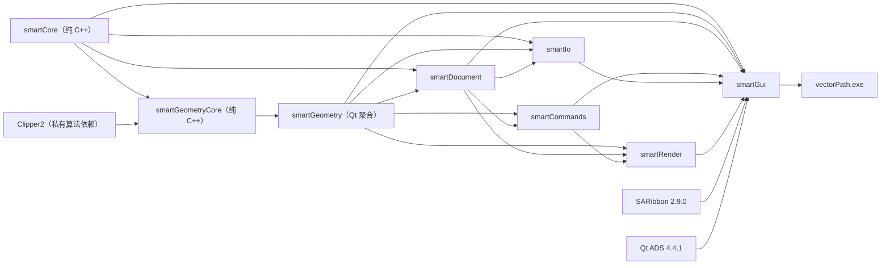
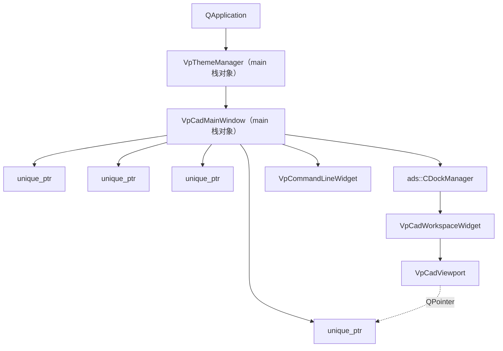
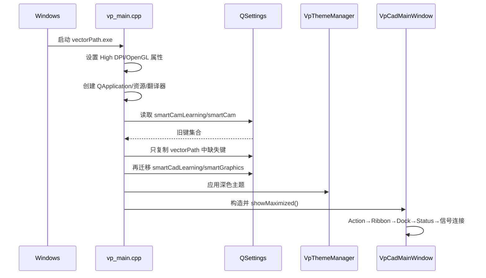
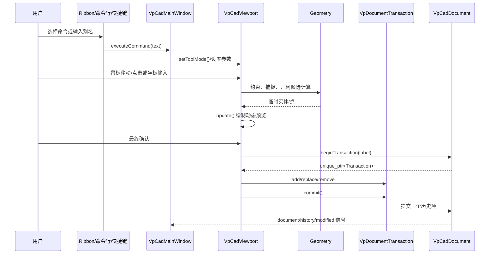
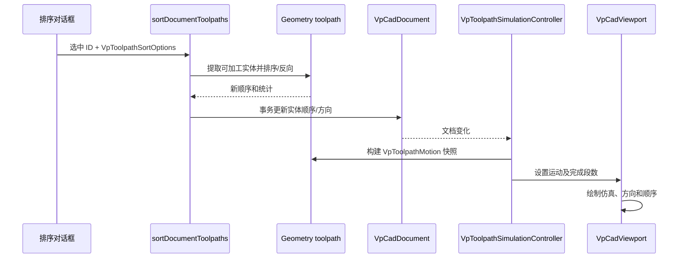

# vectorPath 完整代码架构与文件参考

> 适用版本：`v0.2.0-alpha.1`<br>
> 原始全量核对日期：2026-08-05；核心边界、构建与文件路径更新：2026-09-22；布局/输出证据校正：2026-09-23<br>
> 技术栈：C++17、Qt 5.12.10、CMake、Ninja、QOpenGLWidget、QPainter<br>
> 读者：项目维护者、功能开发者、测试人员、代码评审者和需要系统理解项目的学习者

## 0. 如何阅读本文

本文是 vectorPath 的单文件“总—分—附录”代码参考。它先说明整个系统如何分层和协作，
再逐模块登记每个自研文件及主要类型，随后展开关键运行链路、位图矢量化、测试、构建和
发布，最后提供文件、类型、功能证据、兼容标识和变更影响索引。

本文描述当前源码，不把规划、占位按钮或只有声明的接口写成已完成功能。发生冲突时按以下
顺序判断事实：

1. 当前源码和 `CMakeLists.txt`；
2. 可执行自动测试；
3. `vp_autocad_gap_matrix.yaml` 与 `vp_smartcad_feature_inventory.yaml`；
4. 本文和其他说明文档；
5. 历史 Changelog、路线图和历史测量摘要。

历史名称 `smartCad`、`smartCam`、`SMARTCAD_*`、`SMARTCAM_*` 可能承担文件、设置、资源、
布局或构建兼容责任。本文会明确标注这类标识，不能仅凭品牌变化机械删除。

---

# 第一部分：项目全局总览

## 1. 项目定位、范围与约束

vectorPath 是 Windows 二维 CAD/CAM 学习与技术展示项目。它覆盖二维实体、交互式绘图和
修改、图层与样式、文档事务、撤销重做、恢复审计、多格式 IO、精确颜色位图矢量化、刀路
排序与仿真，以及 Windows 多架构构建和部署。

当前明确边界：

- `ACAD.3D.MODEL`、`ACAD.3D.EDIT`、`ACAD.3D.VISUALIZE` 保持 `out_of_scope`；
- 不是完整 AutoCAD 数据库或完整 DWG 兼容实现；
- 实体主要由 QPainter 绘制，不是完整 GPU/VBO 批渲染管线；
- `VpCadDocument` 不是线程安全对象；
- 位图算法内部并行不等于界面异步；
- DWG 通过同步 LibreDWG 子进程转换，默认最长等待 120 秒；
- DXF 导入还不是完整原子操作；
- 当前只有模型视图，没有图纸空间/布局视口；输出只保留 CTB/STB 样式管理，页面设置、打印和 PDF 发布未实现；
- 撤销历史没有内存预算，保存点只使用 modified 布尔值；
- 项目采用 source-available 许可，不能直接称为 OSI 开源软件。

自研 `.h/.cpp` 每个最多 800 个物理行，约 700 行应提前按职责拆分；左大括号另起一行；
自研目录使用 `sgraph` 前缀，新文件使用 `vp_` 前缀。

## 2. 仓库总目录关系

```text
vectorPath/
├─ sgraphApp/              进程入口、翻译和应用启动
├─ sgraphCore/             纯 C++ 结果类型与 ID 集合辅助函数
├─ sgraphGeometry/         纯几何/辅助绘图核心与 Qt 桌面几何适配
├─ sgraphDocument/         文档、事务、历史、样式、持久化、恢复
├─ sgraphCommands/         命令目录、别名和坐标解析
├─ sgraphIo/               DXF/DWG/SVG/位图编解码与兼容报告
├─ sgraphRender/           视口、绘制、捕捉、选择和交互状态
├─ sgraphGui/              主窗口、Ribbon、停靠面板、对话框、主题
├─ sgraphTests/            纯核心与 Qt 单元、集成测试
├─ sgraphVectorBenchmark/  位图基准、正确性验证和报告
├─ sgraphBuildTools/       一个入口选择应用、核心、测试和性能基准
├─ sgraphThirdParty/       SARibbon、Qt ADS、Clipper2、LibreDWG 等
├─ sgraphDocs/             用户、开发、测试和功能证据文档
├─ .github/                CI、Issue 和 PR 模板
├─ build/                  本机构建输出，不进入仓库
└─ dist/                   本地发布资产，不进入仓库
```

## 3. CMake target 与编译期依赖

根工程名为 `vectorPath`，CMake 版本为 `0.2.0`，C++ 标准为 C++17。主 target 是
`vectorPath`，输出 `vectorPath.exe`。内部库 target 保留 `smartCore`、`smartGeometry` 等
历史风格名称，它们是构建实现细节。



图中箭头由被依赖目标指向使用者。`smartGeometryCore` 仅编译一份纯算法，桌面聚合 PUBLIC
链接复用；辅助绘图状态由纯核心编译，Qt 点/文本适配由桌面聚合编译，核心不包含 Qt 适配头。

`VECTORPATH_BUILD_DESKTOP` 默认 `ON`；关闭后不查找 Qt，只构建 Core、GeometryCore 和
Clipper2。测试和性能基准默认关闭，按需启用；纯核心测试不加载 Qt。文本与颜色实体、
Document、命令以及完整编辑交互仍依赖 Qt，原重构计划尚未全部完成。

基础层不应依赖 GUI；Geometry 不持有文档；Document 不依赖视口；IO 通过文档公开接口或
中间值结构工作。当前 `VpCadViewport` 和 `VpCadMainWindow` 在运行时仍承担较多命令编排，
这是已知职责集中点，不应通过增加反向编译依赖继续扩大。

## 4. 功能与模块映射

| 功能 | 入口/编排 | 核心实现 | 状态所有者 | 持久化/测试 |
| --- | --- | --- | --- | --- |
| 应用启动 | `sgraphApp/vp_main.cpp` | Qt 属性、翻译、主题 | `QApplication`、主窗口 | 设置迁移测试 |
| 绘图与编辑 | Ribbon/命令行/视口事件 | Geometry + Render | `VpCadViewport` 临时状态、Document 最终状态 | 视口/几何测试 |
| 文档事务 | GUI/Render 确认操作 | `VpDocumentTransaction` | `VpCadDocument` | 文档测试 |
| 撤销重做 | 主窗口 Action | `VpCadDocument` 历史栈 | Document | 文档/功能测试 |
| 图层与样式 | 停靠面板/对话框 | Document 分拆实现 | Document | 图层、标注测试 |
| 原生文件 | 打开/保存命令 | Document 二进制 IO | Document | 文档/恢复测试 |
| DXF | 文件菜单 | `VpDxfCodec` 及分拆读写器 | 临时解析数据、Document | DWG/DXF 间接测试 |
| DWG | 文件菜单 | `VpDwgCodec` + LibreDWG + DXF | 子进程、临时目录 | DWG codec 测试 |
| SVG | 文件菜单/导入对话框 | SVG Parser + Vector Import | 中间矢量数据、Document | SVG 导入测试 |
| 位图 | `VpVectorImportDialog` | `bitmapToVectorResult()` | QImage、中间轮廓、Document | SVG/位图测试、基准 |
| 刀路 | 排序对话框/仿真控制器 | Geometry + Document + Render | Document、仿真控制器 | 刀路测试 |
| 主题图标 | 主题设置/Action | Design System | `VpThemeManager` | UI/人工视觉验收 |
| 构建发布 | Python 入口 | CMake/Ninja/windeployqt | build/dist | CTest、manifest/hash |

## 5. 运行时对象所有权



Qt 父子对象树负责大部分 QWidget 生命周期；主窗口用 `unique_ptr` 明确拥有非直接父子管理的
核心对象。视口用 `QPointer<VpCadDocument>` 观察文档，文档销毁后指针自动置空。事务用
`unique_ptr<VpDocumentTransaction>` 返回，只有显式 `commit()` 才生效。

## 6. 线程、进程和状态边界

| 对象/任务 | 执行位置 | 约束 |
| --- | --- | --- |
| QWidget、主窗口、视口 | GUI 线程 | 不得从后台线程调用 QWidget API |
| `VpCadDocument` | 创建它的 GUI 线程 | 非线程安全；后台任务不得直接修改 |
| 位图逐行提取/相邻行连接 | 局部 `QThreadPool` | 只写固定分片；汇合后串行编号和归并 |
| 位图 ID/并查集/闭环/SVG | 调用线程 | 当前 GUI 调用时可能阻塞界面 |
| LibreDWG | `QProcess` 子进程 | 同步等待；失败、超时和输出需转为兼容报告 |
| 恢复副本 | GUI/文档流程 | 不改变当前文件路径和 modified 状态 |

异步化应采用“GUI 线程生成不可变快照 → 后台纯计算/进程 → 携带任务代次返回 → GUI 线程
检查文档和取消状态 → 单事务提交”。禁止让后台线程持有并修改文档裸指针。

---

# 第二部分：生产模块逐文件与逐类型详解

## 7. `sgraphApp`：应用进程入口

### 7.1 模块职责和依赖

`sgraphApp` 只负责组装应用，不承载 CAD 业务。它依赖 `smartGui` 和 Qt Core/Gui/Widgets，
创建 QApplication、翻译器、主题管理器和主窗口，并进入事件循环。

### 7.2 文件清单

| 文件 | 类型/入口 | 作用、关系与边界 |
| --- | --- | --- |
| `sgraphApp/CMakeLists.txt` | `vectorPath` target | 声明主程序源文件和 `smartGui` 依赖；构建后复制翻译、Qt ADS、LibreDWG，并调用 windeployqt。 |
| `sgraphApp/vp_main.cpp` | `main()` | 设置高 DPI/OpenGL 属性，创建 QApplication，迁移设置，安装翻译，应用主题，最大化主窗口并进入事件循环。 |
| `sgraphApp/vp_chinese_ui_translator.h` | `VpChineseUiTranslator` | 项目内中文 UI 翻译器接口，继承 QTranslator。 |
| `sgraphApp/vp_chinese_ui_translator.cpp` | 翻译实现 | 根据上下文和源字符串返回中文文本；由 `main()` 安装到 QApplication。 |

### 7.3 `VpChineseUiTranslator`

- **职责**：为第三方或项目中未使用 `.qm` 覆盖的固定 UI 字符串提供运行时中文映射。
- **所有权**：`main()` 栈对象；安装到 QApplication 后在事件循环期间保持存活。
- **接口**：重写 `translate()`；输入上下文、源文本、消歧文本和复数参数，返回翻译文本。
- **失败边界**：无匹配时返回空字符串，让 Qt 继续使用源文本；不得持有窗口或文档状态。

### 7.4 启动顺序

1. 在 QApplication 构造前启用高 DPI、高 DPI pixmap 和共享 OpenGL 上下文；
2. 请求 OpenGL 3.3 Core Profile、4 倍采样；
3. 创建 QApplication 并初始化 `vp_gui_resources`；
4. 将旧设置中缺失键迁移到 `vectorPathLearning/vectorPath`；
5. 设置组织名、应用名和 `0.2.0-alpha.1` 运行版本；
6. 安装 Qt 中文翻译和 `VpChineseUiTranslator`；
7. 创建并应用 `VpThemeManager` 深色主题；
8. 创建 `VpCadMainWindow`，最大化显示并进入事件循环。

OpenGL 3.3 请求只描述上下文配置，不代表实体使用现代 OpenGL 管线绘制。

## 8. 基础核心与边界适配

### 8.1 `sgraphCore` 文件清单

| 文件 | 类型/入口 | 作用、关系与边界 |
| --- | --- | --- |
| `sgraphCore/CMakeLists.txt` | `smartCore` | C++17 INTERFACE 目标；只有标准库头文件，不链接 Qt。 |
| `sgraphCore/vp_result.h` | `VpResult<T>`、`VpResult<void>` | 成功值或 UTF-16 错误文本；可附加保留原生编码的异常诊断字节。 |
| `sgraphCore/vp_id_collection.h` | ID 集合辅助函数 | 按 ID 筛选和稳定删除记录，避免复制完整实体负载。 |

### 8.2 `VpResult<T>` 与 `VpResult<void>`

- **创建**：通过 `success()`、`failure()` 或 `failureWithNativeDetail()`，构造函数私有。
- **检查**：`isSuccess()` 和显式 `operator bool()`；调用方应先检查再读取值。
- **读取**：`value()` 返回可变或只读引用；`errorMessage()` 返回 `std::u16string`。
- **异常诊断**：`nativeErrorDetail()` 返回未解码的 `std::string`；纯核心保留原生库字节，
  桌面通过 `toQtError()` 使用原有 `QString::fromLocal8Bit` 语义附加显示。
- **不变量**：成功状态携带有效值；失败状态携带错误文本，但实现未强制错误文本非空。
- **限制**：`failure()` 会构造 `TValue{}`，所以 T 必须可默认构造；失败状态调用 `value()`
  没有断言、异常或类型保护；错误没有稳定错误码和嵌套原因。
- **使用者**：纯布尔运算及现有原生 IO、DXF/DWG、SVG、位图、填充和二进制读取。

### 8.3 Qt 基础适配与设置迁移

Qt 适配不再建立独立目录或目标；点、文本和错误显示编入现有 `smartGeometry` 的桌面源列表，
设置迁移归入 `smartGui`，都不进入 `smartCore` 或 `smartGeometryCore`。

| 文件 | 类型/入口 | 作用、关系与边界 |
| --- | --- | --- |
| `sgraphGeometry/vp_qt_text.h` | `toCoreText()`、`toQtText()`、`toQtError()` | 保留 UTF-16 代码单元的转换及本地编码异常显示，仅桌面使用。 |
| `sgraphGeometry/vp_qt_geometry.h` | `toQtPoint()`、`toCorePoint()`、`formatPoint()` | QPointF 边界转换及坐标显示接口，纯点头不包含此头。 |
| `sgraphGeometry/vp_qt_geometry.cpp` | Qt 几何适配实现 | 编入桌面 `smartGeometry`，保留点坐标和原有格式精度。 |
| `sgraphGui/vp_application_settings_migration.h` | `migrateMissingApplicationSettings()` | 声明 QSettings 缺失键迁移函数，应用与桌面测试调用。 |
| `sgraphGui/vp_application_settings_migration.cpp` | 设置迁移实现 | 编入 `smartGui`；同步两端设置，只复制新位置不存在的旧键，错误返回 `-1`。 |

设置迁移先 `sync()` 两端 QSettings，再复制缺失键并计数；保留原有策略，不覆盖用户已建立
的新设置。Document 不依赖设置迁移，因此此次归入 Gui 不增加文档到界面的反向依赖。

### 8.4 纯辅助绘图状态

| 文件 | 类型/入口 | 作用、关系与边界 |
| --- | --- | --- |
| `sgraphGeometry/vp_drafting_state.h` | `VpDraftingState`、`VpGridBasis` | 栅格基、间距/旋转、正交、追踪点状态及约束接口。 |
| `sgraphGeometry/vp_drafting_state.cpp` | 辅助绘图实现 | 编入 `smartGeometryCore`，接收世界坐标和显式容差，不访问 QWidget 或文档。 |

视口直接包含纯状态头，负责屏幕转换、事件转发、渲染和文档集成。工具切换、选择、夹点、
完整动态预览与事务交互仍未全部迁移；这次只收拢文件归属，不撤销已建立的纯 C++ 边界。

## 9. `sgraphGeometry`：几何与绘图基础

### 9.1 模块职责和依赖

`smartGeometryCore` PUBLIC 依赖 `smartCore`，PRIVATE 依赖 Clipper2；其点、曲线、标准
形状、布尔、多边形和辅助绘图状态接口不包含 Qt。`smartGeometry` PUBLIC 链接核心及 Qt
Core/Gui，包含文本与颜色实体、标注、填充完整检查、刀路及 Qt 点/文本适配；两个目标通过
显式源列表保持边界，桌面与独立核心使用相同曲线类型和算法。

禁止在 Geometry 中弹对话框、读写 QSettings、发文档信号或直接修改 `VpCadDocument`。

### 9.2 文件清单

| 文件 | 类型/关键函数 | 作用、关系与边界 |
| --- | --- | --- |
| `sgraphGeometry/CMakeLists.txt` | `smartGeometryCore`、`smartGeometry` | 前者始终构建且无 Qt；后者仅桌面构建并复用核心。 |
| `sgraphGeometry/vp_geometry_types.h` | `VpPoint2d`、`distance()` | 不包含 Qt 的二维点和距离接口；Qt 转换与显示移至适配器。 |
| `sgraphGeometry/vp_geometry_types.cpp` | 基础几何实现 | 实现距离，不持有全局状态。 |
| `sgraphGeometry/vp_curve_entities.h` | 六种纯曲线实体 | 唯一定义 Line/Circle/Arc/Polyline/Spline/Ellipse；桌面实体聚合引入并共用。 |
| `sgraphGeometry/vp_entity.h` | 实体枚举与值结构 | 引入纯曲线结构，定义含 QString/QColor 的其余实体及 `VpEntityRecord`、关联阵列和稳定 ID。 |
| `sgraphGeometry/vp_dimension_geometry.h` | 尺寸计算接口 | 测量值、显示文本、参考点和有效性检查。 |
| `sgraphGeometry/vp_dimension_geometry.cpp` | 尺寸计算实现 | 按尺寸类型计算线性/角度/半径等测量，不绘制 UI。 |
| `sgraphGeometry/vp_ellipse_geometry.h` | 椭圆接口 | 椭圆有效性、参数点和离散近似。 |
| `sgraphGeometry/vp_ellipse_geometry.cpp` | 椭圆实现 | 将中心、长短轴和参数区间转换为点列，供绘制、命中和导出使用。 |
| `sgraphGeometry/vp_hatch_geometry.h` | 填充检查接口 | 引入纯多边形接口，并声明仍依赖 Qt 填充实体的有效性检查。 |
| `sgraphGeometry/vp_hatch_geometry.cpp` | 填充检查实现 | 调用纯多边形算法，并检查图案文本和颜色有效性；暂留桌面聚合。 |
| `sgraphGeometry/vp_polygon_geometry.h` | 多边形接口 | 不依赖 Qt 的点包含判断和环面积接口。 |
| `sgraphGeometry/vp_polygon_geometry.cpp` | 多边形实现 | 共用原填充基础算法，保留方向、容差及边界行为。 |
| `sgraphGeometry/vp_polygon_boolean.h` | `VpPolygonBooleanOperation` | 定义 Union/Intersection/Difference/Xor 等布尔操作入口。 |
| `sgraphGeometry/vp_polygon_boolean.cpp` | Clipper2 适配 | 在项目点列与 Clipper2 路径之间转换，执行整数缩放、布尔计算和结果还原。 |
| `sgraphGeometry/vp_spline_geometry.h` | 样条求值接口 | 三次样条点、切向、离散近似和近似长度。 |
| `sgraphGeometry/vp_spline_geometry.cpp` | 样条实现 | 对 `VpSplineEntity` 四控制点执行三次 Bézier 等价求值。 |
| `sgraphGeometry/vp_standard_shape.h` | `VpStandardShapeType` | 标准三角形、多边形、星形等形状枚举和生成接口。 |
| `sgraphGeometry/vp_standard_shape.cpp` | 标准形状实现 | 根据中心/半径/方向生成确定性顶点序列。 |
| `sgraphGeometry/vp_toolpath.h` | 刀路类型和函数 | 可加工实体判断、起终点、反转、排序选项、运动段结构。 |
| `sgraphGeometry/vp_toolpath.cpp` | 刀路算法 | 排序候选、方向反转和运动序列计算；因依赖含 Qt 的实体记录暂留桌面聚合。 |

### 9.3 基础类型与实体模型

#### `VpPoint2d`

二维 double 坐标值。它是世界坐标、实体几何、捕捉结果、刀路运动和 SVG/DXF 中间数据的
共同语言。比较和算术应注意浮点容差；不应把屏幕像素直接存入该类型后混作世界坐标。
原 `toPointF()` / `fromPointF()` 成员已移除；Qt 调用方显式使用适配层的
`toQtPoint()` / `toCorePoint()`，`formatPoint()` 也位于适配层。

#### 实体枚举

| 类型 | 作用 |
| --- | --- |
| `VpEntityType` | 区分 Line、Circle、Arc、Polyline、Text、Dimension、Hatch、Spline、Ellipse、MText、Leader 等实体。序列化数值需要兼容。 |
| `VpTextHorizontalAlignment` | 左、中、右等文字水平对齐。 |
| `VpTextVerticalAlignment` | 基线、中部、顶部等垂直对齐。 |
| `VpDimensionType` | 线性、对齐、角度、半径、直径、弧长和坐标尺寸。 |
| `VpHatchFillType` | 实体填充或图案类填充模式。 |
| `VpArrayType` | 矩形、极轴、路径等关联阵列类型。 |

这些枚举进入原生文件或外部格式映射时必须维持旧数值语义；添加成员需要检查版本门槛、默认
分支、渲染、属性 UI、DXF/DWG 和测试。

#### 实体几何结构

| 结构 | 核心状态 | 主要使用者 |
| --- | --- | --- |
| `VpLineEntity` | 起点、终点 | 绘制、捕捉、修剪、刀路 |
| `VpCircleEntity` | 圆心、半径 | 圆构造、捕捉、偏移、DXF |
| `VpArcEntity` | 圆心、半径、起止角及方向信息 | 圆弧构造、修剪、尺寸、IO |
| `VpPolylineEntity` | 顶点、闭合、bulge、起止宽度 | 多段线编辑、填充、刀路、DXF |
| `VpTextEntity` | 位置、文本、高度、旋转和对齐 | 标注绘制、样式、IO |
| `VpMTextEntity` | 位置、富文本、宽度、高度、旋转 | 多行文字和外部格式降级 |
| `VpLeaderEntity` | 引线点列、文字、文字高度、箭头尺寸 | 注释绘制和 IO |
| `VpLinearDimensionEntity` | 定义点、尺寸线点、类型和样式字段 | 尺寸计算、绘制、持久化 |
| `VpHatchEntity` | 外环/内环、填充类型、颜色和图案参数 | 填充验证、绘制、DXF/SVG |
| `VpSplineEntity` | 四个控制点 | 求值、编辑、近似和渲染 |
| `VpEllipseEntity` | 中心、长短轴、参数范围 | 椭圆构造、近似、渲染、DXF |
| `VpAssociativeArrayData` | 阵列类型、行列/角度/路径参数和源关联 | 阵列编辑、持久化、展开兼容 |

#### `VpEntityRecord`

`VpEntityRecord` 是文档实体的聚合记录：稳定 `VpEntityId`、`VpEntityType`、具体
`VpEntityGeometry` 变体、图层名、颜色/线宽等显示属性及可选关联阵列数据。Document 存储
记录，Render 读取并生成显示，IO 映射它，事务通过添加、替换、删除记录形成历史。

不变量：`type` 必须与 geometry 变体匹配；实体 ID 在活动文档中唯一；图层名应能解析；几何
参数应通过对应有效性检查。审计器负责发现部分不一致，但创建路径应主动保证不变量。

### 9.4 专用算法类型

- `VpPolygonBooleanOperation`：布尔运算选择；输入需是可转换的闭合多边形。
- `VpStandardShapeType`：将 UI 形状命令映射为确定性顶点模板。
- `VpToolpathHorizontalDirection` / `VpToolpathVerticalDirection`：规定扫描或排序偏好。
- `VpToolpathSortMode`：选择排序策略。
- `VpToolpathSortOptions`：组合排序范围、方向、反转允许等参数。
- `VpToolpathSortResult`：返回排序后的实体及统计。
- `VpToolpathMotionType` / `VpToolpathMotion`：区分快移、加工等运动，携带起终点和实体关联。

### 9.5 测试与技术债

Geometry 主要由标准形状、布尔运算、椭圆、曲线构造、偏移、圆角、样条和刀路测试覆盖。
当前多类曲线仍通过固定段数近似完成显示、长度或外部格式转换；误差与缩放相关。布尔运算的
整数缩放和容差需要在极大/极小坐标场景继续验证。

## 10. `sgraphDocument`：文档、事务、历史和持久化

### 10.1 模块职责和所有权

Document 依赖 Core 和 Geometry，是业务状态的唯一权威来源。`VpCadDocument` 拥有实体、
图层、样式、绘图设置、文件路径和历史；GUI/Render 不应维护另一份可提交的实体真相。

`VpCadDocument` 继承 QObject 并发出状态信号，但不是线程安全容器。正常情况下由
`VpCadMainWindow` 独占创建并在 GUI 线程使用。

### 10.2 文件清单

| 文件 | 类型/关键函数 | 作用、关系与边界 |
| --- | --- | --- |
| `sgraphDocument/CMakeLists.txt` | `smartDocument` | 汇集文档、IO 分拆和恢复代码，链接 Core、Geometry、Qt Core/Gui。 |
| `sgraphDocument/vp_cad_document.h` | `VpCadDocument` | 文档公开 API、信号、历史项和全部权威状态定义。 |
| `sgraphDocument/vp_cad_document.cpp` | 文档基础实现 | 构造、实体/图层访问、事务创建、清空、ID 分配和公共状态发射。 |
| `sgraphDocument/vp_cad_document_history.cpp` | 历史实现 | 压入历史项、撤销、重做，以及实体/图层/设置前后状态恢复。 |
| `sgraphDocument/vp_cad_document_io.cpp` | 原生文件实现 | 版本 24 二进制保存、加载、恢复；使用 QSaveFile 和版本分支。 |
| `sgraphDocument/vp_cad_document_audit.cpp` | 文档审计实现 | 扫描 ID、图层、几何和样式异常，可选择修复并报告严重度。 |
| `sgraphDocument/vp_cad_document_color_layer.cpp` | 颜色图层工作流 | 按颜色创建/分配图层、合并同色图层及相关事务。 |
| `sgraphDocument/vp_cad_document_layer_state.cpp` | 图层状态 | 保存、恢复、删除命名图层状态。 |
| `sgraphDocument/vp_cad_document_text_style.cpp` | 文字样式 | 添加更新、删除、切换当前文字样式并纳入历史。 |
| `sgraphDocument/vp_cad_document_dimension_style.cpp` | 尺寸样式 | 管理尺寸样式和当前样式，并发出对应信号。 |
| `sgraphDocument/vp_document_transaction.h` | `VpDocumentTransaction` | 声明所有实体创建、替换、删除、图层和绘图设置事务操作。 |
| `sgraphDocument/vp_document_transaction.cpp` | 事务实现 | 暂存变更，显式 commit 后交给文档形成单个历史项；析构不自动提交。 |
| `sgraphDocument/vp_entity_binary_io.h` | 实体二进制接口 | 单个 `VpEntityRecord` 的写入和按版本读取。 |
| `sgraphDocument/vp_entity_binary_io.cpp` | 实体二进制实现 | 映射实体枚举与 geometry 变体，处理版本 2–24 字段演进。 |
| `sgraphDocument/vp_dimension_binary_io.h` | 尺寸二进制接口 | 尺寸字段读写。 |
| `sgraphDocument/vp_dimension_binary_io.cpp` | 尺寸二进制实现 | 按格式版本恢复尺寸类型、参考点和样式相关字段。 |
| `sgraphDocument/vp_hatch_binary_io.h` | Hatch 二进制接口 | 填充边界和参数读写。 |
| `sgraphDocument/vp_hatch_binary_io.cpp` | Hatch 二进制实现 | 处理外环、内环和版本 20 后字段。 |
| `sgraphDocument/vp_associative_array_io.h` | 阵列二进制接口 | 关联阵列参数的读写与版本适配。 |
| `sgraphDocument/vp_associative_array_io.cpp` | 阵列二进制实现 | 序列化阵列类型、行列、角度、路径等数据。 |
| `sgraphDocument/vp_document_style_io.h` | `VpLoadedDocumentStyles` | 文字/尺寸样式集合的读写接口和读取结果容器。 |
| `sgraphDocument/vp_document_style_io.cpp` | 样式二进制实现 | 按版本 17/19 等门槛读取旧文件默认样式或新样式表。 |
| `sgraphDocument/vp_drawing_settings.h` | `VpDrawingSettings` 等 | 插入单位、角度格式、精度、格式化和合法性接口。 |
| `sgraphDocument/vp_drawing_settings.cpp` | 绘图设置实现 | 单位键映射、数值格式化和参数验证。 |
| `sgraphDocument/vp_layer_record.h` | `VpLayerRecord`、`VpLayerStateRecord` | 图层属性和命名状态快照值结构。 |
| `sgraphDocument/vp_text_style_record.h` | `VpTextStyleRecord` | 字体、字高等文字样式值结构。 |
| `sgraphDocument/vp_dimension_style_record.h` | `VpDimensionStyleRecord` | 尺寸文字、箭头、精度等样式值结构。 |
| `sgraphDocument/vp_document_audit.h` | 审计类型 | 严重度、问题和报告结构；供 Document 和 GUI 展示。 |
| `sgraphDocument/vp_document_recovery_manager.h` | `VpRecoveryEntry`、`VpDocumentRecoveryManager` | 恢复目录、候选条目、定时副本和清理接口。 |
| `sgraphDocument/vp_document_recovery_manager.cpp` | 恢复实现 | 生成 `.vectorpath.sv$`，扫描/保存/删除恢复候选。 |
| `sgraphDocument/vp_plot_style_table.h` | `VpPlotStyleTable` 等 | STB/CTB 类打印样式记录、加载和查询接口。 |
| `sgraphDocument/vp_plot_style_table.cpp` | 打印样式基础实现 | 解压解析 CTB/STB，提供颜色/线宽映射辅助及旧名称兼容；不实现页面设置或打印导出。 |
| `sgraphDocument/vp_toolpath_document.h` | `VpToolpathDocumentSortResult` | 将纯刀路排序应用到文档的接口。 |
| `sgraphDocument/vp_toolpath_document.cpp` | 刀路提交实现 | 选取实体、调用 Geometry 排序并通过事务写回实体顺序/方向。 |

### 10.3 `VpCadDocument`

#### 状态与不变量

| 状态 | 含义与不变量 |
| --- | --- |
| `m_entities` | 活动实体记录；ID 应唯一，类型与 geometry 变体一致。 |
| `m_layers` | 至少存在 `0` 层；Defpoints 按需建立；当前图层必须可解析。 |
| `m_layer_states` | 命名图层快照，不是独立文档。 |
| `m_text_styles` / `m_dimension_styles` | 至少有 Standard 默认样式；当前名应存在。 |
| `m_drawing_settings` | 单位、角度格式和精度必须通过合法性检查。 |
| `m_undo_stack` / `m_redo_stack` | 每个条目代表一次显式事务或文档级属性改变。 |
| `m_next_entity_id` / `m_next_layer_id` | 单调分配，加载后必须大于已有最大 ID。 |
| `m_file_path` | 空表示未命名；恢复时重新指向原始目标。 |
| `m_is_modified` | 表示当前需保存，但不是精确历史保存点。 |

#### 公共接口组

- **只读查询**：`entities()`、`filePath()`、`displayName()`、`isModified()`、
  `canUndo()`、`canRedo()`、绘图设置、图层和样式查询。
- **图层操作**：创建、删除、重命名、合并、隔离、锁定、冻结、显示、打印、颜色、线宽、
  线型、透明度和命名状态。
- **样式操作**：添加更新、删除和切换文字/尺寸样式。
- **事务入口**：`beginTransaction(label)` 返回独占事务。
- **文件操作**：`save()`、`saveRecoveryCopy()`、`load()`、`recover()`。
- **维护操作**：`audit(repair)`、`clear()`、`undo()`、`redo()`。

#### 信号

`documentChanged` 驱动视口和属性 UI 更新；`filePathChanged` 与 `modifiedChanged` 驱动窗口标题；
`historyChanged` 更新撤销/重做 Action；图层、绘图设置、文字样式、尺寸样式均有专门信号，
避免所有面板只依赖宽泛刷新。

#### 所有权和线程

主窗口拥有文档。视口和管理器观察它，事务持有引用但生命周期短于文档。所有公开修改函数应
在文档线程调用；后台工作先生成值结果，再回 GUI 线程提交。

### 10.4 `VpDocumentTransaction`

事务构造时引用文档并记录标签。`addLine()`、`addCircle()`、`addArc()`、`addEllipse()`、
`addSpline()`、`addPolyline()`、文字/尺寸/Hatch 等便利函数最终建立 `VpEntityRecord`；
`addEntity()`/`addEntityCopy()` 支持通用和导入场景；`replaceEntity()`、`removeEntity()`、
图层/线宽/绘图设置/实体顺序操作暂存旧新状态。

`commit()` 把暂存实体、删除记录、图层、设置和顺序交给文档，文档压入一个历史项并清空重做
栈。析构函数不会自动提交；未提交事务应没有文档副作用。`m_is_committed` 防止重复提交。

重要规则：动态预览不能使用已提交事务；最终确认时才创建/提交。一个用户动作应尽量对应一个
事务，避免撤销被拆成多个无法理解的步骤。

### 10.5 历史条目和撤销重做

私有 `VpHistoryEntry` 可记录添加/删除实体，以及图层、当前图层、绘图设置、文字样式、尺寸
样式、实体顺序的前后状态。撤销按反方向恢复，重做按正方向重放。新的提交会清空重做栈。

当前没有历史条目数量或字节预算；大型导入、阵列和位图实体可能让内存增长。modified 只是
布尔值，撤销回保存时刻也不一定自动变为未修改，这是后续保存点模型需要解决的问题。

### 10.6 原生格式

`vp_cad_document_io.cpp` 的兼容常量：

- magic：8 字节 `SMCAD001`；
- 当前格式版本：24；
- 字节序：Little Endian；
- QDataStream 版本：Qt 5.12；
- manifest 上限：1 MiB；
- manifest `application` 仍写 `smartCad`，属于兼容字段；
- 新默认扩展名 `.vectorpath`，兼容 `.smartcam`、`.smartcad`。

保存使用 `QSaveFile`，只有 stream 状态正常且 `commit()` 成功才替换目标。加载先验证 magic 和
manifest，再按格式版本读取图层、状态、样式、实体和关联数据。修改字段顺序、枚举数值、magic
或 manifest 必须增加版本门槛和旧文件回归测试。

### 10.7 恢复、审计、样式和刀路

- `VpDocumentRecoveryManager` 保存恢复副本时不更新文档路径/modified；条目包含原文件、恢复
  文件和时间信息，由 GUI 恢复管理器展示。
- `VpDocumentAuditReport` 聚合问题和修复统计；审计修复本身可能改变文档，应更新信号和状态。
- `VpPlotStyleTable` 管理打印颜色/线宽等映射，旧文件名别名承担持久化兼容。
- `sortDocumentToolpaths()` 把 Geometry 的排序结果通过文档事务提交，返回排序和反转数量。

### 10.8 测试与技术债

文档、设置迁移、恢复、审计、DWG、标注、尺寸、填充、图层颜色、刀路和 SVG 导入测试覆盖
主要路径。重点技术债是历史内存预算、保存点模型、DXF 导入原子性和更严格的实体不变量验证。

## 11. `sgraphCommands`：命令目录和坐标输入

### 11.1 文件清单

| 文件 | 类型/关键函数 | 作用、关系与边界 |
| --- | --- | --- |
| `sgraphCommands/CMakeLists.txt` | `smartCommands` | 链接 Geometry、Document 和 Qt Core，向 Render/GUI 提供命令基础。 |
| `sgraphCommands/vp_coordinate_input.h` | `VpCoordinateInputMode`、`VpCoordinateInput` | 坐标输入结果、模式和解析接口。 |
| `sgraphCommands/vp_coordinate_input.cpp` | `parseCoordinateInput()` | 解析绝对/相对/极坐标文本，返回成功状态或错误。 |
| `sgraphCommands/vp_command_catalog.h` | 命令目录接口 | 返回全部补全项和按前缀匹配的候选。 |
| `sgraphCommands/vp_command_catalog.cpp` | 命令目录数据 | 维护命令及别名集合，为命令行 QCompleter 服务。 |

### 11.2 类型和调用关系

实际命令由 `VpCadMainWindow::executeCommand()` 分发，视口状态机执行交互；模块提供目录、
补全和坐标解析。已删除无人实现或调用的命令接口声明，不再将空接口视为自动化能力证据。

`VpCoordinateInputMode` 区分不同坐标语法；`VpCoordinateInput` 保存解析是否成功、坐标/距离角度
值和错误信息。解析函数只负责语法，不应直接移动光标或写文档。

新增命令需要同步命令目录、别名、Ribbon、快捷键、视口预览、事务、测试和 CAD YAML；只加
补全字符串不代表功能完成。

## 12. `sgraphIo`：外部格式和位图矢量化

### 12.1 模块职责

IO 依赖 Core、Geometry、Document 和 Qt Concurrent。它把外部数据转换为中间值或文档
事务，并通过 `VpFileCompatibilityReport` 暴露警告、跳过和降级。格式错误应返回 `VpResult`，
不能静默留下难以判断的半成品状态。

### 12.2 文件清单

| 文件 | 类型/关键函数 | 作用、关系与边界 |
| --- | --- | --- |
| `sgraphIo/CMakeLists.txt` | `smartIo` | 汇集 DXF/DWG/SVG/位图代码，链接 Qt Concurrent，并注入 LibreDWG 路径常量。 |
| `sgraphIo/vp_i_file_codec.h` | `VpIFileCodec` | 统一格式 ID、名称、扩展名、read/write 接口。 |
| `sgraphIo/vp_file_compatibility_report.h` | `VpFileCompatibilityReport` | 记录读取/写入统计、警告和兼容信息。 |
| `sgraphIo/vp_dxf_codec.h` | `VpDxfCodec` | DXF codec 公共接口。 |
| `sgraphIo/vp_dxf_codec.cpp` | DXF 总控 | 读取 pair、table/entity 段并写入文档；导出组织 HEADER/TABLES/ENTITIES。 |
| `sgraphIo/vp_dxf_pair.h` | `VpDxfPair`、pair 函数 | DXF group code/value 基础记录和查找、读写接口。 |
| `sgraphIo/vp_dxf_pair.cpp` | pair 解析实现 | 按两行一组读取 ASCII DXF，验证 group code 并生成错误文本。 |
| `sgraphIo/vp_dxf_entity_io.h` | 实体 DXF 接口 | 单实体读取/写入和类型分派。 |
| `sgraphIo/vp_dxf_entity_io.cpp` | 实体 DXF 实现 | 映射直线、圆、弧、多段线、文字、尺寸、样条、椭圆等支持子集。 |
| `sgraphIo/vp_dxf_hatch_io.h` | Hatch DXF 接口 | 独立读取/写入复杂 Hatch 组码。 |
| `sgraphIo/vp_dxf_hatch_io.cpp` | Hatch DXF 实现 | 解析边界环和填充字段，失败返回详细错误。 |
| `sgraphIo/vp_dxf_table_io.h` | 图层 table 接口 | 读取图层表和当前图层，写出文档表数据。 |
| `sgraphIo/vp_dxf_table_io.cpp` | table 实现 | 映射图层颜色、可见性、线型等可支持字段。 |
| `sgraphIo/vp_dwg_codec.h` | `VpDwgCodec` | DWG codec、工具可用性和版本查询。 |
| `sgraphIo/vp_dwg_codec.cpp` | DWG 总控 | 调用 LibreDWG 做 DWG↔DXF 转换，使用临时目录和原子目标复制。 |
| `sgraphIo/vp_dwg_dxf_adapter.h` | DWG 中转适配接口 | 为 LibreDWG R2000 DXF 中转准备兼容数据。 |
| `sgraphIo/vp_dwg_dxf_adapter.cpp` | 中转适配实现 | 修正/降级 DXF 内容以满足外部工具，结合文档信息保留可支持字段。 |
| `sgraphIo/vp_svg_vector_data.h` | SVG 中间类型 | 填充规则、轮廓、区域、源尺寸和警告。 |
| `sgraphIo/vp_svg_path_parser.h` | `VpSvgSubpath` | SVG path `d` 属性解析接口和子路径结果。 |
| `sgraphIo/vp_svg_path_parser.cpp` | path 解析实现 | 处理移动、直线、曲线、闭合等命令并转换为点列/闭合标记。 |
| `sgraphIo/vp_svg_parser.h` | `parseSvgVectorData()` | 从 QByteArray 解析完整 SVG 中间数据。 |
| `sgraphIo/vp_svg_parser.cpp` | SVG 文档解析 | 读取元素、变换、样式、颜色、轮廓和区域，收集不支持项警告。 |
| `sgraphIo/vp_svg_document_operations.h` | 填充/去重报告 | 定义颜色图层优先级、填充和去重文档操作。 |
| `sgraphIo/vp_svg_document_operations.cpp` | SVG 文档操作 | 基于图层和几何执行填充、重复实体删除等事务。 |
| `sgraphIo/vp_vector_fill.h` | 导入设置和中间几何 | 缩放、背景、填充模式、颜色实体、Hatch 生成。 |
| `sgraphIo/vp_vector_fill.cpp` | 区域填充实现 | 将 SVG/位图轮廓转为线框或 Hatch，验证孔洞和填充规则。 |
| `sgraphIo/vp_vector_document_import.h` | 文档导入报告 | 把矢量中间结果提交到文档的接口和统计。 |
| `sgraphIo/vp_vector_document_import.cpp` | 导入提交实现 | 建立颜色图层、转换坐标并通过事务添加实体。 |
| `sgraphIo/vp_bitmap_vectorizer.h` | 位图公共类型/API | 设置、阶段指标、轮廓、结果和 SVG 转换入口。 |
| `sgraphIo/vp_bitmap_vectorizer.cpp` | SVG 输出包装 | 规范化轮廓并生成 SVG；`bitmapToSvgData()` 调用核心结果函数。 |
| `sgraphIo/vp_bitmap_vector_private.h` | `VpBoundarySegment`、私有接口 | 边压缩、闭环等跨实现文件共享的内部数据。 |
| `sgraphIo/vp_bitmap_run_vectorizer.cpp` | 游程核心 | 行游程、并行连接、稳定 ID、并查集、边生成、指标和总控。 |
| `sgraphIo/vp_bitmap_contour_stitcher.cpp` | 边压缩/闭环 | 合并共线段，把有向边拼接为闭合、规范化且排序的轮廓。 |

### 12.3 `VpIFileCodec` 与兼容报告

`VpIFileCodec` 的 `id()` 是稳定实现标识，`displayName()` 面向 UI，`extensions()` 用于路由；
`read()`/`write()` 返回 `VpResult<VpFileCompatibilityReport>`。失败表示操作无法完成，成功报告仍
可带警告，表示结果可用但存在降级。调用方必须展示或记录警告，不能只检查布尔成功。

`VpDxfCodec` 与 `VpDwgCodec` 实现接口。原生文件未走该接口，而由 VpCadDocument 自己处理；
SVG/位图先形成专用中间模型，再进入文档导入事务。

### 12.4 DXF 数据流和边界

```text
文件文本 -> VpDxfPair 列表 -> HEADER/TABLES/ENTITIES 分段
        -> 图层/实体专用解析 -> VpEntityRecord/中间对象 -> VpCadDocument
```

写出方向相反。DXF 支持 ASCII 子集；未知组码可以跳过，但未知实体和降级必须进入兼容报告。
当前导入还不是完整“先解析全部、验证全部、一次替换”的原子流程，因此错误路径要检查文档是否
被部分改变。理想演进是先生成独立导入模型，完整验证后用单事务替换。

### 12.5 DWG 数据流和进程边界

`VpDwgCodec::isAvailable()` 要求 `dwgread.exe`、`dwg2dxf.exe`、`dxf2dwg.exe` 同时存在。
默认先查应用目录的 `libredwg`，开发环境可使用编译期 `VECTORPATH_LIBREDWG_DIR`。

导入：DWG → `dwg2dxf --as r2000` → 临时 DXF → `VpDxfCodec::read()`。<br>
导出：Document → DXF → R2000 适配 → `dxf2dwg` → 临时 DWG → QSaveFile 原子复制。

QProcess 启动上限 10 秒，默认完成上限 120 秒；超时后 kill 并等待 5 秒。外部 stderr 截断后
进入报告。32 位主程序是真实 x86，但 LibreDWG 是独立 x64 工具，所以完整 DWG 能力要求
64 位 Windows。代理对象、布局、富文本、关联阵列和未映射字段可能降级或展开。

### 12.6 SVG 中间模型

- `VpVectorFillRule` 表示 EvenOdd/NonZero；
- `VpVectorOutline` 保存点列、闭合和颜色；
- `VpVectorRegion` 保存多个轮廓、颜色和填充规则；
- `VpSvgVectorData` 汇总轮廓、区域、源尺寸和警告；
- `VpSvgSubpath` 是 path 解析阶段的子路径。

解析器把 SVG 元素和 path 命令转为上述中间值；导入设置决定缩放、填充或轮廓方式；
`importVectorGeometry()` 类流程最终创建颜色图层并提交文档。滤镜、脚本、动画、复杂 CSS 和
部分高级特性不属于完整支持范围。

### 12.7 位图公共类型

| 类型 | 作用 |
| --- | --- |
| `VpBitmapVectorSettings` | 是否忽略背景、背景色和 worker 数；0 表示自动。 |
| `VpBitmapVectorMetrics` | 像素、游程、组件、段、轮廓、各阶段耗时、内存估算、SVG 字节和线程数。 |
| `VpBitmapContour` | 颜色、稳定色块 ID 和闭合点列。 |
| `VpBitmapVectorResult` | SVG 字节、规范轮廓和指标。 |
| `VpBoundarySegment` | 内部有向边，记录起终点、颜色、所属游程和组件。 |

核心失败场景包括空图、全背景无前景、边压缩异常和闭环失败。成功输出必须满足轮廓闭合、颜色
保留、组件数一致和确定性排序。

### 12.8 测试与技术债

DXF/DWG、SVG、位图由 codec、SVG 导入和基准测试覆盖。技术债包括 DXF 导入原子性、DWG
同步阻塞与取消、SVG 高级语义覆盖，以及把位图对话框改为可取消后台任务。

## 13. `sgraphRender`：视口、绘制和交互状态机

### 13.1 模块职责

Render 依赖 Commands、Document、Geometry 和 Qt OpenGL/Widgets。它把文档值转换为屏幕
图形，解释鼠标/键盘输入，维护命令临时状态并在最终确认时提交文档事务。

当前核心类 `VpCadViewport` 同时承担视图变换、绘制、选择、捕捉、命令状态和动态预览，因而
通过大量 `vp_cad_viewport_*.cpp` 按实现职责拆分。拆分降低单文件长度，但类本身仍是高职责类。

### 13.2 基础算法和头文件清单

| 文件 | 类型/关键函数 | 作用、关系与边界 |
| --- | --- | --- |
| `sgraphRender/CMakeLists.txt` | `smartRender` | 登记全部视口分拆源文件并链接 Commands、Document、Geometry、Qt OpenGL/Widgets。 |
| `sgraphRender/vp_cad_viewport.h` | `VpCadViewport`、工具/夹点枚举 | 视口完整公开接口、信号、事件覆写、私有方法和状态定义。 |
| `sgraphRender/vp_cad_viewport.cpp` | 构造与基础绑定 | 初始化焦点/鼠标、绑定文档信号、设置工具和通用命令取消。 |
| `sgraphRender/vp_cad_viewport_geometry.h` | 变换/编辑纯函数 | 实体平移、旋转、缩放、镜像、多段线状态、分解、圆角等共享几何接口。 |
| `sgraphRender/vp_cad_viewport_geometry.cpp` | 共享几何实现 | 对 geometry 变体执行通用实体变换，供预览和事务提交复用。 |
| `sgraphRender/vp_cad_viewport_drafting.cpp` | 绘图辅助接入 | 将栅格设置委托给 `VpDraftingState`，保留视口通知和重绘。 |
| `sgraphRender/vp_object_snap.h` | 捕捉枚举/结果 | 捕捉类型、位掩码模式、点和实体关联结果。 |
| `sgraphRender/vp_object_snap.cpp` | 捕捉算法 | 从实体端点、中心、节点等候选中按容差选择结果。 |
| `sgraphRender/vp_curve_offset.h` | 曲线偏移接口 | 对支持实体计算偏移结果和错误。 |
| `sgraphRender/vp_curve_offset.cpp` | 曲线偏移实现 | 处理线、圆、圆弧和多段线偏移及退化情况。 |
| `sgraphRender/vp_associative_array_geometry.h` | 阵列几何接口 | 生成矩形、极轴、路径阵列实例和参数更新结果。 |
| `sgraphRender/vp_associative_array_geometry.cpp` | 阵列实现 | 计算实例变换并携带关联阵列元数据。 |
| `sgraphRender/vp_circle_tangent_math.h` | `VpVector3`、`VpLinearConstraint` | 相切圆求解的内部代数类型和约束工具。 |
| `sgraphRender/vp_circle_tangent_geometry.cpp` | 相切圆实现 | 求两切一半径、三切等圆构造候选。 |
| `sgraphRender/vp_arc_construction_geometry.cpp` | 圆弧构造实现 | 根据三点、中心起终点、角度/方向/半径等模式求弧。 |
| `sgraphRender/vp_polyline_geometry.cpp` | 多段线基础算法 | bulge、弧段、采样、距离和局部几何工具。 |
| `sgraphRender/vp_polyline_edit.cpp` | 多段线编辑算法 | 顶点编辑、闭合、连接、反向和曲线化相关值变换。 |
| `sgraphRender/vp_polyline_fillet.cpp` | 多段线圆角算法 | 对相邻线段求切点、bulge 和新顶点序列。 |
| `sgraphRender/vp_spline_edit.h` | 样条编辑接口 | 反向和转多段线等无 UI 变换。 |
| `sgraphRender/vp_spline_edit.cpp` | 样条编辑实现 | 重排控制点或按段数生成近似多段线。 |

### 13.3 `VpCadViewport` 分拆实现文件

| 文件 | 负责的方法组 | 与其他组件的关系 |
| --- | --- | --- |
| `vp_cad_viewport_events.cpp` | OpenGL 初始化、paintGL、resize、鼠标/滚轮/键盘事件 | 事件转世界坐标；paintGL 清背景后用 QPainter 调用各绘制层。 |
| `vp_cad_viewport_render.cpp` | 网格、实体集合和通用预览调度 | 读取 Document，只画可见/未冻结图层；调用实体专用绘制。 |
| `vp_cad_viewport_entity_render.cpp` | 每种实体的 QPainter 绘制 | 使用 `worldToScreen()`；处理线型、线宽、文字、曲线和选中样式。 |
| `vp_cad_viewport_overlay.cpp` | 导航和通用叠加 | 绘制坐标/提示等非文档图形。 |
| `vp_cad_viewport_entity_overlay.cpp` | 节点、方向、顺序显示 | 根据开关读取实体关键点和刀路方向，不修改实体。 |
| `vp_cad_viewport_snap_render.cpp` | 捕捉标记 | 显示当前 `VpObjectSnapResult` 和追踪提示。 |
| `vp_cad_viewport_simulation.cpp` | 刀路仿真叠加 | 读取运动快照、已完成数量和显示开关。 |
| `vp_cad_viewport_appearance.cpp` | 画布/网格/线宽等外观设置 | 接收主题/界面设置，触发 repaint。 |
| `vp_cad_viewport_zoom.cpp` | 世界/屏幕变换、缩放范围 | 维护 `m_zoom`、`m_pan_offset`，保证缩放上下限。 |
| `vp_cad_viewport_interaction.cpp` | 通用点接受和工具阶段调度 | 根据 `VpToolMode` 把点送到绘制/修改/标注处理器。 |
| `vp_cad_viewport_keyword.cpp` | 命令关键字 | 解释当前工具可接受的 Close/Undo/Radius 等关键字。 |
| `vp_cad_viewport_tracking.cpp` | 正交、栅格、对象追踪约束 | 组合 `constrainedPoint()` 和参考点，输出最终候选。 |
| `vp_cad_viewport_selection.cpp` | 命中、点选、窗口/交叉选择 | 更新实体 ID 集合并发出选择信号。 |
| `vp_cad_viewport_grip.cpp` | 夹点生成、拖动、提交/取消 | 预览使用实体副本，确认后以事务替换。 |
| `vp_cad_viewport_transform.cpp` | 移动、复制、旋转、缩放、镜像 | 调用共享实体变换函数，生成预览并事务提交。 |
| `vp_cad_viewport_modify_complete.cpp` | 通用修改完成逻辑 | 集中处理删除、变换等选中实体的最终提交和状态清理。 |
| `vp_cad_viewport_stretch.cpp` | 拉伸 | 依据窗口/夹点集合变换受影响顶点并预览。 |
| `vp_cad_viewport_lengthen.cpp` | 拉长 | 处理线/弧等支持实体的长度修改。 |
| `vp_cad_viewport_align.cpp` | 对齐 | 收集源/目标点，计算平移旋转及可选缩放。 |
| `vp_cad_viewport_curve_draw.cpp` | 线、圆、多段线等基础绘制 | 收集点和宽度/bulge，最终调用事务创建实体。 |
| `vp_cad_viewport_curve_construction.cpp` | 圆/圆弧多种构造 | 调用相切圆和圆弧几何求解，绘制候选预览。 |
| `vp_cad_viewport_standard_shape.cpp` | 标准形状命令 | 由中心/半径调用 Geometry 生成多段线。 |
| `vp_cad_viewport_curve_trim.cpp` | 修剪选择、计算和预览 | 选边界与目标，调用交点/裁剪算法；最终替换或删除。 |
| `vp_cad_viewport_curve_extend.cpp` | 延伸计算 | 找边界交点并延伸支持曲线。 |
| `vp_cad_viewport_curve_break.cpp` | 打断计算 | 将实体按一或两点拆分为记录集合。 |
| `vp_cad_viewport_curve_join.cpp` | 连接计算 | 合并相容线段/多段线并处理方向。 |
| `vp_cad_viewport_curve_fillet.cpp` | 圆角核心计算 | 求两曲线切点和新圆弧/修剪实体。 |
| `vp_cad_viewport_curve_chamfer.cpp` | 倒角核心计算 | 使用两距离生成倒角线和修剪结果。 |
| `vp_cad_viewport_fillet.cpp` | 圆角交互与预览 | 管理半径、实体选择和事务提交。 |
| `vp_cad_viewport_chamfer.cpp` | 倒角交互与预览 | 管理两距离、选择和提交。 |
| `vp_cad_viewport_blend.cpp` | 混接 | 在曲线间生成平滑样条连接及预览。 |
| `vp_cad_viewport_break_render.cpp` | 打断预览 | 绘制切点和将保留/删除的区段。 |
| `vp_cad_viewport_extend_render.cpp` | 延伸预览 | 绘制延伸后的临时几何。 |
| `vp_cad_viewport_join_render.cpp` | 连接预览 | 绘制合并候选。 |
| `vp_cad_viewport_explode_render.cpp` | 分解预览 | 绘制由复合实体生成的子实体。 |
| `vp_cad_viewport_array_rect.cpp` | 矩形阵列 | 行列数、间距、预览和关联阵列提交。 |
| `vp_cad_viewport_array_polar.cpp` | 极轴阵列 | 中心、数量、填充角和旋转预览。 |
| `vp_cad_viewport_array_path.cpp` | 路径阵列 | 选择路径、数量、对齐和沿路径放置。 |
| `vp_cad_viewport_array_edit.cpp` | 关联阵列编辑 | 读取/更新 `VpAssociativeArrayData` 并重建实例。 |
| `vp_cad_viewport_polyline_edit.cpp` | PEDIT 交互 | 选择多段线，处理 Close/Open/Join/Width/Reverse/Decurve 等关键字。 |
| `vp_cad_viewport_spline_edit.cpp` | 样条编辑交互 | 控制点选择、反向、转多段线和预览。 |
| `vp_cad_viewport_annotation.cpp` | Text/MText/Leader | 收集位置和文本参数，创建注释实体。 |
| `vp_cad_viewport_dimension.cpp` | 尺寸输入、测量和绘制 | 映射工具到 `VpDimensionType`，绘制箭头/文字并提交尺寸。 |
| `vp_cad_viewport_hatch.cpp` | Hatch 边界与预览 | 从闭合实体构造 Hatch，应用当前填充设置。 |
| `vp_cad_viewport_drafting.cpp` | 栅格和绘图辅助显示 | 绘制旋转网格、正交/捕捉相关辅助。 |

以上文件都实现同一个 `VpCadViewport`，没有各自独立对象。它们共享头文件中的状态，因此修改
一个交互流程时必须检查事件调度、取消清理、预览绘制和最终提交是否同时更新。

### 13.4 视口类型

#### `VpToolMode`

覆盖 Select、Line、Circle、Polyline、PolylineEdit、Ellipse、Spline、Rectangle、
StandardShape、Arc、Move、Copy、Rotate、Scale、Mirror、Erase、Trim、Extend、Break、Join、
Explode、Stretch、Lengthen、Fillet、Chamfer、Blend、Align、三类阵列及编辑、Offset、文字、
尺寸和 Hatch。它是交互分派键，不是持久化实体类型。

新增枚举值必须补齐：工具注册、命令分派、状态提示、点接受、关键字、预览、取消和测试；
只增加枚举会产生不可执行模式。

#### 夹点类型

- `VpGripRole` 区分整体移动、控制点、半径点、弧起终点；
- `VpGripOperation` 区分 Stretch/Move/Rotate/Scale/Mirror；
- `VpGripHandle` 关联实体 ID、角色、索引和世界点；
- `entityGripHandles()` 从实体生成可编辑夹点；
- `gripEditedEntity()` 和 `gripTransformedEntities()` 生成预览/提交值。

#### 构造模式

`VpCircleConstruction` 包含圆心半径/直径、两点、三点、两切半径、三切；
`VpArcConstruction` 包含三点以及中心/起点/终点/角度/方向/半径组合。

#### `VpCadViewport`

- **所有权**：由 `VpCadWorkspaceWidget` 的 Qt 子对象树拥有。
- **文档引用**：`QPointer<VpCadDocument>`；`setDocument()` 重连信号并刷新。
- **视图状态**：缩放、平移、画布/网格颜色、网格开关、线宽显示。
- **绘图辅助**：对象捕捉位掩码、正交、网格捕捉、旋转、追踪点。
- **命令状态**：当前/上次工具、首点、输入点、参数、文本、Hatch、阵列设置。
- **选择状态**：主选 ID、多选 ID、参考实体、框选坐标。
- **预览状态**：光标、预览点、活动捕捉、夹点源和预览记录。
- **仿真状态**：运动快照、完成段数、轨迹显示开关。

主要信号应把命令提示、光标坐标、选择变化和上下文请求交给 GUI。视口不应自行弹复杂对话框；
需要文本/参数时由主窗口或服务收集，再设置视口状态。

### 13.5 渲染顺序

`initializeGL()` 初始化 OpenGL 函数并关闭深度测试。`paintGL()`：

1. OpenGL 设置画布色并清颜色缓冲；
2. 在 QOpenGLWidget 上构造 QPainter，启用抗锯齿；
3. 可选绘制网格；
4. 绘制文档实体；
5. 绘制节点/方向/顺序实体叠加；
6. 绘制刀路仿真；
7. 绘制当前命令动态预览；
8. 绘制夹点和导航叠加。

这证明当前是“OpenGL 上下文/FBO + QPainter 二维绘制”，不是 VBO 批量实体管线。

### 13.6 测试与技术债

视口、精确捕捉、夹点、阵列、曲线构造、偏移、圆角、混接、多段线、样条、标注、尺寸、
Hatch 和标准形状测试覆盖核心纯函数及部分 offscreen 交互。真实高 DPI、OpenGL、字体、Ribbon
和停靠组合仍需人工视觉验收。首要技术债是把命令会话状态、预览计算和渲染适配器从
`VpCadViewport` 进一步拆开。

## 14. `sgraphGui`：主窗口、工作区和设计系统

### 14.1 模块职责和所有权

GUI 依赖全部自研库、SARibbon、Qt ADS 和 Qt Widgets/Svg/PrintSupport。它负责将业务能力
组织成窗口、Ribbon、停靠面板、命令行、快捷键和对话框；参数收集后调用 Render/Document/IO，
不应在控件中复制核心几何算法。

### 14.2 主窗口文件清单

| 文件 | 负责的方法组 | 关系与边界 |
| --- | --- | --- |
| `sgraphGui/CMakeLists.txt` | `smartGui` | 登记 GUI、设计系统和 qrc，链接全部内部库、SARibbon、Qt ADS。 |
| `vp_cad_main_window.h` | `VpCadMainWindow` | 声明窗口生命周期、所有 action、拥有对象和分拆方法。 |
| `vp_cad_main_window.cpp` | 构造、析构、基础连接 | 按顺序创建 Action/Ribbon/停靠/状态栏，连接文档与视口。 |
| `vp_cad_main_window_setup.cpp` | Action、Ribbon、状态栏骨架 | 建立主界面结构并注册工具 action。 |
| `vp_cad_main_window_workspace.cpp` | Qt ADS 停靠工作区 | 创建中央工作区、图层/属性/命令停靠，配置比例和兼容 object name。 |
| `vp_cad_main_window_command.cpp` | 命令执行主路由 | 规范化文本，路由坐标、视图、绘图、修改、IO 和设置命令。 |
| `vp_cad_main_window_execute.cpp` | 命令子路由 | 处理多类命令别名和通用工具激活。 |
| `vp_cad_main_window_coordinate.cpp` | 坐标输入 | 调用 Commands 解析坐标并把世界点交给视口。 |
| `vp_cad_main_window_drafting.cpp` | 绘图辅助 UI | 对象捕捉、正交、网格、追踪等 Action 与视口状态同步。 |
| `vp_cad_main_window_display.cpp` | 显示选项 | 节点、方向、顺序、线宽等显示开关。 |
| `vp_cad_main_window_view.cpp` | 视图命令 | 缩放范围和视图相关 Ribbon 配置。 |
| `vp_cad_main_window_file.cpp` | 新建、打开、保存、工作区设置 | 路由扩展名、关闭确认、窗口标题、工作区持久化。 |
| `vp_cad_main_window_vector_import.cpp` | SVG/位图导入 | 打开导入对话框，将中间几何替换为新文档实体。 |
| `vp_cad_main_window_plot.cpp` | 打印样式管理 | PLOTSTYLE/STYLESMANAGER 的样式详情、导入和删除；没有打印、预览或 PDF 输出入口。 |
| `vp_cad_main_window_recovery.cpp` | 恢复入口 | 创建恢复副本、展示候选并恢复原路径。 |
| `vp_cad_main_window_audit.cpp` | 审计入口 | 运行只读或修复审计，汇总报告给用户。 |
| `vp_cad_main_window_layer.cpp` | 图层 UI | 图层停靠操作、清空图层、颜色和当前层同步。 |
| `vp_cad_main_window_annotation.cpp` | 注释 Ribbon/命令 | Text、MText、Leader 参数和工具激活。 |
| `vp_cad_main_window_dimension.cpp` | 尺寸 Ribbon/命令 | 多种尺寸工具、图标和命令映射。 |
| `vp_cad_main_window_dimension_style.cpp` | 尺寸样式对话框 | 管理样式并同步文档当前样式。 |
| `vp_cad_main_window_text_style.cpp` | 文字样式对话框 | 管理字体/高度等文字样式。 |
| `vp_cad_main_window_hatch.cpp` | Hatch UI | 填充设置、新建/编辑入口和视口参数同步。 |
| `vp_cad_main_window_boolean.cpp` | 多边形布尔 UI | 配置 Ribbon，收集选中实体并调用 Geometry/事务。 |
| `vp_cad_main_window_quick_operation.cpp` | 快捷实体操作 | 配置快速栏并调用 `executeQuickEntityOperation()`。 |
| `vp_cad_main_window_simulation.cpp` | 刀路仿真 UI | 仿真 Ribbon、命令和控制器状态同步。 |
| `vp_cad_main_window_shortcut.cpp` | 快捷键设置 | 注册 Action、打开设置对话框并刷新绑定。 |
| `vp_cad_main_window_ui_scale.cpp` | UI 比例 | 应用比例到 token、Ribbon、停靠和工作区。 |
| `vp_cad_main_window_units.cpp` | 单位设置 | 编辑 `VpDrawingSettings` 并通过文档提交。 |
| `vp_cad_main_window_icon.cpp` | 图标刷新 | 主题改变时重建 Action、停靠和状态按钮图标。 |

### 14.3 其他 GUI 组件文件清单

| 文件 | 类型/作用 | 主要协作者 |
| --- | --- | --- |
| `vp_cad_workspace_widget.h/.cpp` | `VpCadWorkspaceWidget`：文档标签、视口和快速操作工具栏容器 | MainWindow、Viewport、Document |
| `vp_cad_workspace_proportion.cpp` | 计算/应用主工作区和停靠比例 | MainWindow、Qt ADS |
| `vp_command_line_widget.h/.cpp` | `VpCommandLineWidget`：历史文本、输入框、补全、预览和提交信号 | Commands 目录、MainWindow |
| `vp_selection_context_bar.h/.cpp` | `VpSelectionContextBar`：选择后的上下文快捷操作 | MainWindow、Viewport |
| `vp_cad_property_tree.h/.cpp` | 构建实体/图层属性树项 | Document、DesignToken |
| `vp_cad_property_ui.h/.cpp` | 属性编辑控件和选项辅助函数 | 属性停靠面板、Document |
| `vp_dialog_service.h/.cpp` | `VpDialog`、`VpDialogService`：统一对话框尺寸、消息和布局策略 | 全部 GUI 对话框 |
| `vp_shortcut_manager.h/.cpp` | `VpShortcutBinding`、`VpShortcutManager`：注册、冲突检查、持久化、应用 QAction 快捷键 | MainWindow、QSettings |
| `vp_shortcut_dialog.h/.cpp` | `VpShortcutDialog`：搜索、树形显示和录入快捷键 | ShortcutManager |
| `vp_vector_import_dialog.h/.cpp` | `VpVectorImportDialog`：SVG/位图预览、背景/缩放/填充设置和中间结果重建 | IO bitmap/SVG/vector fill |
| `vp_quick_entity_operation.h/.cpp` | `VpQuickEntityOperation`、结果结构和执行函数 | DocumentTransaction、MainWindow |
| `vp_toolpath_sort_dialog.h/.cpp` | `VpToolpathSortDialog`：编辑 `VpToolpathSortOptions` | MainWindow、Toolpath Document |
| `vp_toolpath_simulation_controller.h/.cpp` | `VpSimulationState`、`VpToolpathSimulationController`：定时推进运动并更新视口 | Document、Viewport、QTimer |
| `vp_gui_resources.qrc` | 主题 JSON 等 Qt 资源表 | App `Q_INIT_RESOURCE`、ThemeManager |

### 14.4 设计系统文件清单

| 文件 | 类型/作用 | 说明 |
| --- | --- | --- |
| `sgraphDesignSystem/vp_design_token.h` | `VpDesignToken`、`VpThemeMode` | 集中颜色、间距、尺寸和主题枚举，减少控件硬编码。 |
| `sgraphDesignSystem/vp_theme_manager.h/.cpp` | `VpThemeManager` | 加载主题 JSON、应用样式表、保存模式并发出主题变化。 |
| `sgraphDesignSystem/vp_theme_dark.json` | 深色主题 | 当前默认颜色与控件样式数据。 |
| `sgraphDesignSystem/vp_theme_light.json` | 浅色主题 | 浅色模式数据。 |
| `sgraphDesignSystem/vp_theme_high_contrast.json` | 高对比主题 | 可访问性和高对比显示数据。 |
| `sgraphDesignSystem/vp_icon_provider.h/.cpp` | `VpIconType`、`VpIconProvider` | 将语义图标枚举映射为主题自适应 QIcon。 |
| `sgraphDesignSystem/vp_icon_names.cpp` | 图标名/语义映射 | 集中名称与分类，避免 Action 使用资源路径。 |
| `sgraphDesignSystem/vp_file_icon.h/.cpp` | 文件类图标绘制 | 新建、打开、保存、导入导出等。 |
| `sgraphDesignSystem/vp_dimension_icon.h/.cpp` | 尺寸图标绘制 | 各尺寸类型的几何符号。 |
| `sgraphDesignSystem/vp_hatch_icon.h/.cpp` | Hatch 图标绘制 | 填充/图案相关符号。 |
| `sgraphDesignSystem/vp_import_icon.h/.cpp` | 导入图标绘制 | SVG、位图等导入语义。 |
| `sgraphDesignSystem/vp_output_icon.h/.cpp` | 输出图标绘制 | 打印、导出和结果输出语义。 |
| `sgraphDesignSystem/vp_quick_transform_icon.h/.cpp` | 快速变换图标 | 移动、旋转、镜像等快捷操作。 |
| `sgraphDesignSystem/vp_shape_boolean_icon.h/.cpp` | 布尔图标 | 并、交、差、异或的形状组合。 |
| `sgraphDesignSystem/vp_specialized_icon.h/.cpp` | 专用图标 | 不适合其他分类的 CAD/CAM 符号。 |
| `sgraphDesignSystem/vp_proxy_style.h/.cpp` | `VpProxyStyle` | 调整 Qt 原生控件绘制和尺寸，使主题/比例一致。 |

### 14.5 `VpCadMainWindow`

- **基类**：`SARibbonMainWindow`；使用原生窗口框架与 Ribbon 内容区。
- **核心所有权**：ThemeManager 引用；Document、ShortcutManager、RecoveryManager、
  SimulationController 为 unique_ptr；Qt ADS manager 和 QWidget 由父子树管理。
- **Action 状态**：文件、导入、绘图、撤销、捕捉、主题、颜色等 QAction 指针用于启用、
  勾选、图标刷新和快捷键绑定。
- **命令路由**：`executeCommand()` 是文字命令总入口，再分到坐标、绘图辅助、夹点、布尔、
  图层、输出、快捷键、仿真和快速操作等子路由。
- **文件流程**：`maybeSave()` 是新建/打开/关闭前门卫；扩展名决定原生/DXF/DWG/SVG/位图
  路径；新原生保存自动补 `.vectorpath`。
- **工作区**：保存/恢复 Qt ADS 状态、版本和界面比例；历史 object name 可能保留兼容。
- **关闭**：`closeEvent()` 先执行保存确认，再保存工作区并允许关闭。

主窗口是当前另一个高职责类。后续拆分方向是命令路由器、文件工作流服务、Ribbon builder 和
文档会话控制器；拆分必须保持 Action/快捷键和窗口状态行为。

### 14.6 关键 GUI 类型

- `VpCommandLineWidget`：拥有只读历史区、输入框和 completer；发出命令提交和预览信号，不
  直接执行 CAD 修改。
- `VpShortcutManager`：绑定 command ID、显示名、分类、默认/当前 QKeySequence 和 QAction；
  冲突或无效序列应在应用前报告。
- `VpVectorImportDialog`：持有源 SVG/位图和中间 `VpVectorImportGeometry`；参数变化直接调用
  `rebuildVectorData()`，当前大图可能在 GUI 线程阻塞。
- `VpToolpathSimulationController`：状态为 Stopped/Running/Paused 等，QTimer 推进完成运动数，
  把只读运动快照交给视口；不修改文档实体。
- `VpThemeManager`：当前主题和设计 token 的权威来源；主题变化驱动样式表和图标重建。
- `VpIconProvider`：根据语义枚举和 token 以 QPainter 生成图标，避免深/浅主题使用固定颜色位图。

### 14.7 测试与人工验收

命令行、窗口控制、工作区、快捷键、对话框尺寸、UI 比例、快速操作和刀路仿真有 offscreen
测试。真实窗口标题、系统最小化/还原/关闭按钮、高 DPI、字体、OpenGL、Ribbon 和停靠拖动
必须由用户在真实 Windows 环境人工截图验收，不使用自动截图工具代替。

---

# 第三部分：关键业务链路

## 15. 应用启动与设置迁移



迁移顺序意味着 smartCam 旧值先填补，新位置仍缺失的键再由 smartCad 填补；任何已存在的
vectorPath 值都不会被覆盖。迁移函数返回错误时当前 `main()` 不向用户弹出错误，这是可观测性
改进点。

## 16. 命令分发、动态预览与事务提交



关键不变量：预览只使用临时值，不写文档；取消清理输入点、参考实体、捕捉、预览和夹点；
最终确认只产生一个可理解的撤销单元；锁定/冻结图层和无效几何应在提交前拒绝。

## 17. 选择、捕捉和坐标变换

屏幕事件先经 `screenToWorld()` 变为世界点，再按网格捕捉、对象捕捉、正交和追踪规则生成
`constrainedPoint()`。命中测试以世界坐标容差检查实体；容差应随 zoom 转换，避免相同屏幕
距离在不同缩放下语义变化。

点选更新实体 ID 集合；窗口选择要求实体落在矩形内，交叉选择允许相交。选择变化发信号给
属性树、上下文操作栏和 Action 启用状态。夹点拖动保存源记录和预览记录，移动时只刷新预览，
释放时事务替换，右键/Esc 取消时恢复源显示。

## 18. 文档历史、保存和恢复

### 18.1 撤销重做

提交时保存足够的前后值；undo 从撤销栈弹出、恢复 before 并压入重做栈；redo 恢复 after 并
返回撤销栈。任何新提交清空重做栈。文档信号必须在实体和附属状态全部恢复后发出，避免 UI
观察到中间状态。

### 18.2 正常保存

```text
VpCadMainWindow::saveDocument[As]
  -> VpCadDocument::save()
  -> saveInternal(update_document_state=true)
  -> QSaveFile + QDataStream(Qt_5_12, LittleEndian)
  -> magic + manifest + layers + states + styles + entities
  -> QSaveFile::commit()
  -> 更新 filePath、modified=false、发信号
```

失败发生在打开、写 stream 或 commit 阶段；失败时不得把文档标记为已保存。

### 18.3 恢复副本

恢复管理器生成 `.vectorpath.sv$`，调用 `saveRecoveryCopy()`，其中
`update_document_state=false`。恢复时先 load 副本，再把文档路径指回原始目标并设为 modified，
让用户明确执行正常保存。清理恢复文件必须只删除已确认的候选路径。

## 19. 文件打开和外部格式路由

主窗口根据扩展名选择：

```text
.vectorpath/.smartcam/.smartcad -> VpCadDocument::load
.dxf                            -> VpDxfCodec::read
.dwg                            -> VpDwgCodec::read -> LibreDWG -> DXF codec
.svg                            -> parseSvgVectorData -> importVectorGeometry
位图                            -> VpVectorImportDialog -> bitmapToSvgData
                                  -> SVG parse/vector import -> Document
```

打开新文件前调用 `maybeSave()`。外部格式返回的兼容警告必须呈现；导入失败时不应丢失当前
文档。原生 load 是文档级替换；DXF 当前原子性较弱，是需重点回归的失败路径。

## 20. SVG 与位图导入到 CAD 实体

`VpVectorImportDialog` 对 SVG 直接解析，对位图先生成 SVG。两者随后共享轮廓/区域、缩放、
填充和颜色图层路径。`VpVectorImportSettings` 决定线框、填充、缩放和背景策略；
`VpVectorImportGeometry` 保存待提交的彩色实体几何；`replaceWithVectorGeometry()` 创建新文档或
清空目标后提交。

颜色图层名称由颜色稳定生成；填充规则决定外环和孔洞组合。导入后 GUI 可执行 SVG 填充和
去重文档操作。对复杂源文件应先完整构建中间值，再一次提交，避免参数变化不断污染文档。

## 21. 刀路排序与仿真



仿真控制器不修改文档。文档在仿真期间变化时应重建或停止旧快照，避免实体 ID 与运动段失配。
该模块是学习级 CAM，不提供机床安全、碰撞检查、完整后处理或生产责任保证。

---

# 第四部分：位图矢量化专题

## 22. 目标、输入语义与非目标

算法面向像素画、标志和平面色块，使用精确 ARGB32 颜色和四邻域。它不使用 K-means、
Potrace 或曲线平滑，不减少颜色，也不把像素阶梯自动拟合成 Bézier 曲线。照片、抗锯齿和渐变
可能产生大量颜色组件和 SVG 路径。

`ignore_background=true` 时默认把左上角像素作为背景，也可显式给背景色；全透明像素被视为
无前景。基准为完整正确性对比通常设置 `ignore_background=false`。

## 23. 核心算法逐阶段

### 23.1 图像规范化

`bitmapToVectorResult()` 拒绝空图和非正尺寸，然后转换为 `QImage::Format_ARGB32`。这样每行
可按 QRgb 连续读取，颜色比较包含 alpha，不经过色差阈值。

### 23.2 水平同色游程

`extractRowRuns()` 从左到右扫描，每次颜色变化输出：

```text
VpColorRun { row, begin_x, end_x, color, run_id, is_foreground }
```

区间为半开 `[begin_x,end_x)`，长度是 `end_x-begin_x`。背景游程也保留在行结构中以辅助边界
扫描，但只有前景游程分配 ID。

### 23.3 相邻行严格连接

`connectRows(upper, lower, boundary_y, result)` 双指针遍历两行。两个游程重叠区间为：

```text
begin = max(A.begin_x, B.begin_x)
end   = min(A.end_x,   B.end_x)
```

只有 `begin < end`、两者均为前景且颜色完全相同时才记录 join。`begin == end` 只是端点接触，
不连接，因此斜对角像素在四邻域下保持不同组件。颜色不同或一侧背景时，在行边界生成相应方向
的水平边。

### 23.4 稳定 ID 与并查集

并行提取结束后，主线程严格按行、按行内顺序给前景游程分配 `0..N-1` ID。随后并行相邻行
任务的 join 结果按固定 boundary 顺序串行送入 `VpDisjointSet::unite()`。这种顺序避免线程完成
先后改变最终组件根。

图像顶行、底行以及每个游程左右侧生成有向边。所有边最终把 `block_id` 规范为并查集根，
`component_roots` 统计色块数。

### 23.5 共线压缩与闭环

`bitmapVectorPrivate::compressSegments()` 合并颜色、组件、方向和直线位置一致的相邻段，减少
SVG 点数。`stitchSegments()` 按起点索引连接有向边，要求每条组件边能够闭合；无法继续或未
闭合返回失败，不输出静默损坏轮廓。

闭合轮廓会统一起点/方向等表示并排序，`bitmapContoursToSvgData()` 再按稳定次序写 SVG。
因此单线程和多线程相同输入可生成完全相同的 SVG 字节，而不只是视觉近似。

### 23.6 并行策略

自动 worker 规则：

```text
settings.worker_count > 0 -> 使用显式值（至少 1）
像素数 < 1,048,576      -> 1 线程
否则                    -> max(1, QThread::idealThreadCount())
```

`parallelRanges()` 使用局部 QThreadPool，最大线程数为 worker count；任务数最多为线程数的
4 倍，按连续区间切片，最后等待全部 future。

并行阶段只有：

1. 每行游程提取；
2. 每对相邻行的连接和边生成。

串行阶段包括稳定 ID、并查集 union、组件根、边汇集、共线压缩、闭环、规范化、排序和 SVG
输出。内部并行函数同步等待全部 future，所以从 GUI 调用仍会阻塞调用线程。

## 24. GUI、正式算法与基准的关系

```text
GUI:
VpVectorImportDialog::rebuildVectorData()
  -> bitmapToSvgData()
  -> bitmapToVectorResult()

Benchmark:
smartBitmapVectorBenchmark
  -> bitmapToVectorResult(worker_count=1)
  -> bitmapToVectorResult(worker_count=N)
```

两者共享 `sgraphIo/vp_bitmap_run_vectorizer.cpp`。flood fill 只位于基准模块，作为正确性和性能
参照，不是软件正式导入算法。基准绕过文件选择和 UI，但核心轮廓结果由同一函数生成。

## 25. 指标与失败语义

`VpBitmapVectorMetrics` 分别记录 scan、connection、stitch 和 total 纳秒；计数包括像素、游程、
组件、压缩后段和轮廓；`estimated_working_bytes` 只估算核心游程/边容器，不等于进程峰值工作
集；`svg_bytes` 是最终 QByteArray 大小。

主要失败：源图为空、忽略背景后无前景、边压缩失败、轮廓无法闭合。界面应保留错误文本并不
提交文档；后台化后还需增加取消和过期结果语义。

## 26. 已记录的历史性能结果

以下为历史测量摘要。原固定图片、逐文件 HTML 与 manifest 已从仓库移除；当前生成器改用
合成图案变体，不能仅凭相同种子完全复现旧输入和结果。这些数字不作为当前版本的验收结果，
后续测量需通过保留的运行入口在本地重新生成样本与报告。

### 26.1 1000 文件相对均衡测试

| 指标 | 结果 |
| --- | ---: |
| 正确性 | 1000/1000 |
| flood fill | 19,618.17 ms |
| 游程单线程 | 7,015.54 ms |
| 自动多线程 | 4,879.50 ms |
| 相对 flood fill | 4.02× |
| 相对游程单线程 | 1.44× |
| 峰值工作集 | 359.3 MB |

### 26.2 5000 文件压力测试

固定种子 `20260727`、Release x64、12 线程、每算法三次取中位数：

| 指标 | 结果 |
| --- | ---: |
| 正确性 | 5000/5000，失败 0 |
| flood fill | 1,216,018.72 ms |
| 游程单线程 | 279,075.69 ms |
| 游程 12 线程 | 102,223.19 ms |
| 相对 flood fill | 11.90× |
| 相对游程单线程 | 2.73× |
| 逐文件 P10/P50/P90 | 2.88× / 13.70× / 27.80× |
| 峰值工作集 | 384.1 MB |

5000 组中 4010 张是 4096×4096，因此主要反映大图压力和耐久，不是均衡图片样本，不能承诺
所有图片更快。测试没有独立计时外预热轮次；CPU、图片颜色/边界分布和线程调度都会影响结果。

---

# 第五部分：测试、基准、构建与发布

## 27. `sgraphTests`：纯核心与桌面测试

`VECTORPATH_BUILD_TESTS` 默认 OFF。开启后，4 个纯核心套件共用 `vectorPathCoreTests`，
桌面模式再将 34 个 Qt 套件编入 `vectorPathDesktopTests`，普通测试只生成两个可执行程序。
CTest 保留 38 个原套件名称，每项以套件参数启动独立进程；Qt 运行器按套件初始化所需应用类型，
需要 QWidget 时设置 `QT_QPA_PLATFORM=offscreen`。纯测试不创建 Qt 应用，也不加载 Qt DLL。

| 测试文件 | CTest/领域 | 主要场景 |
| --- | --- | --- |
| `vp_core_test_main.cpp` | `vectorPathCoreTests` | 按参数分派纯核心套件，注册表在构建目录生成。 |
| `vp_desktop_test_main.cpp`、`vp_test_runner.h` | `vectorPathDesktopTests` | 按参数与应用类型运行单个 Qt 套件，注册表在构建目录生成。 |
| `vp_core_result_test.cpp` | `vectorPathCoreResultTests` | 纯结果成功/失败、UTF-16 和原生错误字节。 |
| `vp_geometry_core_test.cpp` | `vectorPathGeometryCoreTests` | 曲线采样边界、多边形面积/包含、五种布尔操作、错误与异常。 |
| `vp_id_collection_test.cpp` | `vectorPathIdCollectionTests` | 稳定过滤、重复/缺失 ID、随机输入和零实体负载复制。 |
| `vp_drafting_state_test.cpp` | `vectorPathDraftingStateTests` | 栅格、旋转、正交、追踪状态和参数边界，无 Qt。 |
| `vp_qt_adapter_test.cpp` | `vectorPathQtAdapterTests` | UTF-16 代码单元往返及原生编码异常显示。 |
| `vp_document_history_test.cpp` | `vectorPathDocumentHistoryTests` | 文档事务、撤销重做和历史行为。 |
| `vp_cad_document_test.cpp` | `smartDocumentTests` | 事务、实体、撤销重做、原生持久化、兼容扩展名。 |
| `vp_application_settings_migration_test.cpp` | `vectorPathApplicationSettingsMigrationTests` | 只迁移缺失键、不覆盖新值、空设置和错误边界。 |
| `vp_dwg_codec_test.cpp` | `vectorPathDwgCodecTests` | LibreDWG 可用性、DXF 中转、读写报告和失败。 |
| `vp_document_recovery_test.cpp` | `smartDocumentRecoveryTests` | 恢复副本、候选扫描、原路径恢复和清理。 |
| `vp_document_audit_test.cpp` | `smartDocumentAuditTests` | 问题发现、只读报告、修复和状态变化。 |
| `vp_cad_viewport_test.cpp` | `vectorPathViewportTests` | 工具状态、视图、选择、预览和基础交互。 |
| `vp_curve_offset_test.cpp` | `vectorPathCurveOffsetTests` | 线/圆/弧/多段线偏移和退化输入。 |
| `vp_array_operations_test.cpp` | `vectorPathArrayOperationsTests` | 矩形/极轴/路径阵列、关联参数和编辑。 |
| `vp_curve_fillet_test.cpp` | `vectorPathCurveFilletTests` | 曲线圆角、切点、半径零/过大和失败。 |
| `vp_spline_blend_test.cpp` | `vectorPathSplineBlendTests` | 曲线间样条混接、切向和预览结果。 |
| `vp_spline_edit_test.cpp` | `vectorPathSplineEditTests` | 控制点、反向、近似多段线和错误类型。 |
| `vp_annotation_test.cpp` | `vectorPathAnnotationTests` | Text/MText/Leader 创建、修改、绘制/持久化。 |
| `vp_dimension_test.cpp` | `vectorPathDimensionTests` | 多类尺寸测量、样式、绘制和二进制读写。 |
| `vp_hatch_test.cpp` | `vectorPathHatchTests` | 边界有效性、孔洞、填充创建、绘制和 IO。 |
| `vp_polyline_corner_test.cpp` | `vectorPathPolylineCornerTests` | 多段线 bulge、圆角、倒角和角点边界。 |
| `vp_grip_edit_test.cpp` | `vectorPathGripEditTests` | 不同实体夹点、拖动预览、变换和提交。 |
| `vp_precision_snap_test.cpp` | `vectorPathPrecisionSnapTests` | 栅格基、旋转捕捉、浮点精度和对象捕捉。 |
| `vp_command_line_widget_test.cpp` | `vectorPathCommandLineWidgetTests` | 输入、历史、补全、提交/预览信号。 |
| `vp_window_control_test.cpp` | `vectorPathWindowControlTests` | 窗口控制按钮、标题栏和窗口状态。 |
| `vp_workspace_persistence_test.cpp` | `vectorPathWorkspacePersistenceTests` | Qt ADS 布局保存、版本、兼容恢复。 |
| `vp_ellipse_test.cpp` | `vectorPathEllipseTests` | 椭圆构造、有效性、近似、绘制和 IO。 |
| `vp_curve_construction_test.cpp` | `vectorPathCurveConstructionTests` | 多模式圆/圆弧和相切几何。 |
| `vp_shortcut_manager_test.cpp` | `vectorPathShortcutManagerTests` | 默认绑定、冲突、设置持久化和 QAction 应用。 |
| `vp_dialog_size_policy_test.cpp` | `vectorPathDialogSizePolicyTests` | 统一对话框尺寸、缩放和屏幕边界。 |
| `vp_standard_shape_test.cpp` | `vectorPathStandardShapeTests` | 标准多边形/星形点序和退化参数。 |
| `vp_layer_color_workflow_test.cpp` | `vectorPathLayerColorWorkflowTests` | 按颜色建层、分配、合并、撤销和锁定边界。 |
| `vp_polygon_boolean_test.cpp` | `vectorPathPolygonBooleanTests` | 并/交/差/异或、孔洞、空结果和非法多边形。 |
| `vp_ui_scale_test.cpp` | `vectorPathUiScaleTests` | 比例 token、控件/工作区应用和持久化。 |
| `vp_toolpath_sort_test.cpp` | `vectorPathToolpathSortTests` | 可加工筛选、顺序、方向反转和文档提交。 |
| `vp_toolpath_simulation_test.cpp` | `vectorPathToolpathSimulationTests` | 运动快照、运行/暂停/停止、计时推进和视口同步。 |
| `vp_quick_entity_operation_test.cpp` | `vectorPathQuickEntityOperationTests` | 快捷变换、选择要求、事务和错误结果。 |
| `vp_svg_vector_import_test.cpp` | `vectorPathSvgVectorImportTests` | SVG path/区域/颜色层、位图核心、填充、去重和确定性。 |

仅当桌面同时开启测试和性能基准时，注册位图 smoke 与输出布局两项，合计 40 项；
纯核心只运行 4 个套件。性能程序默认不构建，只有 `--benchmarks` 不会执行 CTest。
具体清单以对应构建目录的 `ctest -N` 为准，验证结果与测试程序数量应分别记录。

## 28. `sgraphVectorBenchmark`：位图正确性与性能基准

### 28.1 文件清单

| 文件 | 类型/入口 | 作用、输入输出和关系 |
| --- | --- | --- |
| `sgraphVectorBenchmark/CMakeLists.txt` | 可选 `smartBitmapVectorBenchmark` | 仅桌面开启基准时构建；同时开启测试才注册 20 case smoke 与布局检查。 |
| `sgraphVectorBenchmark/README.md` | 基准说明 | 运行参数、结果目录、正式/冒烟示例和口径。 |
| `sgraphVectorBenchmark/vp_run_benchmark.py` | Python 入口 | 解析常用参数、构建 Release x64 benchmark 并传递执行参数。 |
| `src/vp_bitmap_benchmark_types.h` | 5 个基准结构 | case、算法摘要、case 结果、选项等共享数据模型。 |
| `src/vp_bitmap_benchmark_generator.h` | 生成接口 | 声明固定种子图像/案例生成和断点复用。 |
| `src/vp_bitmap_benchmark_generator.cpp` | 生成实现 | 按 case 索引与种子生成合成图案；有效本地 PNG 复用，缺失/损坏/尺寸错则重建，不读取固定图片。 |
| `src/vp_bitmap_flood_baseline.h` | flood fill 接口 | 声明四邻域基线输出。 |
| `src/vp_bitmap_flood_baseline.cpp` | 基线实现 | 用逐像素 flood fill 建组件轮廓，只供正确性和性能参照。 |
| `src/vp_bitmap_benchmark_validation.h` | `VpBitmapValidationResult` | 声明轮廓哈希、单多线程和回栅格验证结果。 |
| `src/vp_bitmap_benchmark_validation.cpp` | 验证实现 | 比较组件、SVG 字节、轮廓哈希，并把轮廓栅格化后逐像素对比源图。 |
| `src/vp_bitmap_benchmark_report.h` | 报告接口 | 声明 aggregate、HTML 和 manifest 输出。 |
| `src/vp_bitmap_benchmark_report.cpp` | 报告实现 | 统计耗时、加速比、分位数、峰值工作集，标题使用实际 case 数。 |
| `src/vp_bitmap_vector_benchmark.cpp` | `main()` | 参数解析、三算法重复计时取中位数、验证、诊断文件和报告总控。 |
| `tests/vp_verify_output_layout.cmake` | 布局 CTest | 检查 smoke 结果目录必需 manifest/报告/数据文件。 |

### 28.2 基准类型

- `VpBitmapBenchmarkCase`：编号、名称、路径、尺寸和生成类别等 case 元数据。
- `VpBitmapAlgorithmSummary`：成功状态、耗时、指标、哈希和错误。
- `VpBitmapBenchmarkCaseResult`：一个 case 的 flood、游程单线程、多线程结果及验证状态。
- `VpBitmapBenchmarkOptions`：case 数、种子、线程、重复、输出目录和 smoke 开关。
- `VpBitmapValidationResult`：正确性布尔值、错误、serial/parallel hash 等。

### 28.3 执行数据流

```text
options/seed
  -> generator 创建或复用本次 cases
  -> 每个 case：flood / run-serial / run-parallel，各重复 N 次
  -> 取中位数并保留代表性 metrics
  -> 比较组件、SVG 字节、轮廓哈希、回栅格像素
  -> 失败时输出诊断 SVG/PNG
  -> 聚合加速比、分位数、峰值工作集
  -> manifest.json + HTML 报告
```

结果按日期和序号形成独立目录，例如 `20260728-1`；数据和报告同属本次运行，不使用长期共享
`data/generated`。已有有效 PNG 可断点复用，但 manifest 必须记录本次真实输入与参数。
样本、manifest 和 HTML 均仅在本地生成，整个结果目录由 Git 忽略，不再保存到仓库。

## 29. 构建脚本、CMake 和发布

### 29.1 唯一构建入口

| 文件 | 作用 |
| --- | --- |
| 根 `CMakeLists.txt` | C++17、Qt 门控、模块顺序；桌面默认 ON，测试与基准默认 OFF。 |
| 各模块 `CMakeLists.txt` | 显式源列表、PUBLIC/PRIVATE 依赖；Qt 适配不进入纯核心源列表。 |
| `sgraphBuildTools/vp_build.py` | 唯一构建入口，默认构建 64 位 Release 应用。 |
| `sgraphBuildTools/vp_build_common.py` | 参数解析、Qt/VS 查找、CMake/Ninja、可选 CTest、部署和打包。 |

```powershell
python sgraphBuildTools/vp_build.py
python sgraphBuildTools/vp_build.py --bits 32 --config Debug --test
python sgraphBuildTools/vp_build.py --core --test
python sgraphBuildTools/vp_build.py --test --benchmarks
```

`--bits 32|64`、`--config Debug|Release` 选择架构和配置；`--core` 关闭桌面并显式禁用 Qt
查找。`--test` 构建并运行测试；`--benchmarks` 开启性能程序，只有与 `--test` 同用才运行
注册的基准检查。其余参数为 `--jobs auto|N`、`--qt-dir`、`--clean`、`--run`、`--package`。
`--core` 不能与 `--run` 或 `--package` 同用。

CMake 对应开关为 `VECTORPATH_BUILD_DESKTOP`、`VECTORPATH_BUILD_TESTS`、
`VECTORPATH_BUILD_BENCHMARKS`。旧 `SMARTCAM_BUILD_TESTS`、`SMARTCAD_BUILD_TESTS` 只承担
一个版本的映射兼容；新调用方使用当前开关。

### 29.2 公共驱动

| 函数组 | 作用和失败边界 |
| --- | --- |
| `repo_root()` | 从脚本路径定位仓库，不依赖调用目录。 |
| `pe_architecture()` | 验证 exe/DLL 为目标 x86 或 x64 架构。 |
| Qt candidate/validate/find | 桌面模式检查 Qt 版本、架构、CMake 配置、DLL 和部署工具；核心模式不调用。 |
| VS environment | 激活与目标架构一致的 MSVC 环境。 |
| `runtime_files()` / `file_origin()` | 枚举应用运行文件并标注来源。 |
| `write_runtime_manifest()` | 写产品、版本、架构、文件大小及 SHA-256。 |
| `create_package()` | 生成便携 ZIP 和同名 `.sha256`。 |
| `run_build()` | 配置目标模式，构建，按需运行测试、打包与启动。 |

`--clean` 只清理本次模式、位数和配置的 build 目录。默认不运行测试不代表交付可跳过验证，
开发变更应显式使用 `--test`，位图/基准变更再开启 `--benchmarks`。

### 29.3 输出、部署和架构

桌面输出为 `build/<位数>/<配置>`，核心输出为 `build/core/<位数>/<配置>`。桌面要求
Qt 5.12.10 且架构匹配，32 位应用是真正 x86；核心输出不包含应用和 Qt 运行库。

windeployqt 部署桌面所需 Qt DLL 和插件，App 构建复制 Qt ADS 和 LibreDWG 工具。
便携包使用 `vectorPath-0.2.0-alpha.1-windows-x64.zip` 等名称；manifest 和哈希从最终文件
生成。正式位图测量入口仍为 `sgraphVectorBenchmark/vp_run_benchmark.py`，内部通过统一
构建入口开启性能目标；仓库保留生成和验证代码，图片与报告只在本地生成，不随应用部署。

## 30. GitHub Actions

| 文件 | 作用 |
| --- | --- |
| `.github/workflows/windows-ci.yml` | 无 Qt 核心 Debug/Release 与桌面 Release x86/x64；全部调用统一入口，显式开启测试，桌面同时开启基准。 |
| `.github/ISSUE_TEMPLATE/bug_report.yml` | 要求版本、环境、复现、期望/实际和附件。 |
| `.github/ISSUE_TEMPLATE/feature_request.yml` | 收集场景、目标、范围和验收。 |
| `.github/ISSUE_TEMPLATE/config.yml` | Issue 模板选择与空白 Issue 策略。 |
| `.github/PULL_REQUEST_TEMPLATE.md` | 变更说明、测试、兼容和检查清单。 |

CI 不能替代本地配置验证和人工界面验收。桌面 Debug CI、clang-tidy/静态分析、SBOM、签名
和自动 Release 工作流仍可后续完善。

---

# 第六部分：仓库治理、文档与第三方边界

## 31. 根配置和治理文件

| 文件 | 作用 |
| --- | --- |
| `AGENTS.md` | 项目协作约束：800 行、风格、测试、Git 交付、CAD 功能完成条件和三维暂停。 |
| `.gitignore` | 排除 build、dist、Qt SDK、生成数据、IDE 和本机文件。 |
| `.gitattributes` | 换行、文本/二进制和 Git 属性。 |
| `.editorconfig` | 编辑器缩进、字符集、换行和末尾空白基线。 |
| `.clang-format` | 自研 C++ 自动格式规则；不得用压缩排版绕过行数。 |
| `.clang-tidy` | 静态检查规则和项目兼容配置。 |
| `README.md` | 仓库入口、主要功能、构建、性能摘要、截图和文档导航。 |
| `LICENSE.md` | vectorPath 自研代码的 source-available 授权条款。 |
| `CONTRIBUTING.md` | 贡献流程、风格、测试和提交要求。 |
| `SECURITY.md` | 安全问题报告范围与渠道。 |
| `CHANGELOG.md` | 版本和历史行为变化；历史名称不机械改写。 |
| `COPYRIGHT.md` | 自研和历史版权口径。 |
| `THIRD_PARTY_NOTICES.md` | 第三方版本、用途、许可证和分发义务。 |

## 32. `sgraphDocs` 文件职责

| 文件 | 权威内容与维护责任 |
| --- | --- |
| `ARCHITECTURE.md` | 快速架构概览；详细内容以本文为准。 |
| `BUILDING.md` | 统一构建入口、模式/测试/基准开关、工具链与常见错误。 |
| `USER_GUIDE.md` | 面向普通用户的简明操作。 |
| `TEST_RESULTS.md` | 已执行测试和性能结果记录，必须注明配置和日期。 |
| `vp_coding_style.md` | C++ 命名、格式、文件和 Qt 使用规范。 |
| `vp_default_shortcuts.md` | 默认命令快捷键及冲突口径。 |
| `vp_icon_catalog.md` | 语义图标、主题适配和使用位置。 |
| `vp_autocad_2026_feature_catalog.yaml` | 以稳定 ID 列出 AutoCAD 功能基线、依赖和范围。 |
| `vp_autocad_gap_matrix.yaml` | complete/partial/stub/missing/blocked/out_of_scope 差距状态。 |
| `vp_smartcad_feature_inventory.yaml` | 当前实现的源码、入口和测试证据；名称是历史兼容。 |
| `vp_autocad_2026_command_index.md` | 命令和功能 ID 索引。 |
| `vp_autocad_sources.md` | 功能基线来源和引用说明。 |
| `vp_feature_implementation_roadmap.md` | 规划优先级，不代表已实现。 |
| `vp_implementation_status.md` | 阶段性状态摘要，数字可能滞后，发布前需复核。 |
| `images/vp_bitmap_vectorization_ui.png` | README/文档使用的人工界面截图资产。 |
| `CODEBASE_REFERENCE.md` | 本文；代码结构、逐文件/类型和关键链路的总参考。 |

功能评审前先读 catalog 和 gap matrix。只有主题自适应图标、Ribbon、命令/别名、动态预览、
事务撤销、持久化/兼容、自动测试和三份证据同步齐全，才可标记 `complete`。占位按钮、空面板
或仅接口声明只能是 `stub`。

## 33. 第三方集成边界

| 组件 | 用途/链接 | 发布与许可边界 |
| --- | --- | --- |
| Qt 5.12.10 | Core、Gui、Widgets、OpenGL、Svg、PrintSupport、Concurrent、Test | SDK 不入仓；windeployqt 部署；遵守适用 LGPL/商业许可。 |
| SARibbon 2.9.0 | 静态构建，提供 Ribbon 主窗口、分类和面板 | 源码位于 ThirdParty；不按自研风格修改；保留许可。 |
| Qt Advanced Docking System 4.4.1 | 动态库，提供可停靠工作区 | 发布复制 DLL；遵守 LGPL 和通知义务。 |
| Clipper2 | 静态/源码库，提供多边形布尔运算 | Geometry 适配；保留原许可和版权。 |
| GNU LibreDWG 0.14 x64 | 独立进程做 DWG↔DXF | GPLv3+；不链接进主程序；包内工具和源代码义务需单独审查。 |

第三方目录中的内部文件不属于 vectorPath 自研逐文件参考。升级任一组件需重新检查 CMake
选项、ABI/架构、部署文件、许可证、THIRD_PARTY_NOTICES 和功能回归。

---

# 第七部分：附录

## 34. 自研类型索引

### 34.1 App/Core/Geometry

| 类型 | 文件 | 职责/主要协作者 |
| --- | --- | --- |
| `VpChineseUiTranslator` | `sgraphApp/vp_chinese_ui_translator.h` | Qt 运行时中文翻译；QApplication。 |
| `VpResult<T>` / `VpResult<void>` | `sgraphCore/vp_result.h` | 值或错误文本；Document/IO。 |
| `VpPoint2d` | `sgraphGeometry/vp_geometry_types.h` | 二维世界坐标；全模块。 |
| `VpEntityType` 及文字/尺寸/Hatch/阵列枚举 | `sgraphGeometry/vp_entity.h` | 实体分类和持久化语义。 |
| 六种纯曲线 geometry 结构 | `sgraphGeometry/vp_curve_entities.h` | 曲线参数；GeometryCore 与桌面共用。 |
| 其余实体 geometry 与聚合 | `sgraphGeometry/vp_entity.h` | 仍含 Qt 文本和颜色；Document/Render/IO。 |
| `VpDraftingState`、`VpGridBasis` | `sgraphGeometry/vp_drafting_state.h` | 无 Qt 的栅格、正交和追踪状态。 |
| `VpEntityRecord` | `sgraphGeometry/vp_entity.h` | ID、类型、geometry、图层和显示属性聚合。 |
| `VpPolygonBooleanOperation` | `sgraphGeometry/vp_polygon_boolean.h` | Clipper2 布尔操作选择。 |
| `VpStandardShapeType` | `sgraphGeometry/vp_standard_shape.h` | 标准形状模板。 |
| 刀路枚举/选项/结果/运动 | `sgraphGeometry/vp_toolpath.h` | 排序和仿真共享模型。 |

### 34.2 Document/Commands/IO

| 类型 | 文件 | 职责/主要协作者 |
| --- | --- | --- |
| `VpCadDocument` | `sgraphDocument/vp_cad_document.h` | 权威文档、信号、历史和 IO；MainWindow/Viewport。 |
| `VpDocumentTransaction` | `sgraphDocument/vp_document_transaction.h` | 单撤销单元的暂存与提交；VpCadDocument。 |
| `VpLayerRecord` / `VpLayerStateRecord` | `sgraphDocument/vp_layer_record.h` | 图层值和快照。 |
| `VpTextStyleRecord` | `sgraphDocument/vp_text_style_record.h` | 文字样式。 |
| `VpDimensionStyleRecord` | `sgraphDocument/vp_dimension_style_record.h` | 尺寸样式。 |
| `VpInsertionUnit` / `VpAngleFormat` / `VpDrawingSettings` | `sgraphDocument/vp_drawing_settings.h` | 插入单位、角度格式和精度。 |
| `VpAuditSeverity` / `VpDocumentAuditIssue` / `VpDocumentAuditReport` | `sgraphDocument/vp_document_audit.h` | 审计严重度、单项问题和汇总模型。 |
| `VpRecoveryEntry` / `VpDocumentRecoveryManager` | `sgraphDocument/vp_document_recovery_manager.h` | 恢复候选和副本生命周期。 |
| `VpLoadedDocumentStyles` | `sgraphDocument/vp_document_style_io.h` | 样式反序列化临时结果。 |
| `VpPlotStyleTableType` / `VpPlotStyleRecord` / `VpPlotStyleTable` | `sgraphDocument/vp_plot_style_table.h` | STB/CTB 类型、单项记录、解析和查询。 |
| `VpToolpathDocumentSortResult` | `sgraphDocument/vp_toolpath_document.h` | 文档刀路提交统计。 |
| `VpCoordinateInputMode` / `VpCoordinateInput` | `sgraphCommands/vp_coordinate_input.h` | 坐标解析结果。 |
| `VpIFileCodec` | `sgraphIo/vp_i_file_codec.h` | 外部文件 codec 接口。 |
| `VpFileCompatibilityReport` | `sgraphIo/vp_file_compatibility_report.h` | 格式警告和统计。 |
| `VpDxfCodec` / `VpDwgCodec` | 对应 codec 头文件 | DXF/DWG 读写实现。 |
| `VpDxfPair` | `sgraphIo/vp_dxf_pair.h` | DXF group code/value。 |
| SVG 填充/轮廓/区域/文档类型 | `sgraphIo/vp_svg_vector_data.h` | SVG 中间模型。 |
| `VpSvgSubpath` | `sgraphIo/vp_svg_path_parser.h` | path 子路径。 |
| `VpSvgLayerPriority` / `VpSvgFillReport` / `VpSvgDeduplicateReport` | `sgraphIo/vp_svg_document_operations.h` | SVG 图层取舍、填充和去重统计。 |
| `VpImportFillMode` / `VpVectorImportSettings` / `VpColoredEntityGeometry` / `VpVectorImportGeometry` | `sgraphIo/vp_vector_fill.h` | SVG/位图导入模式、设置和彩色中间几何。 |
| `VpVectorDocumentImportReport` | `sgraphIo/vp_vector_document_import.h` | 中间几何提交文档后的实体/图层统计。 |
| Bitmap 设置/指标/轮廓/结果 | `sgraphIo/vp_bitmap_vectorizer.h` | 位图核心公开协议。 |
| `VpBoundarySegment` | `sgraphIo/vp_bitmap_vector_private.h` | 位图内部有向边。 |

### 34.3 Render/GUI/Benchmark

| 类型 | 文件 | 职责/主要协作者 |
| --- | --- | --- |
| `VpCadViewport` | `sgraphRender/vp_cad_viewport.h` | 绘制、输入、选择、预览和提交。 |
| `VpToolMode`、构造/夹点枚举和 `VpGripHandle` | `sgraphRender/vp_cad_viewport.h` | 视口交互状态。 |
| `VpObjectSnapType` / `VpObjectSnapMode` / `VpObjectSnapResult` | `sgraphRender/vp_object_snap.h` | 捕捉候选类型、位掩码模式和最终结果。 |
| `VpVector3` / `VpLinearConstraint` | `sgraphRender/vp_circle_tangent_math.h` | 相切圆内部代数。 |
| `VpCadMainWindow` | `sgraphGui/vp_cad_main_window.h` | 应用 GUI 总编排和会话所有权。 |
| `VpCadWorkspaceWidget` | `sgraphGui/vp_cad_workspace_widget.h` | 视口/标签/快速栏容器。 |
| `VpCommandLineWidget` | `sgraphGui/vp_command_line_widget.h` | 命令输入、历史和补全。 |
| `VpSelectionContextBar` | `sgraphGui/vp_selection_context_bar.h` | 选择上下文操作。 |
| `VpDialog` / `VpDialogService` | `sgraphGui/vp_dialog_service.h` | 对话框统一策略。 |
| Shortcut binding/manager/dialog | 对应 shortcut 头文件 | 快捷键模型、持久化和 UI。 |
| `VpVectorImportDialog` | `sgraphGui/vp_vector_import_dialog.h` | SVG/位图参数和中间结果。 |
| `VpQuickEntityOperation` / `VpQuickEntityOperationResult` | `sgraphGui/vp_quick_entity_operation.h` | 快捷实体操作选择和事务执行结果。 |
| `VpToolpathSortDialog` | `sgraphGui/vp_toolpath_sort_dialog.h` | 刀路排序参数。 |
| 仿真状态/控制器 | `sgraphGui/vp_toolpath_simulation_controller.h` | QTimer 推进刀路快照。 |
| Design token/theme/icon/proxy 类型 | `sgraphGui/sgraphDesignSystem/*.h` | 主题、比例、语义图标和 Qt 样式。 |
| Benchmark case/summary/result/options | `sgraphVectorBenchmark/src/vp_bitmap_benchmark_types.h` | 基准共享模型。 |
| `VpBitmapValidationResult` | `sgraphVectorBenchmark/src/vp_bitmap_benchmark_validation.h` | 正确性验证结果。 |

## 35. 全部自研代码文件索引

本节是完整性清单。上文用 `.h/.cpp` 合并描述的文件，在此按真实路径逐项列出。第三方目录和
生成的 build/results/data 不属于自研代码索引。

### 35.1 App、Core、Geometry

```text
sgraphApp/CMakeLists.txt
sgraphApp/vp_chinese_ui_translator.cpp
sgraphApp/vp_chinese_ui_translator.h
sgraphApp/vp_main.cpp
sgraphCore/CMakeLists.txt
sgraphCore/vp_id_collection.h
sgraphGui/vp_application_settings_migration.cpp
sgraphGui/vp_application_settings_migration.h
sgraphGeometry/vp_qt_text.h
sgraphGeometry/vp_qt_geometry.cpp
sgraphGeometry/vp_qt_geometry.h
sgraphGeometry/vp_drafting_state.cpp
sgraphGeometry/vp_drafting_state.h
sgraphCore/vp_result.h
sgraphGeometry/CMakeLists.txt
sgraphGeometry/vp_curve_entities.h
sgraphGeometry/vp_polygon_geometry.cpp
sgraphGeometry/vp_polygon_geometry.h
sgraphGeometry/vp_dimension_geometry.cpp
sgraphGeometry/vp_dimension_geometry.h
sgraphGeometry/vp_ellipse_geometry.cpp
sgraphGeometry/vp_ellipse_geometry.h
sgraphGeometry/vp_entity.h
sgraphGeometry/vp_geometry_types.cpp
sgraphGeometry/vp_geometry_types.h
sgraphGeometry/vp_hatch_geometry.cpp
sgraphGeometry/vp_hatch_geometry.h
sgraphGeometry/vp_polygon_boolean.cpp
sgraphGeometry/vp_polygon_boolean.h
sgraphGeometry/vp_spline_geometry.cpp
sgraphGeometry/vp_spline_geometry.h
sgraphGeometry/vp_standard_shape.cpp
sgraphGeometry/vp_standard_shape.h
sgraphGeometry/vp_toolpath.cpp
sgraphGeometry/vp_toolpath.h
```

### 35.2 Document、Commands、IO

```text
sgraphDocument/CMakeLists.txt
sgraphDocument/vp_associative_array_io.cpp
sgraphDocument/vp_associative_array_io.h
sgraphDocument/vp_cad_document.cpp
sgraphDocument/vp_cad_document.h
sgraphDocument/vp_cad_document_audit.cpp
sgraphDocument/vp_cad_document_color_layer.cpp
sgraphDocument/vp_cad_document_dimension_style.cpp
sgraphDocument/vp_cad_document_history.cpp
sgraphDocument/vp_cad_document_io.cpp
sgraphDocument/vp_cad_document_layer_state.cpp
sgraphDocument/vp_cad_document_text_style.cpp
sgraphDocument/vp_dimension_binary_io.cpp
sgraphDocument/vp_dimension_binary_io.h
sgraphDocument/vp_dimension_style_record.h
sgraphDocument/vp_document_audit.h
sgraphDocument/vp_document_recovery_manager.cpp
sgraphDocument/vp_document_recovery_manager.h
sgraphDocument/vp_document_style_io.cpp
sgraphDocument/vp_document_style_io.h
sgraphDocument/vp_document_transaction.cpp
sgraphDocument/vp_document_transaction.h
sgraphDocument/vp_drawing_settings.cpp
sgraphDocument/vp_drawing_settings.h
sgraphDocument/vp_entity_binary_io.cpp
sgraphDocument/vp_entity_binary_io.h
sgraphDocument/vp_hatch_binary_io.cpp
sgraphDocument/vp_hatch_binary_io.h
sgraphDocument/vp_layer_record.h
sgraphDocument/vp_plot_style_table.cpp
sgraphDocument/vp_plot_style_table.h
sgraphDocument/vp_text_style_record.h
sgraphDocument/vp_toolpath_document.cpp
sgraphDocument/vp_toolpath_document.h
sgraphCommands/CMakeLists.txt
sgraphCommands/vp_command_catalog.cpp
sgraphCommands/vp_command_catalog.h
sgraphCommands/vp_coordinate_input.cpp
sgraphCommands/vp_coordinate_input.h
sgraphIo/CMakeLists.txt
sgraphIo/vp_bitmap_contour_stitcher.cpp
sgraphIo/vp_bitmap_run_vectorizer.cpp
sgraphIo/vp_bitmap_vector_private.h
sgraphIo/vp_bitmap_vectorizer.cpp
sgraphIo/vp_bitmap_vectorizer.h
sgraphIo/vp_dwg_codec.cpp
sgraphIo/vp_dwg_codec.h
sgraphIo/vp_dwg_dxf_adapter.cpp
sgraphIo/vp_dwg_dxf_adapter.h
sgraphIo/vp_dxf_codec.cpp
sgraphIo/vp_dxf_codec.h
sgraphIo/vp_dxf_entity_io.cpp
sgraphIo/vp_dxf_entity_io.h
sgraphIo/vp_dxf_hatch_io.cpp
sgraphIo/vp_dxf_hatch_io.h
sgraphIo/vp_dxf_pair.cpp
sgraphIo/vp_dxf_pair.h
sgraphIo/vp_dxf_table_io.cpp
sgraphIo/vp_dxf_table_io.h
sgraphIo/vp_file_compatibility_report.h
sgraphIo/vp_i_file_codec.h
sgraphIo/vp_svg_document_operations.cpp
sgraphIo/vp_svg_document_operations.h
sgraphIo/vp_svg_parser.cpp
sgraphIo/vp_svg_parser.h
sgraphIo/vp_svg_path_parser.cpp
sgraphIo/vp_svg_path_parser.h
sgraphIo/vp_svg_vector_data.h
sgraphIo/vp_vector_document_import.cpp
sgraphIo/vp_vector_document_import.h
sgraphIo/vp_vector_fill.cpp
sgraphIo/vp_vector_fill.h
```

### 35.3 Render

```text
sgraphRender/CMakeLists.txt
sgraphRender/vp_arc_construction_geometry.cpp
sgraphRender/vp_associative_array_geometry.cpp
sgraphRender/vp_associative_array_geometry.h
sgraphRender/vp_cad_viewport.cpp
sgraphRender/vp_cad_viewport.h
sgraphRender/vp_cad_viewport_align.cpp
sgraphRender/vp_cad_viewport_annotation.cpp
sgraphRender/vp_cad_viewport_appearance.cpp
sgraphRender/vp_cad_viewport_array_edit.cpp
sgraphRender/vp_cad_viewport_array_path.cpp
sgraphRender/vp_cad_viewport_array_polar.cpp
sgraphRender/vp_cad_viewport_array_rect.cpp
sgraphRender/vp_cad_viewport_blend.cpp
sgraphRender/vp_cad_viewport_break_render.cpp
sgraphRender/vp_cad_viewport_chamfer.cpp
sgraphRender/vp_cad_viewport_curve_break.cpp
sgraphRender/vp_cad_viewport_curve_chamfer.cpp
sgraphRender/vp_cad_viewport_curve_construction.cpp
sgraphRender/vp_cad_viewport_curve_draw.cpp
sgraphRender/vp_cad_viewport_curve_extend.cpp
sgraphRender/vp_cad_viewport_curve_fillet.cpp
sgraphRender/vp_cad_viewport_curve_join.cpp
sgraphRender/vp_cad_viewport_curve_trim.cpp
sgraphRender/vp_cad_viewport_dimension.cpp
sgraphRender/vp_cad_viewport_drafting.cpp
sgraphRender/vp_cad_viewport_entity_overlay.cpp
sgraphRender/vp_cad_viewport_entity_render.cpp
sgraphRender/vp_cad_viewport_events.cpp
sgraphRender/vp_cad_viewport_explode_render.cpp
sgraphRender/vp_cad_viewport_extend_render.cpp
sgraphRender/vp_cad_viewport_fillet.cpp
sgraphRender/vp_cad_viewport_geometry.cpp
sgraphRender/vp_cad_viewport_geometry.h
sgraphRender/vp_cad_viewport_grip.cpp
sgraphRender/vp_cad_viewport_hatch.cpp
sgraphRender/vp_cad_viewport_interaction.cpp
sgraphRender/vp_cad_viewport_join_render.cpp
sgraphRender/vp_cad_viewport_keyword.cpp
sgraphRender/vp_cad_viewport_lengthen.cpp
sgraphRender/vp_cad_viewport_modify_complete.cpp
sgraphRender/vp_cad_viewport_overlay.cpp
sgraphRender/vp_cad_viewport_polyline_edit.cpp
sgraphRender/vp_cad_viewport_render.cpp
sgraphRender/vp_cad_viewport_selection.cpp
sgraphRender/vp_cad_viewport_simulation.cpp
sgraphRender/vp_cad_viewport_snap_render.cpp
sgraphRender/vp_cad_viewport_spline_edit.cpp
sgraphRender/vp_cad_viewport_standard_shape.cpp
sgraphRender/vp_cad_viewport_stretch.cpp
sgraphRender/vp_cad_viewport_tracking.cpp
sgraphRender/vp_cad_viewport_transform.cpp
sgraphRender/vp_cad_viewport_zoom.cpp
sgraphRender/vp_circle_tangent_geometry.cpp
sgraphRender/vp_circle_tangent_math.h
sgraphRender/vp_curve_offset.cpp
sgraphRender/vp_curve_offset.h
sgraphRender/vp_object_snap.cpp
sgraphRender/vp_object_snap.h
sgraphRender/vp_polyline_edit.cpp
sgraphRender/vp_polyline_fillet.cpp
sgraphRender/vp_polyline_geometry.cpp
sgraphRender/vp_spline_edit.cpp
sgraphRender/vp_spline_edit.h
```

### 35.4 GUI 和设计系统

```text
sgraphGui/CMakeLists.txt
sgraphGui/vp_cad_main_window.cpp
sgraphGui/vp_cad_main_window.h
sgraphGui/vp_cad_main_window_annotation.cpp
sgraphGui/vp_cad_main_window_audit.cpp
sgraphGui/vp_cad_main_window_boolean.cpp
sgraphGui/vp_cad_main_window_command.cpp
sgraphGui/vp_cad_main_window_coordinate.cpp
sgraphGui/vp_cad_main_window_dimension.cpp
sgraphGui/vp_cad_main_window_dimension_style.cpp
sgraphGui/vp_cad_main_window_display.cpp
sgraphGui/vp_cad_main_window_drafting.cpp
sgraphGui/vp_cad_main_window_execute.cpp
sgraphGui/vp_cad_main_window_file.cpp
sgraphGui/vp_cad_main_window_hatch.cpp
sgraphGui/vp_cad_main_window_icon.cpp
sgraphGui/vp_cad_main_window_layer.cpp
sgraphGui/vp_cad_main_window_plot.cpp
sgraphGui/vp_cad_main_window_quick_operation.cpp
sgraphGui/vp_cad_main_window_recovery.cpp
sgraphGui/vp_cad_main_window_setup.cpp
sgraphGui/vp_cad_main_window_shortcut.cpp
sgraphGui/vp_cad_main_window_simulation.cpp
sgraphGui/vp_cad_main_window_text_style.cpp
sgraphGui/vp_cad_main_window_ui_scale.cpp
sgraphGui/vp_cad_main_window_units.cpp
sgraphGui/vp_cad_main_window_vector_import.cpp
sgraphGui/vp_cad_main_window_view.cpp
sgraphGui/vp_cad_main_window_workspace.cpp
sgraphGui/vp_cad_property_tree.cpp
sgraphGui/vp_cad_property_tree.h
sgraphGui/vp_cad_property_ui.cpp
sgraphGui/vp_cad_property_ui.h
sgraphGui/vp_cad_workspace_proportion.cpp
sgraphGui/vp_cad_workspace_widget.cpp
sgraphGui/vp_cad_workspace_widget.h
sgraphGui/vp_command_line_widget.cpp
sgraphGui/vp_command_line_widget.h
sgraphGui/vp_dialog_service.cpp
sgraphGui/vp_dialog_service.h
sgraphGui/vp_gui_resources.qrc
sgraphGui/vp_quick_entity_operation.cpp
sgraphGui/vp_quick_entity_operation.h
sgraphGui/vp_selection_context_bar.cpp
sgraphGui/vp_selection_context_bar.h
sgraphGui/vp_shortcut_dialog.cpp
sgraphGui/vp_shortcut_dialog.h
sgraphGui/vp_shortcut_manager.cpp
sgraphGui/vp_shortcut_manager.h
sgraphGui/vp_toolpath_simulation_controller.cpp
sgraphGui/vp_toolpath_simulation_controller.h
sgraphGui/vp_toolpath_sort_dialog.cpp
sgraphGui/vp_toolpath_sort_dialog.h
sgraphGui/vp_vector_import_dialog.cpp
sgraphGui/vp_vector_import_dialog.h
sgraphGui/sgraphDesignSystem/vp_design_token.h
sgraphGui/sgraphDesignSystem/vp_dimension_icon.cpp
sgraphGui/sgraphDesignSystem/vp_dimension_icon.h
sgraphGui/sgraphDesignSystem/vp_file_icon.cpp
sgraphGui/sgraphDesignSystem/vp_file_icon.h
sgraphGui/sgraphDesignSystem/vp_hatch_icon.cpp
sgraphGui/sgraphDesignSystem/vp_hatch_icon.h
sgraphGui/sgraphDesignSystem/vp_icon_names.cpp
sgraphGui/sgraphDesignSystem/vp_icon_provider.cpp
sgraphGui/sgraphDesignSystem/vp_icon_provider.h
sgraphGui/sgraphDesignSystem/vp_import_icon.cpp
sgraphGui/sgraphDesignSystem/vp_import_icon.h
sgraphGui/sgraphDesignSystem/vp_output_icon.cpp
sgraphGui/sgraphDesignSystem/vp_output_icon.h
sgraphGui/sgraphDesignSystem/vp_proxy_style.cpp
sgraphGui/sgraphDesignSystem/vp_proxy_style.h
sgraphGui/sgraphDesignSystem/vp_quick_transform_icon.cpp
sgraphGui/sgraphDesignSystem/vp_quick_transform_icon.h
sgraphGui/sgraphDesignSystem/vp_shape_boolean_icon.cpp
sgraphGui/sgraphDesignSystem/vp_shape_boolean_icon.h
sgraphGui/sgraphDesignSystem/vp_specialized_icon.cpp
sgraphGui/sgraphDesignSystem/vp_specialized_icon.h
sgraphGui/sgraphDesignSystem/vp_theme_dark.json
sgraphGui/sgraphDesignSystem/vp_theme_high_contrast.json
sgraphGui/sgraphDesignSystem/vp_theme_light.json
sgraphGui/sgraphDesignSystem/vp_theme_manager.cpp
sgraphGui/sgraphDesignSystem/vp_theme_manager.h
```

### 35.5 Tests、Benchmark、Build Tools

```text
sgraphTests/CMakeLists.txt
sgraphTests/vp_annotation_test.cpp
sgraphTests/vp_application_settings_migration_test.cpp
sgraphTests/vp_core_test_main.cpp
sgraphTests/vp_desktop_test_main.cpp
sgraphTests/vp_test_runner.h
sgraphTests/vp_core_result_test.cpp
sgraphTests/vp_geometry_core_test.cpp
sgraphTests/vp_id_collection_test.cpp
sgraphTests/vp_id_collection_fixture.h
sgraphTests/vp_id_collection_benchmark.cpp
sgraphTests/vp_drafting_state_test.cpp
sgraphTests/vp_qt_adapter_test.cpp
sgraphTests/vp_document_history_test.cpp
sgraphTests/vp_array_operations_test.cpp
sgraphTests/vp_cad_document_test.cpp
sgraphTests/vp_cad_viewport_test.cpp
sgraphTests/vp_command_line_widget_test.cpp
sgraphTests/vp_curve_construction_test.cpp
sgraphTests/vp_curve_fillet_test.cpp
sgraphTests/vp_curve_offset_test.cpp
sgraphTests/vp_dialog_size_policy_test.cpp
sgraphTests/vp_dimension_test.cpp
sgraphTests/vp_document_audit_test.cpp
sgraphTests/vp_document_recovery_test.cpp
sgraphTests/vp_dwg_codec_test.cpp
sgraphTests/vp_ellipse_test.cpp
sgraphTests/vp_grip_edit_test.cpp
sgraphTests/vp_hatch_test.cpp
sgraphTests/vp_layer_color_workflow_test.cpp
sgraphTests/vp_polygon_boolean_test.cpp
sgraphTests/vp_polyline_corner_test.cpp
sgraphTests/vp_precision_snap_test.cpp
sgraphTests/vp_quick_entity_operation_test.cpp
sgraphTests/vp_shortcut_manager_test.cpp
sgraphTests/vp_spline_blend_test.cpp
sgraphTests/vp_spline_edit_test.cpp
sgraphTests/vp_standard_shape_test.cpp
sgraphTests/vp_svg_vector_import_test.cpp
sgraphTests/vp_toolpath_simulation_test.cpp
sgraphTests/vp_toolpath_sort_test.cpp
sgraphTests/vp_ui_scale_test.cpp
sgraphTests/vp_window_control_test.cpp
sgraphTests/vp_workspace_persistence_test.cpp
sgraphVectorBenchmark/CMakeLists.txt
sgraphVectorBenchmark/README.md
sgraphVectorBenchmark/vp_run_benchmark.py
sgraphVectorBenchmark/src/vp_bitmap_benchmark_generator.cpp
sgraphVectorBenchmark/src/vp_bitmap_benchmark_generator.h
sgraphVectorBenchmark/src/vp_bitmap_benchmark_report.cpp
sgraphVectorBenchmark/src/vp_bitmap_benchmark_report.h
sgraphVectorBenchmark/src/vp_bitmap_benchmark_types.h
sgraphVectorBenchmark/src/vp_bitmap_benchmark_validation.cpp
sgraphVectorBenchmark/src/vp_bitmap_benchmark_validation.h
sgraphVectorBenchmark/src/vp_bitmap_flood_baseline.cpp
sgraphVectorBenchmark/src/vp_bitmap_flood_baseline.h
sgraphVectorBenchmark/src/vp_bitmap_vector_benchmark.cpp
sgraphVectorBenchmark/tests/vp_verify_output_layout.cmake
sgraphBuildTools/vp_build.py
sgraphBuildTools/vp_build_common.py
```

## 36. 功能—实现—事务—测试证据表

| 功能 | UI/命令入口 | 核心实现 | 文档修改方式 | 主要测试 |
| --- | --- | --- | --- | --- |
| 直线/圆/弧/椭圆/样条 | Ribbon、命令行、VpToolMode | Render 构造 + Geometry | Transaction add* | curve construction、ellipse、spline |
| 多段线编辑 | PEDIT、视口关键字 | polyline geometry/edit | replace/remove | polyline corner |
| 修剪/延伸/打断/连接 | Modify Ribbon/命令 | viewport curve_* | replace/remove/add | viewport、curve tests |
| 圆角/倒角/混接 | Modify Ribbon/命令 | fillet/chamfer/blend | 单事务替换并添加 | fillet、spline blend |
| 关联阵列 | Array Ribbon/命令 | associative array geometry | 添加实例/参数、顺序 | array operations |
| 文字/引线 | Annotation Ribbon | viewport annotation | addText/addMText/addLeader | annotation |
| 尺寸 | Dimension Ribbon | dimension geometry/render | addDimension | dimension |
| Hatch | Hatch Ribbon | hatch geometry/render | addHatch | hatch |
| 图层颜色工作流 | Layer Dock/命令 | Document color layer | Document 历史项 | layer color |
| 多边形布尔 | Boolean Ribbon | Geometry Clipper2 | 删除源/添加结果事务 | polygon boolean |
| SVG/位图导入 | File/Ribbon/Import Dialog | IO vector pipeline | 文档导入事务 | SVG vector import、benchmark |
| DXF/DWG | File Open/Export | codecs/LibreDWG | codec 写文档 | DWG codec、document |
| 刀路排序 | Sort Dialog/命令 | Geometry + Toolpath Document | 顺序/方向事务 | toolpath sort |
| 刀路仿真 | Simulation Ribbon | Controller + Viewport overlay | 不修改文档 | toolpath simulation |
| 快捷实体操作 | Quick Bar/命令 | quick entity operation | 单事务 | quick operation |
| 设置迁移 | App startup | Core migration | QSettings，非文档 | settings migration |
| 工作区恢复 | MainWindow startup/close | Qt ADS state | QSettings，非文档 | workspace persistence |

## 37. 兼容标识白名单

| 标识 | 当前用途 | 清理条件 |
| --- | --- | --- |
| `SMCAD001` | 原生文件 magic | 只能通过有迁移器的新格式版本改变，旧读取必须保留。 |
| manifest `application: smartCad` | 原生文件兼容字段 | 明确新旧读取策略和回归文件后才可演进。 |
| `.smartcad` / `.smartcam` | 旧原生扩展名 | 持续支持打开/保存；新文件默认 `.vectorpath`。 |
| `smartCadLearning/smartGraphics` | 最早设置来源 | 至少保留迁移周期和测试。 |
| `smartCamLearning/smartCam` | 上一品牌设置来源 | 至少保留迁移周期和测试。 |
| `SMARTCAD_BUILD_TESTS` / `SMARTCAM_BUILD_TESTS` | 旧 CMake 变量 | 一个明确弃用版本后，经发布说明移除。 |
| `smartCad.stb` / `smartCam.stb` | 旧打印样式名 | 新名优先，旧名作为查找别名。 |
| Dock object name / workspace version | Qt ADS 布局恢复 | 变更时升级版本并提供回退布局。 |
| `:/smartcad/themes` | qrc 内部资源前缀 | 修改会影响已编译资源路径；需同步 ThemeManager 和测试。 |

白名单只说明保留理由，不表示旧品牌应出现在用户可见新界面。

## 38. 主要技术债与演进优先级

1. 将位图和 DWG 转换改为带进度、取消、代次校验的后台任务；
2. 将 DXF 导入改为完整解析/验证后一次原子文档替换；
3. 从 `VpCadViewport` 抽取命令会话状态和纯预览计算；
4. 从 `VpCadMainWindow` 抽取命令路由、文件工作流和 Ribbon builder；
5. 为撤销历史增加内存预算和精确保存点；
6. 改进 `VpResult<T>`，移除默认构造约束并保护失败值访问；
7. 基于大图纸实测引入空间索引、绘制裁剪和缓存，再评估 GPU 批渲染；
8. 统一外部格式中间模型和兼容报告错误码；
9. 自动校验功能 inventory 中的源码路径和测试证据，减少文档滞后；
10. 增加 Debug CI、静态分析、SBOM、签名和 Release 自动化。

## 39. 修改影响检查表

| 变更 | 必查范围 |
| --- | --- |
| 添加实体类型/字段 | Geometry 变体、Document 事务/版本、Render 绘制/命中/夹点、IO、属性 UI、测试/YAML。 |
| 添加绘图命令 | Ribbon、命令/别名、VpToolMode、提示/点输入、动态预览、取消、事务、图标和测试。 |
| 修改图层/样式 | Document 历史/信号/IO、属性/图层面板、DXF/DWG 和旧文件。 |
| 修改原生格式 | magic/version/字段顺序、旧版本分支、恢复副本、三代扩展名和回归 fixture。 |
| 修改捕捉/坐标 | 世界/屏幕容差、正交/网格/追踪组合、不同 zoom 和精度测试。 |
| 修改位图算法 | 四邻域语义、单/多线程确定性、空图/全背景、回栅格、基准和内存。 |
| 修改 DWG | x64 工具探测、进程超时、临时文件、R2000 适配、警告和原子目标写。 |
| 修改主题/图标 | 三主题、UI scale、高 DPI、Action/停靠/状态刷新和人工截图。 |
| 修改品牌/设置 | CMake/exe/UI、QSettings 迁移、扩展名、magic/manifest/资源/Dock 白名单。 |
| 升级第三方 | CMake 选项、ABI、架构、部署、许可证、THIRD_PARTY_NOTICES 和回归。 |

## 40. 术语表

| 术语 | 定义 |
| --- | --- |
| Entity/实体 | 文档中有稳定 ID、类型、geometry、图层和显示属性的记录。 |
| Geometry | 不含文档所有权和 UI 的二维值与纯算法。 |
| Document | 实体、图层、样式、历史和文件状态的权威所有者。 |
| Transaction | 暂存并作为单个撤销单元提交的一组文档变化。 |
| Viewport | 世界/屏幕转换、绘制和交互状态所在的 QOpenGLWidget。 |
| Overlay | 不属于文档实体的捕捉、夹点、节点、方向、顺序和仿真图形。 |
| Codec | 外部文件格式读写接口实现。 |
| Compatibility report | 成功但降级/跳过时向调用方返回的警告和统计。 |
| Run/游程 | 同一行中颜色相同的连续半开像素区间。 |
| 四邻域 | 像素只通过上、下、左、右连接，斜对角不连接。 |
| Toolpath | 可加工实体排序、方向和仿真运动的二维 CAM 数据。 |
| Source-available | 源码可获得，但许可证不必满足 OSI 开源定义。 |

## 41. 相关文档导航

- [README](../README.md)
- [简版架构说明](ARCHITECTURE.md)
- [构建指南](BUILDING.md)
- [用户指南](USER_GUIDE.md)
- [测试结果](TEST_RESULTS.md)
- [编码规范](vp_coding_style.md)
- [默认快捷键](vp_default_shortcuts.md)
- [AutoCAD 2026 功能目录](vp_autocad_2026_feature_catalog.yaml)
- [AutoCAD 差距矩阵](vp_autocad_gap_matrix.yaml)
- [实现证据清单](vp_smartcad_feature_inventory.yaml)
- [功能实施路线图](vp_feature_implementation_roadmap.md)
- [位图基准说明](../sgraphVectorBenchmark/README.md)
- [贡献指南](../CONTRIBUTING.md)
- [第三方声明](../THIRD_PARTY_NOTICES.md)
